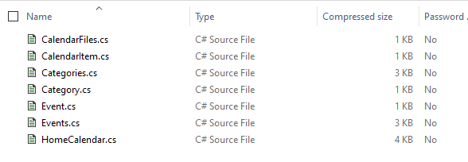
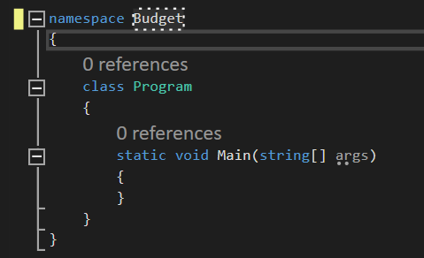

# Create VS Solution From Existing Code

**Console (.NET)**

> Note… instructions are for Microsoft Visual Studio Enterprise 2022 Version 17.4.4. It may be slightly different for different versions of Visual Studio.
>
> Please use Microsoft Visual Studio Enterprise 2022 in the labs (not 2019). If you are setting yourself up at home, please install Visual Studio Enterprise 2022. You could download it from your [Azure education account](https://azureforeducation.microsoft.com/devtools) (free to you as a CS student). 
>
> The Enterprise version is required for some functionality we will be using. 

## Create Solution

* Open Visual Studio

* Choose `File`->`New`->`Project`
* Look for and choose `Console Application C#` (or equivalent). This will create a .NET Core console application.
* Choose a Name for your project, and a directory where your project will be stored on disk. You absolutely MUST know where your files are!!! 
* `Create new solution` should be chosen from the drop-down menu
* Do **NOT** choose `Place solution and project in the same directory`
* Click `Next`
* For the framework, select  **.NET 6.0**. Also check the checkbox to not use top-level statements.
* Click `Create`

## Solutions and projects

Info from https://docs.microsoft.com/en-us/visualstudio/ide/

### Project

A project contains all files that are compiled into an executable, library, or website. Those files can include source code, icons, images, data files, and so on. A project also contains compiler settings and other configuration files that might be needed by various services or components that your program communicates with. 

Visual Studio uses [MSBuild](https://docs.microsoft.com/en-us/visualstudio/msbuild/msbuild?view=vs-2019) to build each project in a solution, and each project contains an MSBuild project file. The file extension reflects the type of project, for example, a C# project (.csproj), a Visual Basic project (.vbproj), or a database project (.dbproj). 

The project file is an XML document that contains all the information and instructions that MSBuild needs in order to build your project, including the content, platform requirements, versioning information, web server or database server settings, and the tasks to perform.

You may have to edit the .csproj file to change some details about the project.

### Solution

A solution is a container for one or more related projects, along with build information, Visual Studio window settings, and any miscellaneous files that aren't associated with a particular project. A solution is described by a text file (extension *.sln*) with its own unique format.

You should NOT edit the .sln file directly.

## Adding Files

* Search through your solution directories to find the `Program.cs` file (which was created for you automatically) Ex: `Solutions/`*`ProjectName/ProjectName/`*

* Copy all of the code files to this directory on your machine 

  * for HomeBudget there are 7 files

  >NOTE: This is a VERY important step.  If you add code to your solution that are not in your solutions folders, then the solution file will not be able to find your files if you change its location (i.e. submitting to LEA or Git)

  

* In your solution explorer in Visual Studio, `right click your project` (*not the solution, but the project*) 

  * If you cannot find the "solution explorer", `View`->`Solution Explorer`

* Choose `Add`->`Existing Item`

  `

* Select all of the budget files and click `Add` 

  * You should now see them in the Solutions Explorer Window							

## Setting the Namespace

Namespaces are a way of organizing code such that the variables, classes, methods, etc, are only available in code that shares the same namespace

* Open one of the new files, and note the namespace that it uses
  * namespace Budget (for HomeBudget code)
  
* In`Program.cs`, 
  
  * change the namespace to be the same as above
  
    
  
  
  
* Rebuild solution to ensure no compilation or linking errors

## Addendum

In our course, we will eventually be building a WPF (GUI) app using the Budget Code files, however…

* We need to update the existing files, and they need to be tested
* To be able to test these files, we need a console app
* Since there is *no* entry point (Main method) in the budget files, we need to keep `Program.cs` just for the sole purpose of creating an executable that can be tested.

## C# Dictionary<TKey, TValue>

A Dictionary is an unordered collection of key value pairs. https://learn.microsoft.com/en-us/dotnet/api/system.collections.generic.dictionary-2?view=net-7.0

Using generics, the type of the keys and the type of the values in the dictionary are specified.

`//Creates a dictionary with string keys and string values`

`Dictionary<string, string> myDictionary = new Dictionary<string, string>();`

To add a key-value pair to a dictionary: 

`myDictionary.Add(myKey, myValue);`

To access the value for a specific key: 

`myDictionary[myKey];`

To get the collection of all the values in the dictionary:  

`myDictionary.Values;`

To get the list of all the keys in the dictionary:  

`myDictionary.Keys;`

## Code inspection lab

1. What does myDictionary.TryGetValue(myKey, out myValue) do?  How does it differ from myDictionary[myKey]?

2. What is the type of the keys in the Dictionary in GetBudgetDictionaryByCategoryAndMonth?  What is the type of the values?

   

In teams, go through and decipher what GetBudgetDictionaryByCategoryAndMonth does using code inspection only.

Questions to answer:

1. What does the CategoryGroup.Key represent? Where does it come from?
2. What is the difference between the two things in the last dictionary: ["details:" + CategoryGroup.Key]  vs [CategoryGroup.Key]
