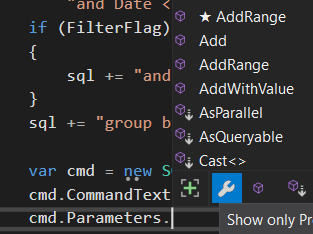

# Document Public API

## What is an API

An application programming interface is a connection between computers or between computer programs. **It is a type of software interface, offering a service to other pieces of software.** A document or standard that describes how to build or use such a connection or interface is called an API specification. [Wikipedia](https://en.wikipedia.org/wiki/API)

The code you are working on will eventually be turned into an API, so that it can be used as a library when we create a GUI program on top of it.

## Why Do We Need to Document Them? 

> Read the code, dude.

* Reading code can be tedious. 

* You might not care how the code does what it does. It could be a layer that is an abstraction for your program.

* More often than not, you don't have the code.

* Properly written documentation, will show up as hints in the Visual Studio IDE.

  * For example, the list of methods that are available to an object

  

* Properly written documentation forms the basis for the help documentation.
  * Example, the [help files](https://docs.microsoft.com/en-us/dotnet/api/system.string?view=net-6.0) for C# String class 

IF THERE IS A DISCREPENCY BETWEEN THE COMMENT/DOCUMENTATION AND THE CODE, THEN YOU IMMEDIATELY KNOW THAT SOMETHING IS WRONG!

## Goals

* Identify public API methods, fields
* Identify the components of a public function/method to document
* Document functions/methods using appropriate XML tags
* Generate web pages with API documentation
* Declare the contract of every public method
  * Why? - What information about a public function do I need to know to use it?

## Using XML to Document the Components

[How to](https://docs.microsoft.com/en-us/dotnet/csharp/codedoc) document with XML comments

### Student Activity

Read the above documentation, and answer the following questions

* Are the XML documentation comments compiled?
* What does an XML documentation line start with?
* How do you specify additional information about a parameter?
* What does DocFx generate?

#### Generating Web Pages

DocFX generates a static website which can then be deployed anywhere.

It can run on Linux, macOS, and Windows.

#### Student Activity

* Install package in Visual Studio using Nuget: `docfx.console`

* Build the solution to generate the web pages.

  (see the Troubleshooting docfx section below if you do not see your documentation after rebuilding when not working on a computer in the lab)

#### More questions

* Where do you find the generated web pages?
* What happens if you add XML documentation comments to a public function in an internal class?


# Style Guide

The following is excerpts from the [google style guide](https://developers.google.com/style/api-reference-comments).

## Documentation basics

The API reference **must** provide a description for each of the following:

* Every class, interface, struct, and any other similar member of the API (such as union types in C++).
* Every constant, field, enum, typedef, etc.
* Every method, with a description for each parameter, the return value, and any exceptions thrown.

## Classes, interfaces, structs
1. In the first sentence of a class description using `<summary>` tags, briefly state the intended **purpose** **or function** of the class or interface with information that can't be deduced from the class name and signature. 

2. In additional documentation (in `<remarks>`), elaborate on **what some of the key features are** and any **best practices or pitfalls**.

3. Provide example code using `<example>` tags.

   To avoid any issues with angle brackets in code examples, you should use a CDATA tag for code in your xml comments.

   ```c#
   /// <example>
   /// <code>
   /// <![CDATA[
   /// if (a < b && b > 0)
   /// {
   ///     Console.WriteLine("Hello");
   /// }
   /// ]]>
   /// </code>
   /// </example>
   ```
   
   

Many doc tools automatically extract the first sentence of each class description for use in a list of all classes, so make the first sentence unique and descriptive, yet short. Additionally:
* **Do not repeat the class name in the first sentence**.
* **Do not say "this class will/does ...."**
* **Do not use a period before the actual end of the sentence**, because some doc generators naively terminate the "short description" at the first period. 
	* For example, some generators terminate the sentence if they see "*e.g.*", so use "*for example*" instead.

## Constants, fields, enums, properties
Using `<summary>` tags document:

#### 1. Constants

* Briefly describe **what the constant represents** and **why it exists**.

* Include units if applicable (seconds, minutes, bytes, etc.).

* Mention **any restrictions or expected ranges**.

#### 2. Fields
* Describe the purpose of the field and how it is used.

#### 3. enums
* Provide a short description of the enum’s purpose.
* For each member, give a concise explanation of what it represents. The `<summary>` tag can be used on each enum value to describe it

#### 4. Properties

* In `<value>` tags describe the value that a property represents.

#### 5. Specify any related classes

Specify other classes that are important to a class for the reader to understand the full usage context. Use  `<seealso>` and `<see>` tags.


## Methods

#### 1. Description

In the first sentence for a method description using `<summary>` tags, briefly state **what** action the method performs. 

Use **present tense** for all descriptions - for example:

   * *Adds a new bird to the ornithology list.*
   * *Returns a bird.*

##### *Examples*

* If a method **performs an operation and returns some data**, start the description with a verb describing the operation - for example:
  * *Adds a new bird to the ornithology list and returns the ID of the new entry.*
* If it's a **"getter"** method and it **returns a boolean**, start with 
  * *Checks whether ....*
* If it's a **"getter" method** and it **returns something other than a boolean**, start with 
  * *Gets the ....*
* If it has **no return value,** start with a verb like one of the following:
  * **Turning on an ability or setting**: 
    * *Sets the ....*
  * **Updating a property**: 
    * *Updates the ....*
  * **Deleting something**: 
    * *Deletes the ....*
* If it's a **convenience method that constructs the class object**, start with 
  * *Creates a ....*

In subsequent sentences using `<remarks>`, explain **why and how to use** the method, state any prerequisites that must be met before calling it.

#### 2. Parameters

For parameter descriptions, use `<param>` tags and follow these guidelines:

* **Capitalize the first word**, and **end the sentence or phrase with a period**.

##### Non Boolean

* Begin descriptions of non-boolean parameters with **"*The*" or "*A*"** if possible:
  * *The ID of the bird you want to get.*
  * *A description of the bird.*

##### Boolean

* For boolean parameters for **requesting an action**, start sentences with 
  * *If true ...* and *If false ....*
    * Example:  *If true, turn traffic lines on. If false, turn them off.*
* For boolean parameters for **setting the state of something** (not making a request), use the format 
  * *True if ...; false otherwise.*
    * Example: *True if the zoom is set; false otherwise.*
* In this context, don't put the words "true" and "false" in code font or quotation marks.

#### 3. Return Values

Use `<returns>` tags to specify method return values.

Be as **brief** as possible in the return value's description; **put any detailed information in the class description**.

##### Non Boolean

If the return value is anything **other than a boolean**, start with 

* *The ....*
  * Example: *The bird specified by the given ID.*

##### Boolean

If the return value is a **boolean**, use the format 

* *True if ...; false otherwise.*
  * Example: *True if the bird is in the sanctuary; false otherwise.*

#### 4. Exceptions

Use `<exception>` tags to specify if a method throws *any* exceptions.

In languages where the reference generator **automatically inserts the word `Throws`**, begin your description with 

* *If ...*
  * Example: *If no key is assigned.*

**Otherwise**, begin with 

* *Thrown when ...*
  
  * Example: *Thrown when no key is assigned.*
  

> ⚠️IMPORTANT!  
>
> You must also document exceptions that are thrown by methods called within your method. 
>
> If not handled in your method, these exceptions can be bubbled up (thrown) by your method -  callers of your API method need to know this so they can choose how to handle these exceptions, if they occur.
>
> You do not need to document these exceptions if:
>
> - your method would catch and handle the exception if it was thrown 
>
> - your method includes checks that would make the scenario where an exception would be thrown impossible.
>
>   If, for example, you check that a value is null before sending it into a method that would throw if it was null
>
> 

#### 5. Specify any related classes

Specify other classes that are important to a class or method for the reader to understand the full usage context. Use  `<seealso>` and `<see>` tags.


#### 6. Provide example code
All the methods should have extensive examples with inputs and outputs shown using `<example>` tags.  Make sure to include examples with all the different combinations of parameters for methods.


## Style Choice - Table of Contents

If you want to see the table of contents in a sidebar, modify the `docfx.json` file (found in your solution explorer).  Look for the `dest:` keyword, near the end of the file

change from:
```json
    "dest": "_site",
    "template": [
      "default"
    ]
```

to:
```json
    "dest": "_site",
    "template": [
      "statictoc"
    ]
```


## Troubleshooting docfx

Working on your laptop or at home? After installing docfx.console on your project using the NuGet package manager and rebuilding your project you likely see an error simialr to this one in the output: 

```
>[26-01-21 12:59:20.886]Warning:[MetadataCommand.ExtractMetadata](.../HomeCalendar/HomeCalendar/HomeCalendar1.csproj)Workspace failed with: [Failure] Msbuild failed when processing the file '...\HomeCalendar\HomeCalendar.csproj' with message: Method not found: 'System.ReadOnlySpan`1<Char> Microsoft.IO.Path.GetFileName(System.ReadOnlySpan`1<Char>)'.
>[26-01-21 12:59:20.886]Warning:[MetadataCommand.ExtractMetadata]Project '...\HomeCalendar1\HomeCalendar.csproj' does not contain any documents.
>[26-01-21 12:59:20.886]Warning:[MetadataCommand.ExtractMetadata]No metadata is generated for HomeCalendar.
```

There seems to be an issue with newer versions on VS, in particular since docfx.console is deprecated. You can still generate the documentation html by using the command line tool.


### Using the command-line docfx

(After having installed docfx.console and rebuilding, you have a docfx.json file in the folder with your cs files. Leave it there. The command-line tool will use it.

1- Open the Terminal in VS: View -> Terminal

2- Run the following command to make sure the command-line docfx is installed:

```
> dotnet tool update -g docfx
```

> ⚠️IMPORTANT: You must restart Visual Studio. docfx is added to your PATH but the instance of VS only reloads the environment variables at start up.


3- In the terminal, navigate to the folder where your .csproj is. You should see your .csproj file when you run `dir`.   


4- From the project folder, run this to create the documentation content for the project: 

```
> docfx metadata
```


5- Next, run this to build the html page: 

```
> docfx build
```

Your html pages will be in the `_site/api` folder. Open `index.html` in a browser to look at our documentation. 


6- To see updated HTML pages after your changes to the documentation XML comments run the two last commands

```
> docfx metadada
> docfx build
```


# 🧩 Lab

1. Download the Hackathon code files. 
2. Create a new **C# Console App** with the solution name **Hackathon**.
3. Add the **HackathonManager.cs** and the **HackathonProject.cs** files to the project.
4. Write XML documentation comments for the **HackathonManager** class as well as all its public methods (including the constructor) and fields.
