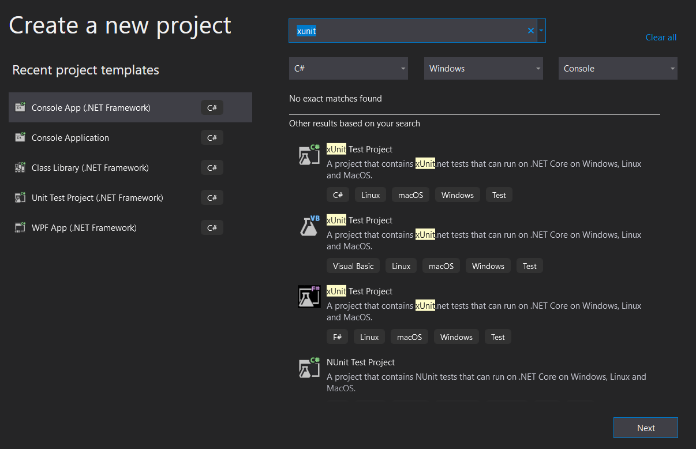
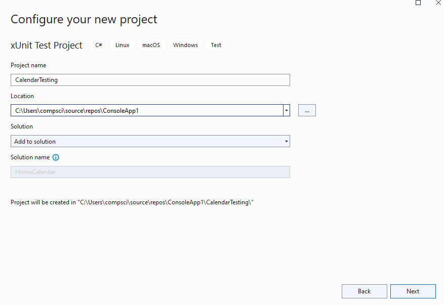
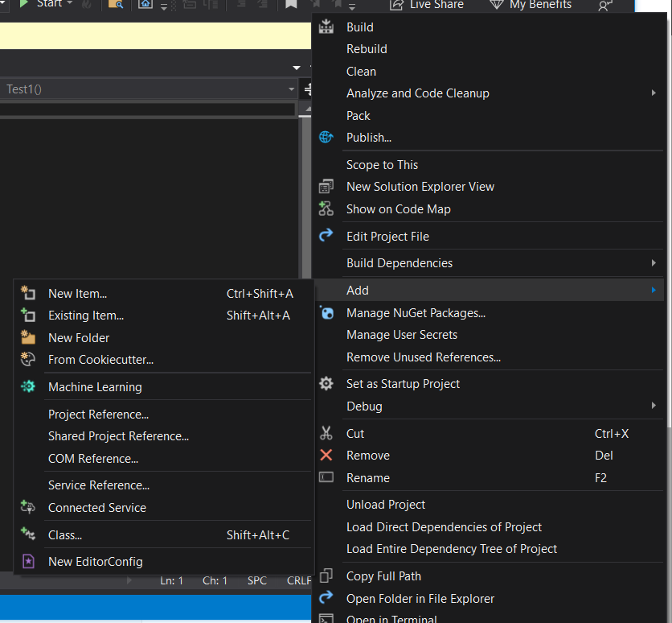
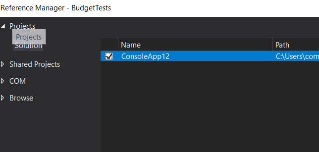
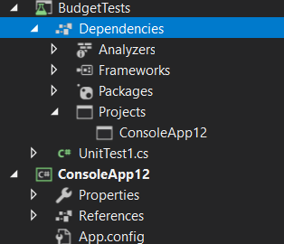

# Create Test Files for a Project

**Console (.NET)**

> Note… instructions are for Microsoft Visual Studio Enterprise 2022 Version 17.4.4. It may be slightly different for different versions of Visual Studio.

## Tutorial

Useful [tutorial](https://docs.microsoft.com/en-us/visualstudio/test/walkthrough-creating-and-running-unit-tests-for-managed-code?view=vs-2019) on testing (but we are using a different test project, XUnit). A little outdated, but very informative.  

A good read on testing basics: [Unit testing fundamentals](https://learn.microsoft.com/en-us/visualstudio/test/unit-test-basics?view=vs-2019)


## Create Test Project

> NOTE: These instructions may change as we (your teachers) figure out which is the best testing framework for automated testing on Git.  

* Open Visual Studio

* Choose `File`->`Open`->`Project/Solution`, and open your solution

* Choose `File`->`New`->`Project`

* You must find the `xUnit Test Project (.NET Core)`. Make sure to choose the C# version.

  

  

* Click `Next`

* **BEFORE CLICKING `CREATE`**…Make sure that the “option” for the “solution” is `add to solution`, not “create new solution”.

  


## Preparations Before Testing

* Link your project to the test suite

  * Right click References in your Test Project (in Solution Explorer)

  * Choose Add->Reference

    

  * Find the project you want to test, and select it, 

  * 

  * click OK

  * Verify!

    

* Give your test code access to the code you want to test

  * Open `UnitTest1.cs`

    > NOTE: if `using Xunit` is giving an error,  just be patient, Visual Studio will download the necessary files automatically.

  * You must `use` the namespace of the code you want to test.

  * Example: `using Budget;`

## Writing a Test

In your test file, you must include the `[FACT]` keyword to indicate which classes/methods are part of testing, as opposed to helper functions.

```csharp
[Fact]
public void SomethingMethod_Test()
{
  // this is a test
}
```

### Assert

Tests are validated through a series of `Assert` statements, which will cause specific exceptions to be created.  The testing framework will capture these exceptions, creating a list of passed and failed tests. 

### Example Test

```csharp
[Fact]
public void CategoriesMethod_Delete()
{
    // Arrange
    Categories categories = new Categories(testInputFile);
    int IdToDelete = 3;

    // Act
    categories.Delete(IdToDelete);
    List<Category> categoriesList = categories.List();

    // Assert
    Assert.Equal(numberOfCategoriesInFile - 1, sizeOfList);
    Assert.False(categoriesList.Exists(e => e.Id == IdToDelete), 
                 "correct Category item deleted");
}
```


## Adding Test Files

* If any test files already exist, add them to your project the same way you would add files to any project

## Student Activity

* a Console .NET Framework project (call it 'Budget' to keep it simple).
* Add all the necessary files (get them from LEA)
* Create a new `Xunit` project (within the same solution)
  * Don't forget to add the reference to the budget project
* Add all the test files to the test project.

> NOTE: For HomeBudget tests, there are additional test files which must also be included into the project. In other words, include all files.

* Delete `unitTest1.cs`

## Viewing Your Test Files

* Select `View` -> `Test Explorer`
  * You will now have a panel, where you can choose to run your tests, run specific tests, etc.

* You may need to rebuild your solution to see the tests.

## Running Tests

* From Test Explorer, you can click on the green arrow to choose which tests to run.

### Debug a Failing Test

* The details of a failing test (if selected) will shown in the `Test Detail Summary` window.  This information includes a stack trace, which will indicate which `assert` failed.
  * This will allow you to go directly to the failing Assert.

* Debugging
  * You can set breakpoints in tests, and in your project code, as per usual
  * To debug, select test(s) that you wish to debug, right click, and select `debug`

## Student Activity

In our course, we will eventually be building a WPF (gui) app using the BudgetCode files, however…

* Out of 60 tests, there are 4 failing tests! 
  * you will expected to debug, and fix before proceeding to make any modifications

* In class exercise... debug the failing test: `BudgetCodeTests.TestCategories.Categories_TypeSavingsReadCorrectlyFromFile`