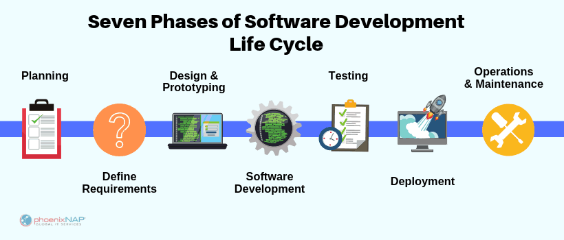

# Systems Development Life Cycle (SDLC)

## Definition
*Summarized from [Wikipedia article](https://en.wikipedia.org/wiki/Systems_development_life_cycle)*.

A systems development life cycle is composed of a number of clearly defined and distinct work phases which are used by systems engineers and systems developers to **plan** for, **design**, **build**, **test**, and **deliver** information systems. 

Computer systems are complex. To manage this level of complexity, a number of SDLC models or methodologies have been created, such as 

* Sequential or big-design-up-front (BDUF) models, such as waterfall, focus on complete and correct planning to guide large projects and risks to successful and predictable results.
* [Iterative](https://en.wikipedia.org/wiki/Iterative_and_incremental_development) methodologies, such as [Rational Unified Process](https://en.wikipedia.org/wiki/Rational_Unified_Process) and [dynamic systems development method](https://en.wikipedia.org/wiki/Dynamic_systems_development_method), focus on limited project scope and expanding or improving products by multiple iterations. 
* Agile methodologies, such as [XP](https://en.wikipedia.org/wiki/Extreme_Programming) and [Scrum](https://en.wikipedia.org/wiki/Scrum_(development)), focus on lightweight processes which allow for rapid changes (without necessarily following the pattern of SDLC approach) along the development cycle.

>  “Agile: make it up as you go along. Waterfall: make it up before you start, live with the consequences”. [[41\]](https://en.wikipedia.org/wiki/Agile_software_development#cite_note-41)

## Phases of SDLC

There are many models of the *phases* of SDLC.  A typical example is shown below.

> Note that the phases do not necessarily have to be performed exclusively in this order, and in iterative or agile approaches to software development, each phase could be repeated many times.

[source](https://phoenixnap.com/blog/software-development-life-cycle#:~:text=Software%20Development%20Life%20Cycle%20is,%2C%20Test%2C%20Deploy%2C%20Maintain.&text=SDLC%20is%20a%20way%20to%20measure%20and%20improve%20the%20development%20process)

## How SDLC fits into the ‘big picture’

Managers want:

* To be able to estimate their costs effectively, not just for this month, but for the months ahead
* To be able to measure their employees effectiveness at their job

Customers want:
* An exact quote for the application that is being developed
* Being able to refine requirements as the product is being developed
* Guarantees on delivery of the product

Programmers / Designers want:
* Clear Requirements
* Little or no writing of documentation
* Trust me, leave me alone and let me do my job (freedom)
* Beer and Pizza
* Coffee

## Various SDLC Methodologies

### Waterfall

With the waterfall method, each SLDC phase is completed *before* the next phase begins.

* Customer, management and developers meet and discuss requirements.
* Developers go off on their own to discuss.
* Determine the cost and delivery date for each of:
  * Design
  * Code
  * Test
  * Deploy
* Customer and management sign a contract.
* Employees are given their tasks, and must follow all procedures for each step, in order (design everything, then code everything, ...).

#### Pros 

Managers:
Like Waterfall method because, if it actually worked,…

* After the planning phase, each step (Design, Code, Test, Deliver) is set at a fixed price and timeline, and if any step is delayed, the manager immediately knows the delivery date is delayed
* Managing programmers is like trying to herd cats.
* Feel that they have absolute control over the process 
  * many managers are not coders, so talking to them about technical difficulties can be difficult

Customers:
Think they like the waterfall method, because...

 * There is a fixed price
 * There is a fixed delivery date

#### Cons
It has been proven, unequivocally, that if there is a bug in the software or design, and it is only found during the testing phase (which in waterfall is done only after all the code has been completed), then it costs significantly more to fix said bug than if it had been found earlier in the process.

Customers:
Realize that they don’t like the waterfall method when...

* They can’t adjust their requirements once the contract has been signed,
* It’s 85% into the project, they have paid some money up front, but now the company says it will be delay release for another year, 
* AND THE COMPANY HAS ABSOLUTELY NOTHING IN HAND, NOT EVEN A PARTIALLY WORKING APPLICATION

Developers:

Do not like the waterfall method, because...

* It is very hard to estimate the time it will take to develop a very large project (too many unknowns)
* In spite of best effort, requirements are usually not precise
* After the design phase is over, if one feature turns out not workable as designed, it may be necessary to redesign everything!
* If testers find a major bug, that is the result of a design flaw, everything has to go back to the beginning, and the whole project will be late, and managers will be angry, and people will be fired!

### Iterative

> NOTE: Sandy was using the RUP framework (which is an iterative methodology) at CAE in Mirabel.  She found it worked well for the work that they were doing.

The iterative approach can be best described as a series of mini waterfalls, typically 2-3 months long.

The cost and schedule of the final product is only an estimate, and will be refined as the project unfolds.  

At each iteration

* Global requirements are reviewed, and modified if necessary.
* Schedule and costs are revisited, to ensure that everyone is in agreement.
  * The scope of the project may be reduced if the projected cost is too high.
* A decision as to what will be implemented in this iteration is decided upon (managers, customers and developers are part of these discussions)
  * A risk analysis is done:
    * Possible technical issues
    * Possible costs and scheduling issues
    * Possible hardware issues
* Design, Coding and Testing are performed
* A **functional** product is created, and released to the customer.

In the early stages, the majority of time in each iteration is spent on requirements, with only a little time is spent on designing, coding and testing (implement prototypes).

As time progresses, each iteration will have less and less time spent on requirements, and more and more time spent on coding and testing.

#### Pros
Managers like Iterative because:
* They still can quickly assess their current expenses, and revenue
* Can determine if the developers are getting their work done in the promised time

Customers like RUP because 
* They are always guaranteed to have *something* at the end of an iteration
* Requirements can be adjusted
* If the costs are running too high, features can be cut.

#### Cons
* There can still be too much focus on documentation and process, which can hamper the flexibility of the developers.

* Some say that a three month iteration is still too long to be adaptable to changing requirements.

### Agile 
Agile Development is **an umbrella term** for several iterative and incremental software development methodologies. 

Popular agile methodologies include Extreme Programming (XP), Scrum and Kanban (Lean Development).

*summarized from [wikipedia](https://en.wikipedia.org/wiki/Agile_software_development)*

#### Values
- ***Individuals and interactions** over processes and tools*
- ***Working software** over comprehensive documentation*
- ***Customer collaboration** over contract negotiation*
- ***Responding to change** over following a plan*

That is to say, while both sides have value and the items on the right should be considered, the authors of the manifesto chose to tip the balance in favor of the items on the left.

#### Principles
The *Manifesto for Agile Software Development* is based on twelve principles:

1. Customer satisfaction by early and continuous delivery of valuable software.
2. Welcome changing requirements, even in late development.
3. Deliver working software frequently (weeks rather than months)
4. Close, daily cooperation between business people and developers
5. Projects are built around motivated individuals, who should be trusted
6. Face-to-face conversation is the best form of communication (co-location)
7. Working software is the primary measure of progress
8. Sustainable development, able to maintain a constant pace
9. Continuous attention to technical excellence and good design
10. Simplicity—the art of maximizing the amount of work not done—is essential
11. Best architectures, requirements, and designs emerge from self-organizing teams
12. Regularly, the team reflects on how to become more effective, and adjusts accordingly

#### Pros

* Adaptable
  * Agile development is defined such that the processes involved in creating a product need to be *adaptable*, so the team chooses what is the best way to monitor and proceed with development.

#### Cons

* Harder for management to predict long term outcomes.
* Not necessarily the best choice if requirements are very rigid to begin with (software for airplanes for example)

