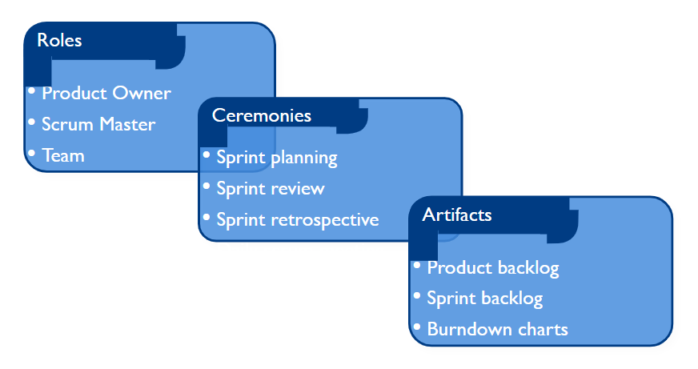
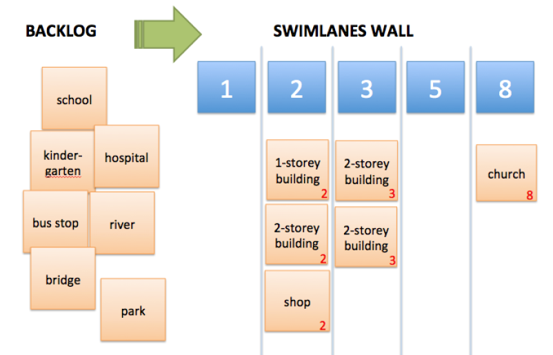
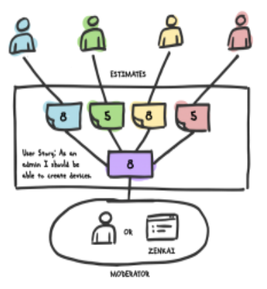
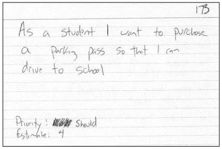
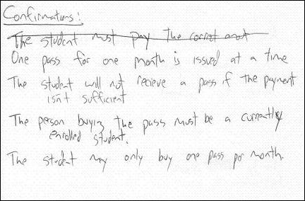

# Scrum - An Agile Framework

## Student Activity

Watch the video on Moodle.

### Questions:

* Do you think Scrum methodology affects good code design?
* Can you anticipate some criticisms of the Scrum methodology?
* Do you think you would like working in a development team using the Scrum methodology? Why or why not?

## What is Scrum?

* Scrum is an **agile process** that allows us to focus on delivering the **highest business value** in the **shortest time**. 

* It allows us to **rapidly** and **repeatedly** inspect actual working software (every two weeks to one month).

* The business sets the priorities, and teams **self-organize** to determine the best way to deliver the **highest priority features**. 

* Every two weeks to a month anyone can **see real working software** and decide to release it as is or continue to enhance it for another sprint.

* Scrum has been used for commercial software, financial applications, ISO 9001-certified applications, video game development, websites, mobiles,24x7 and life-critical systems and more! 

* It has been used by Microsoft, Yahoo, Google, Electronic Arts, High Moon Studios, Nokia, Philips, John Deere, BBC, Capital One…

* A typical team is 7 ±2 people. Scalability comes from teams of teams. Scrum has been used on multiple 500+ person projects

* Created/developed by Ken Schwaber, Jeff Sutherland and Mike Cohn.

  
## Overview

The product is designed, coded and tested during a **sprint**.

## Framework

### Roles

#### Product Owner

* Maximizes the ‘return on investment’ (ROI) by directing the team towards the most valuable work and away from the less valuable work.

* Controls the priority of the items in the team’s backlog.

* Makes sure the team fully understands the requirements.

* Is responsible for recording the product requirements.
  * Often as user stories:
    as a <role> I want a <feature> so that I can <accomplish something>

* Adjusts features and priority every iteration, as needed.

* Accepts or rejects work results.

#### Scrum Master

* Acts as a coach, guiding the team to increase their cohesiveness, self-organization and performance.
  
* Is responsible for enacting Scrum values and practices.

* Ensures that the team is fully functional and productive by removing any impediments that may arise.
  
* Shields the team from external interferences.
* Not a team boss. A peer position set apart by knowledge and responsibilities (not rank!)

#### Team

* Typically consists of 5-9 people.

* Cross-functional: Programmers, testers, designers, etc.

* Members should be full-time (although there may be exceptions, e.g. Database Administrator).
  
* Teams are self-organizing (preferably with no titles/hierarchy).

* Membership should change only between sprints. You have been given the names of the members in your Scrum Team.

📹 Extra [resource](https://www.youtube.com/watch?v=EUALxzRTfkw)

### Ceremonies

#### Sprint Planning

* Team selects items from the product backlog that they commit to completing in the upcoming sprint. 
  This is the **sprint backlog**.
* Tasks are identified and each is estimated.
  This is done in a collaborative manner (e.g. using **[planning poker](https://www.mountaingoatsoftware.com/agile/planning-poker)**) or putting tasks onto a **swim lanes wall**.
     

📹 Extra [resource](https://www.youtube.com/watch?v=bT30zGIfaW8)

#### Sprint Review

* Team presents what it accomplished during the sprint that just took place.

* Typically takes the form of a demonstration of new features. 

* The team participates (but the whole world can be invited).

* At this point there should be a potentially shippable product increment (e.g. set of new features / updated version).

#### Sprint Retrospective

* Take a look at what is working well and what needs improvement.

* Carried out after every sprint.

* Typically 15-30 minutes.

* Whole team participates.
  * Start/Stop/Continue (What I think we should start, stop and continue doing).
  * Expectations (What my team expects from me, what I expect from my team).
  * Post-It Notes (Everyone notes down their ideas then discuss as a group).

| Do                                               | Don't                                   |
| ------------------------------------------------ | --------------------------------------- |
| Make it a safe place to discuss issues           | Play the blame game                     |
| Ask "What else?" instead of "Anything else?"     | Suppress your feelings or anyone else's |
| Motivate the team to participate and make it fun | Include uninvited external members      |
| Keep track of previous items and review results  | Allow distractions to take too long     |

#### Daily Scrum Meeting

* Takes place daily (stand-up, 15 mins max)

* Not for problem solving.

* Whole world is invited but only the team members, Scrum Master and Product Owner can talk.

* Not a status report, it is a commitment in front of your peers.

Typically, each team member answers the following three questions at the daily scrum:
* What did you do yesterday?
* What will you do today?
* Is anything in your way?

### Artifacts

#### Product Backlog

* Is the master **To Do List** for the entire project. 
  * The agile equivalent of the traditional **user requirements document**.

* Requirements initially create the product backlog.
  * The highest priority items are broken down into **user stories**.

* Is **prioritized by Product Owner** as required
  * and reprioritized at the start of each sprint.

* Each item should have priority, description, estimate of effort and type (requirement / maintenance / improvement, etc.)

 |Backlog item|Estimate
 |---|---|
 |Allow a guest to make a reservation|3
 |As a guest, I want to cancel a reservation.|5
 |As a guest, I want to change the dates of a reservation.|3
 |As a hotel employee, I want to run RevPAR reports (revenue-per-available-room)|8
 |Improve exception handling|8
 |…|…

#### User Stories

Features in the product backlog from a user’s perspective.

* [User stories](https://www.mountaingoatsoftware.com/agile/user-stories) are written in the following format:
  As a <role> I want a <feature> so that I can <accomplish something>

  > As a user 
  >
  > I can indicate folders not to backup 
  >
  > so that my backup drive isn’t filled with things I don’t need saved
  
* Some user stories are too large (epic) and need to be split into multiple smaller user stories before it can be worked on.

* We add detail to user stories in two ways:
  * By splitting a user story into multiple smaller user stories.
  * By adding “conditions of satisfaction”.
* User stories are written **throughout** the entire agile project. Everyone in the team participates with the goal of creating the **product backlog** which fully describes the functionality required.

* User stories are incomplete until a discussion about that story has taken place.

* Must be precise in use of language. 

  > Entrée comes with choice of soup or salad and bread.
  
  > The user can enter a name. It can be 127 characters.

##### INVEST

INVEST is the acronym used for qualities you want in your user stories:

* **Independent** –should not need other stories to implement it (where possible).
* **Negotiable** – product owner and development team discuss and expand details.
* **Valuable** – shows product value to the customer (not technical steps required).
* **Estimable** – refined enough that developers can estimate the effort required.
* **Small** – small in executable size (so you can have 6-10 user stores per sprint).
* **Testable** – needs to be testable so development team knows when it is done.

   

#### Backlog

* Individuals sign up for work of their own choosing
  * Work is never assigned
* Estimated work remaining is updated daily
* Any team member can add, delete or change the sprint backlog
* Work for the sprint emerges
* If work is unclear, define a sprint backlog item with a larger amount of time and break it down later
* Update work remaining as more becomes known

