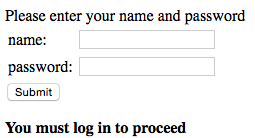
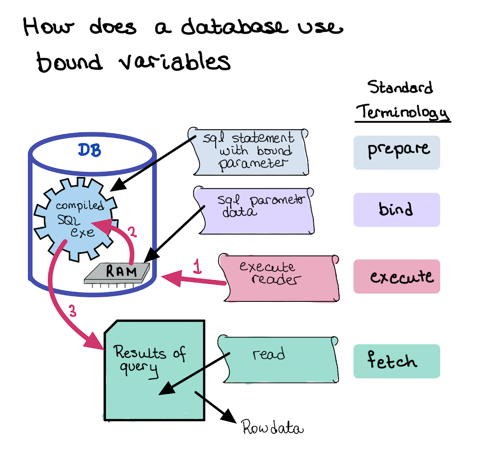

# SQLite and C#

## Goals

Using C# and sqlite, 

* Connect to a database
*  Create tables and insert data via C#
* Verify your work by using sqlite from the command prompt
* Insert data using parameters
* Retrieve data using parameters (querying)
  * Why parameters? To prevent sql injection
* Know and understand what sql injection is!

## Student Activities - Install Packages in Visual Studio

#### Install C# libraries to allow connections with sqlite

We will be using ADO.NET as our database connection protocol

* What is it? (Google it) 
* How does it differ from ODBC (if at all?)

To install additional libraries, we will be using “NuGet” from within Visual Studio

* Look online for instructions on how to use ‘NuGet’
* Must install ```System.Data.SQLite``` into your project (so create a console project first)

## Student Activities - Practice

Use the this [tutorial](https://zetcode.com/csharp/sqlite/)
* Create a *practice*  a database file
* Add tables to a database file
* Insert data into database file
* Query existing data in database file

*ALWAYS VERIFY YOUR WORK BY USING THE SQLITE ON THE COMMAND LINE.*
**Do not just read the tutorial and think you understand it. Type it in. Try it!**

# SQL Injections


*(c) XKCD*

## What is SQL Injection?

I happens when an SQL query is sent to the database server which unintentionally returns more information than was intended.  This information can be used to find passwords, *etc.*

Surprisingly, even many top-tiered companies do not protect themselves from this attack.

## How is it accomplished?

A common web hacking technique.

* Placement of malicious code via *user input*.

Imagine the following...



In the *code behind*, there will need to be a query that looks something like:

```sql
select name from users where name='scott' and password='tiger'
```

### Example 1

Because the input comes from a user, this user can type anything they want.

Imagine the following C# code.

```Csharp
// connect to db, etc 
// ... stuff ...
// Code takes the user input and constructs the SQL command
Console.Write("Enter your user name: ");
string name = Console.ReadLine();
cmd.commandText = $"Select * from users where name='{name}'";
```

Now, the user runs the code (*Notice that the missing quotes at the beginning and the end*)

```text
Enter your user name: sandy' or '1'='1
```

What does ```cmd.CommandText``` become at this stage?

*`Select * from users where name='`*`sandy' or '1'='1'`

 This is then sent to the database to be executed

```csharp
var rdr = cmd.ExecuteReader();
```

And since `'1'='1'` is always true, **ALL** records from the `users` table will be displayed.

### Example 2

Aside from acquiring confidential information such as usernames and passwords, SQL injection can be used to drop tables and data.

```text
Enter your user name: sandy' or DROP TABLE suppliers
```

What does ```cmd.CommandText``` become at this stage?

*`Select * from users where name='`*`sandy' or DROP TABLE suppliers`

***This is why we need to bind our variables!***

Binding variables will ensure that the data passed in the variable is never used as part of the SQL statement (so prevents SQL injection).

## How to Prevent SQL Injection

* Input comes from user, so user can type anything they want.

* Our code encapsulates the user input as data only, and NEVER lets the user input be interpreted as an SQL command.

* HOW? 

  * Using parameters (this is called ‘binding’)

* Example:

  ```csharp
  Console.Write("Enter your user name: ");
  string name = Console.ReadLine();
  
  // USING BINDING TO PREVENT SQL INJECTION
  cmd.commandText="Select * from Users where name = @name";
  cmd.parameter( @name, id); // bind user input to parameter
  var rdr = cmd.ExecuteReader();
  
  ```

**Result**: the data returned will only be the rows where  `name` is equal to the string “` sandy' or '1'='1 `”

## How Does Binding Prevent SQL Injection?



### Typical Cycle of Database Communication

#### Prepare

The database receives the SQL string, with or without parameters.  The SQL string is analyzed, parsed and compiled. 

If there are parameters specified in the SQL command (*i.e*. `UserID = @name`), then the ‘compiled SQL code’ inserts a reference to the data that will be used when the SQL code is executed. (In other words, it creates a pointer to a variable, that is filled in only when the data is bound)

#### Bind

Any parameter that needs to be sent as part of the query needs to be *bound*.  That means that the database will be sent the data and store this data in the pointer location defined in the prepare statement.

The bound data is **NEVER** interpreted as SQL

#### Execute

When the command is executed, the precompiled SQL statement is executed, using the bound data as *inputs only*.  In other words... The bound data is **NEVER** interpreted as SQL.

If the command is a query, the result of the query is stored in the database until it is *fetched*.

#### Fetch

When the data is fetched, the data from the Database is transferred to your local machine.  For SQLite, where the database sits on the local machine, the data is transferred from the SQLite storage to the C# process.

### SQLite/C# processing

#### Set the SQL string

In the C# code, the `cmd.commandText(SQLString)` function will save your SQL string locally.  It is *not* validated by the SQLite database.  If it is invalid, the error message will pop-up later.

#### Binding (locally)

When `cmd.Parameters.AddWithValue` function is called, the value of the parameter is stored locally, in the `cmd` class properties.

#### Prepare and Execute

When `rdr = cmd.ExecuteReader()`or `cmd.ExecuteNonQuery()` is executed, the SQL string, the value of the bound variables will be sent to SQLite.

This step *prepares* the SQL statement (holding a pointer to the compiled SQL) if it has not already done so in a previous call to `Execute*`.  The statement will then be executed.

#### Read

Same as *fetch*


## Student Activities - Questions

At the end of this lesson, you should be able to answer the following questions.  If not, do further research.  If you still cannot answer the questions, seek assistance from your teacher.

* Try creating your own sql injection string
* How do prepared statements (using parameters) prevent sql injection?

LAB:

Create a small WPF application with a text box and a button.
When the button is pressed, run a query on your database:

```csharp
SELECT * FROM myTable WHERE id=’ + retrievedString + ’
```

Try recreating the *Bobby Tables SQL* injection

Then change your code to use bind parameters instead.

# FINAL WORD

There is nothing wrong with writing values directly into built up statements; 

Or even using variables…AS LONG AS YOU ARE ABSOLUTELY CERTAIN WHAT THE TEXT IS i.e. the user isn’t supplying the text

Whenever the data comes from a user (or any other outside source) USE BINDING! (i.e. parameters)

***!!! Security !!!***

NOTE: A ZERO GRADE WILL BE GIVEN TO ANY ASSIGNMENT THAT DOES NOT INCLUDE PROPER BINDING OF USER INPUT!
