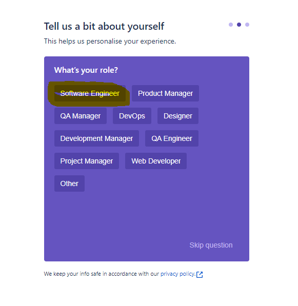
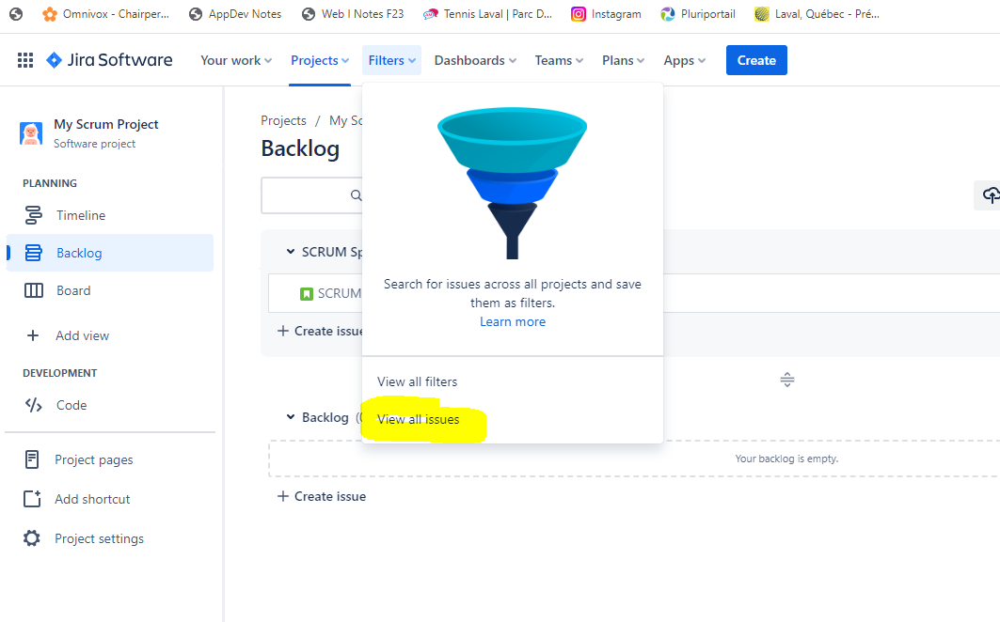

# JIRA - Scrum project management software

## Scrum overview

## What is JIRA?

JIRA is a widely-used industry tool for software project management

https://www.atlassian.com

## Create a JIRA account (<u>**ONE team member**</u> per team)

Create an account using an email address. You could use your JAC email address or any other one (you will need to access your email to confirm your registration).

1. Select Sign in

   

   

2. Select Create an account. Enter the email address you would like to create an account with (need to be able to access the confirmation email). 

   

3. Access your email and confirm your registration, creating a password.

4. Once confirmed, select Jira Software

   

   

6. On the Jira Software page, choose Get It Free.

   

   

7. Click next without selecting a second product.

8. Create your team site! Use this site name format:

   ##### **jacappdevI-2022-yourteamname**

   

9. Choose Software Development for the type of team

   

10. Software Engineer as the profile <!--(Software Developer and Software Engineer are often used interchangeably even though you technically need an engineer certification to be called an engineer in an official capacity)-->

    

11. Enter the email addresses of your **teammates** and **BOTH** teachers (you could also add them later, see later step):

    sandra.bultena@johnabbott.qc.ca

    helen.katalifos@johnabbott.qc.ca

    

    

12. You could answer the questions to set up Jira

    

13. You could add more teammates/teachers from your JIRA page:

    

14. Create a project

    

15. In the backlog view, you could create issues (stories) to be added in the backlog. You could enable the Epic view and epics to your project.

    

16. Click on a story to edit it: associate it to an epic, set the story points, add a description with acceptance criteria.

    

    

17. Fill in your backlog!

18. After a sprint planning meeting, create a sprint.

19. For every new sprint you create, create a ***Filter*** to show the associated stories (helps to see stories in completed sprints):

    

    

20. Check the sprint filter.

    

    

21. Select the sprint in the left panel and save the filter:

    

22. Name the filter for the sprint:

    

