# Install git

[Install](https://git-scm.com/install/)


# Create and account on GitHub

***Each student*** must have a `github` account


# Using VS and GitHub Together

## Creating a repo from VS

1. ***One student*** from each team creates a project using **your team name**. The rest of the students select any **other** name.

2. Select `git` ->`Create Git Repository ...`

   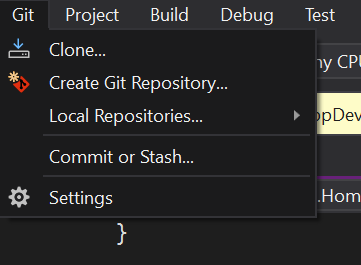

   and then fill in the page.  You will have to log into GitHub from this page, so keep an eye out for any web page that may pop up.

   Make sure that your choose `private repository`.

   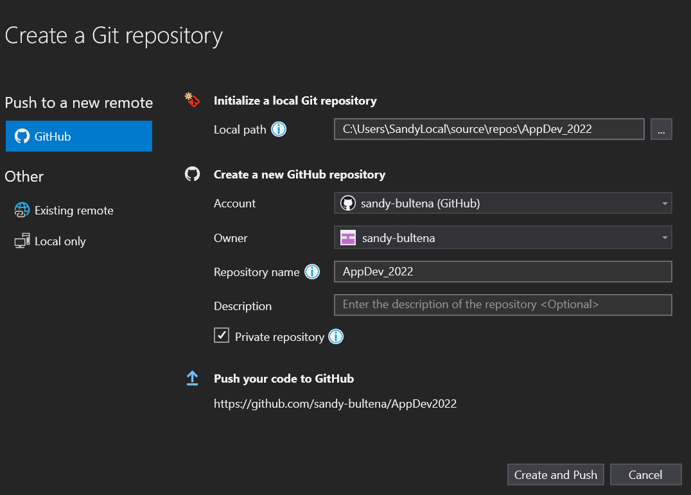

   

3. Right click on the solution file and add item `.gitignore`

4. Let's modify your `.gitignore` file to ignore all the files that you want to ignore.

5. Commit and Push.

## Committing to GitHub

If you do not see the Git Changes panel, then go to `View` on the VS menu, and choose `git changes`.

At this point, you will see a list of all files that have been modified (`.gitignore`), and a text box where you can insert your commit message.

**COMMIT MESSAGES NEED TO BE CLEAR**, 'fix bug' is not a valid commit message!!!!!

When you commit, your changes are saved locally, they are still not in GitHub.

To push your changes to GitHub, simply click the blue up-arrow in the Git Changes pane.

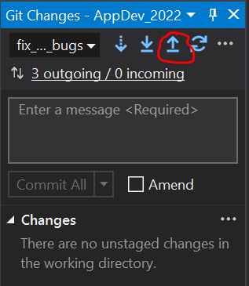


## Adding Collaborators

***The student*** with the team repo 🌐 on `github` should

Go to settings > then choose collaborators > click the `add people` button

**Add**

* all of your teammates to the repo

* add Helen (`hkatalif`) and Meghrig (`meghrigJAC`) to your repo 


## Working Together

1. Every member should clone the repo of their team.
2. One team member
   1. Create a project for `CalendarApp` and add the team member's files with the best documentation.
   2. Create a project for testing and add all the test files in it
   3. make proper changes to `gitignore` file.
   4. stage, commit, push


## .gitignore

`.gitignore` is a file in a Git repository that **tells Git which files or folders to ignore**.

- Git will **not track** these files.
- They won’t be added to commits.

some files/directories git should not track

1. **`bin/` & `obj/`** → Never commit compiled binaries; they’re rebuilt automatically.
2. DocFX generated documentation files `_site` , `articles` , `api`

If you accidentally commits a folder before adding `.gitignore`, run:

```
git rm -r --cached [name of file or folder]
git commit -m "Remove build artifacts"
```


## Branches 

### Branches on GitHub 𓆱

To create a branch on GitHub, select the drop-down box that has a *tree* symbol on it.

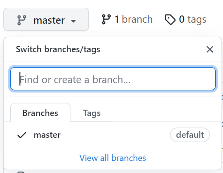

and then enter the name of a new branch.

#### What branches to create?

There are many options, but we (the teachers) suggest either of the following...

* A branch for every feature or story


### Git branching in VS

Once the repo has been created and pushed to GitHub, then you should see the current status of the repository on the bottom of your VS app.

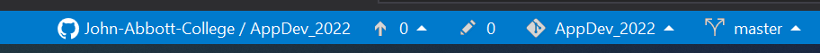

* The *up arrow* indicates how many local commits are waiting to be pushed to GitHub.  
* The pencil with the 'zero' beside it indicates that you have zero changes in your files from the last commit.
* `AppDev_2022` indicates the name of the GitHub repository, 
* and finally, `master` indicates which *branch* you are currently modifying.

### Switching Branches in VS

After creating branches in GitHub, you now need to switch to that branch in VS. But, upon looking at the available branches, you do not see your new branch.

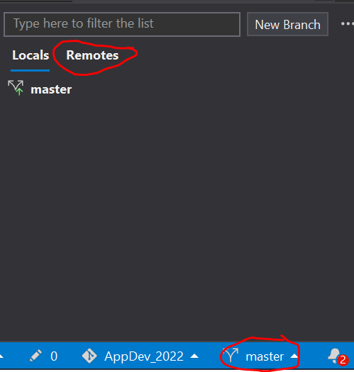

Make sure that you are looking at the *remote* branches!
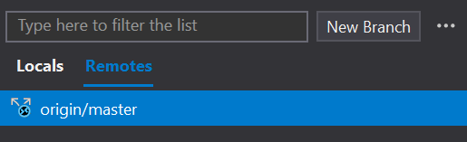

Still not there. What now?

VS is not aware of the changes that you made in GitHub, so you need to update VS.  

The fastest way to do that is to `fetch` the changes (as opposed to pulling).

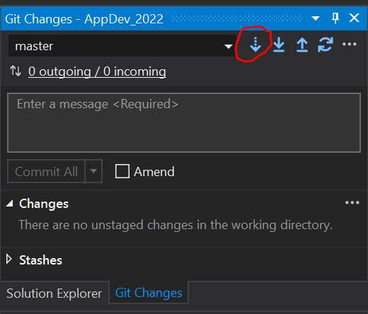


Now, when we check again, we can see all the branches.

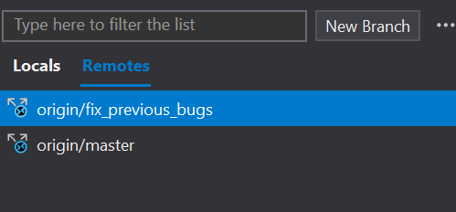


Choose which branch to work on, and verify that the change has happened.


I am currently in branch `fix_previous_bugs`. 


## Merging Changes

### Create a pull request

On GitHub, make certain that you are currently looking at the branch where the changes that have been made need to be merged elsewhere.

If a branch is out of date with another, you should see a pop-up box that looks like the following.  Press the `compare & pull request` button.

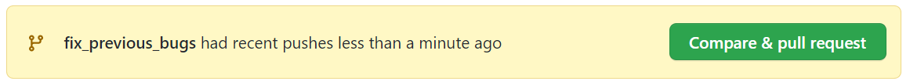

Be ***really*** careful that you have chosen the correct direction for your pull request! 

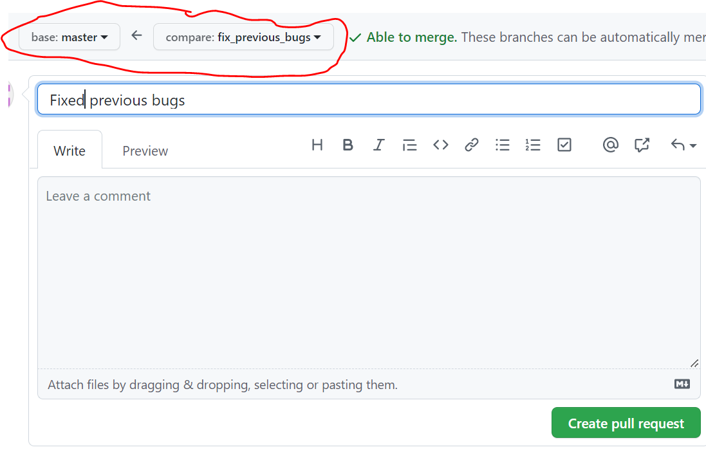

After the request has been made, other members of the team need to review the pull request.  They will be informed that there is a pending pull request by looking at the info on GitHub.

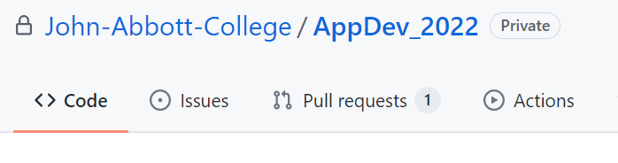

Once the reviewers have reviewed your code (and entered their comments in GitHub where appropriate), then the pull request can be accepted.

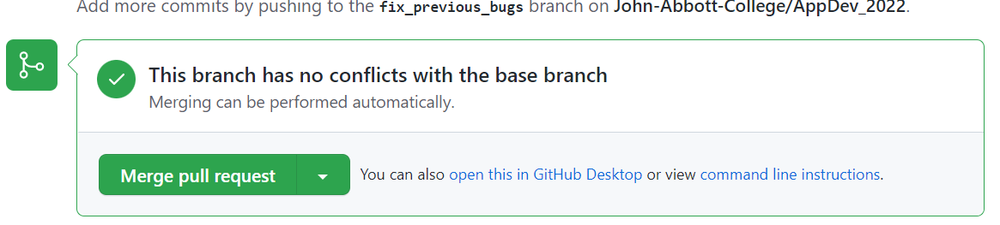


## About commit email addresses

If you want to keep your email address private (I strongly recommend), use the GitHub-provided `noreply` email address in both GitHub and Git Bash

**On GitHub:**

Click on you profile > settings > emails > Turn on `Keep my email addresses private` > copy the GitHub-provided noreply email address

**On the terminal run:**

`git config --global user.email [paste GitHub-provided noreply email address]`

`git config --global user.name [first_name last_name]`

## Pull, Push, and Fetch

- **Pull**: Synchronizes your working copy with the remote repository, merging your files with the commits created since the last pull.

- **Fetch**: Doesn’t  modify your **working copy**, updates only your local repository. You have to merge it manually into your work when you’re ready.

 - **Push**: Sends all the commits created locally since the last push to the remote repository


> git checkout is used to
>
> 1. Switch between branches
>
> 2. Create a new branch and start working on it
>
> 3. Restore a file to a previous state

## Troubleshooting some scenarios

**Scenario1**

If you and your teammates are working on the **same branch**, and you’re done for the day, the correct process is:

1. Commit your work locally
2. Pull 
   1. Download changes your teammates made and pushed on remote (repo on GitHub).
   2. There might be conflicts. Resolve conflicts and commit.
3. Push

**Scenario 2**

You have finished working on a feature branch and are ready to push it to the remote repository to create a pull request.

1. Stage and commit your changes on the feature branch.

2. Pull the latest changes from the remote repository to update `master`.

   > This ensures your branch can merge cleanly.

   To do this:

   1. Switch to the `master` branch.
   2. Pull the latest changes from the remote repository.
   3. Switch back to your feature branch.

3. Merge `master` into your feature branch. You want your branch to include the latest changes from `master` before pushing. To do this:

   1. Go to Git > Manage Branches

      

   2. Right-click the `master` branch → **Merge 'master' into '…'** 

   3. Resolve any conflicts using Visual Studio’s merge tool. Commit the merge if necessary.

4. Push your feature branch to the remote repository.

5. Create a Pull request.

   

   Select your feature branch as the source and `master` as the target.

   Add a descriptive title and details about your changes.

   Assign reviewers if needed and submit the Pull Request.

   

## Rules of thumb

1. `master` stays stable. New work happens on **feature branches**. Changes are merged to master via **pull requests**

2. **Pull frequently**

   **Daily or every time you start working** on your branch. To keep your branch up-to-date with others’ changes so merges don’t become massive or painful.

   go to main branch > pull > go to feature branch > merge main to feature branch > resolve any merge conflicts > commit if needed.

   If more than one person are working on the same branch, you also need to pull from the feature branch.

   pull > resolve any merge conflicts > commit if needed.

3. **Before pushing your changes to create a pull request, always pull**

   go to main branch > pull > go to feature branch > merge main to feature branch > resolve any merge conflicts > commit if needed.

   If more than one person are working on the same branch, you also need to pull from the feature branch.

   pull > resolve any merge conflicts > commit if needed.

   push

   create a pull request on GitHub

## Creating a tag 🏷️ and a release 🚀

Your sprint is finished. The commit ID uniquely defines when your sprint is finished, however,

* Commit IDs are long and unreadable
* Hard to remember
* Not meaningful (you won’t remember what `a7f3c91` represents)

A **tag** in Git:

- Is a label that points to a specific commit
- Lives inside the Git repository
- Is used to mark important versions (e.g., `v1.0`)

Tags do **not** include:

- Descriptions
- Release notes
- Downloadable packaged files

A **release** is a GitHub feature built on top of a tag

When you create a release on GitHub:

- GitHub automatically creates (or uses) a tag
- You can add release notes
- You can attach files (zip, exe, pdf, etc.)
- GitHub generates downloadable source code archives
- It appears nicely in the “Releases” section of your repo

**To create a tag and release**

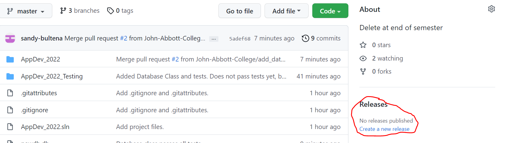

You must specify a tag name (no spaces, version numbers are good)

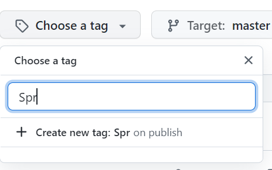


I chose 'V0.001' as my tag.  


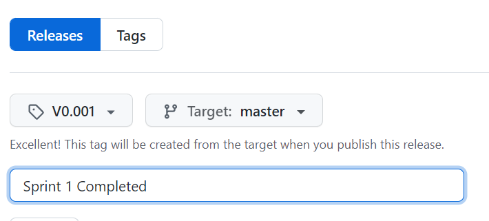

Once complete, you can see that you have releases on the main page of GitHub


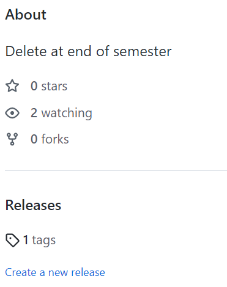

If I click on the tags, I can see that there are 2 Assets.  Basically it is a zip file of your repository at the time that you created the release.

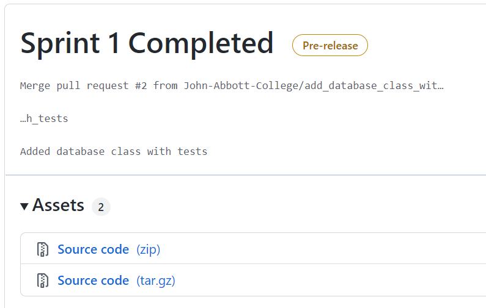


## Inspecting the History

Choose `git` from the VS menu, and then `manage branches`.  You can see how various branches have been merged together.

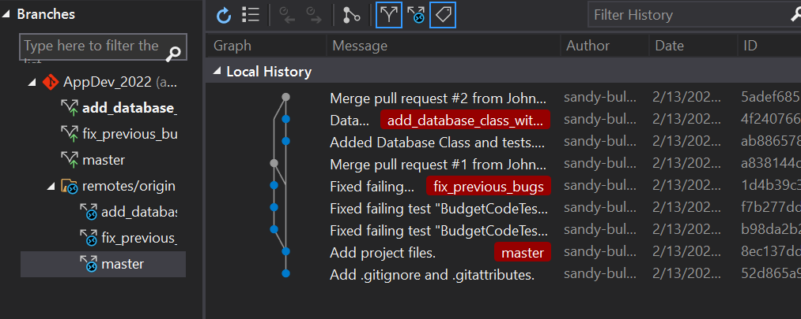


#### Branches
master, add_database, fix_previous_bugs

#### Lines

- **Straight vertical line** → normal commits
- **Line splitting** → branch created
- **Lines joining** → merge commit

Did you notice?

1. `master` should stays stable
2. New work happens on **branches**
3. Changes are merged via **pull requests**
