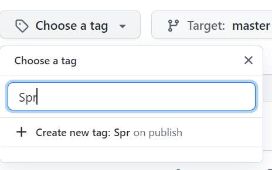

# GIT

[Install](https://www.google.com/search?q=how+to+install+git&rlz=1C1CHBF_enCA938CA938&oq=how+to+install+git&aqs=chrome..69i57j0i512l9.8612j0j4&sourceid=chrome&ie=UTF-8)

> NOTE:  `github desktop` does not work well on Mac (at least that is what Sandy thinks).  If you want a nice interface, try `source tree`.

# GitHub

***Each student*** must have a `github` account

***Each team*** needs to either create or have access to a `github` account, 

***Each team*** must have a *single* repo on `github`, preferably using your team name

***Add***

* all of your teammates to the repo

  Go to settings,

  then choose collaborators,

  click the `add people` button

* add Helen (`hkatalif`) and Sandy (`sandy-bultena`) to your repo 

## Branches

To create a branch on `github`, select the drop-down box that has a *tree* symbol on it.

and then enter the name of a new branch.

### What branches to create?

There are many options, but we (the teachers) suggest either of the following...

* A branch for every team member, or
* A branch for every feature or story

## Merging Changes

### Create a pull request

On GitHub, make certain that you are currently looking at the branch where the changes that have been made need to be merged elsewhere.

If a branch is out of date with another, you should see a pop-up box that looks like the following.  Press the `compare & pull request` button.

Be ***really*** careful that you have chosen the correct direction for your pull request! 

After the request has been made, other members of the team need to review the pull request.  They will be informed that there is a pending pull request by looking at the info on GitHub.

Once the reviewers have reviewed your code (and entered their comments in GitHub where appropriate), then the pull request can be accepted.

## Creating a tag

Your sprint is finished.  The commit ID does uniquely define when your sprint is finished, but that is annoying when you want to just have a snapshot of your repository.

So, create a tag (or release)

You must specify a tag name (no spaces, version numbers are good)

I chose 'V0.001' as my tag.  

Once complete, you can see that you have releases on the main page of GitHub

If I click on the tags, I can see that there are 2 Assets.  Basically it is a zip file of your repository at the time that you created the release.

# Using VS and GitHub Together

## Creating a repo from VS

Assume that you have a solution that you want to store in git.  Also assume that you have modified your `.gitignore` file to ignore all the files that you want to ignore.

From the VS menu, select `git` ->`Create Git Repository ...`

and then fill in the page.  You will have to log into GitHub from this page, so keep an eye out for any web page that may pop up.

Make sure that your choose `private repository`.

## Git branching in VS

Once the repo has been created and pushed to GitHub, then you should see the current status of the repository on the bottom of your VS app.

* The *up arrow* indicates how many local commits are waiting to be pushed to GitHub.  
* The pencil with the 'zero' beside it indicates that you have zero changes in your files from the last commit.
* `AppDev_2022` indicates the name of the GitHub repository, 
* and finally, `master` indicates which *branch* you are currently modifying.

### Switching Branches in VS

After creating branches in GitHub, you now need to switch to that branch in VS.  But, upon looking at the available branches, you do not see your new branch.

Make sure that you are looking at the *remote* branches!

Still not there. What now?

VS is not aware of the changes that you made in GitHub, so you need to update VS.  

The fastest way to do that is to `fetch` the changes (as opposed to pulling).

Now, when we check again, we can see all the branches.

Choose which branch to work on, and verify that the change has happened.

I am currently in branch `fix_previous_bugs`. 

## Committing to GitHub

If you do not see the Git Changes panel, then go to `View` on the VS menu, and choose `git changes`.

At this point, you will see a list of all files that have been modified since your last commit, and a text box where you can insert your commit message.

**COMMIT MESSAGES NEED TO BE CLEAR**, 'fix bug' is not a valid commit message!!!!!

When you commit, your changes are saved locally, they are still not in GitHub (which is ok, as long as you are ok with it).

To push your changes to GitHub, simply click the blue up-arrow in the Git Changes pane.

## Inspecting the History

Choose `git` from the VS menu, and then `manage branches`.  You can see how various branches have been merged together.

