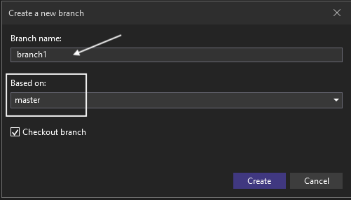
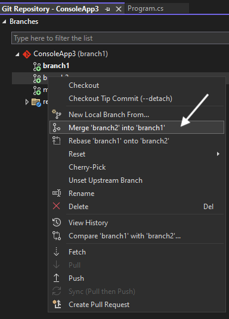
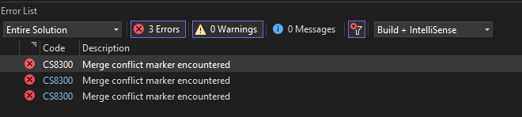
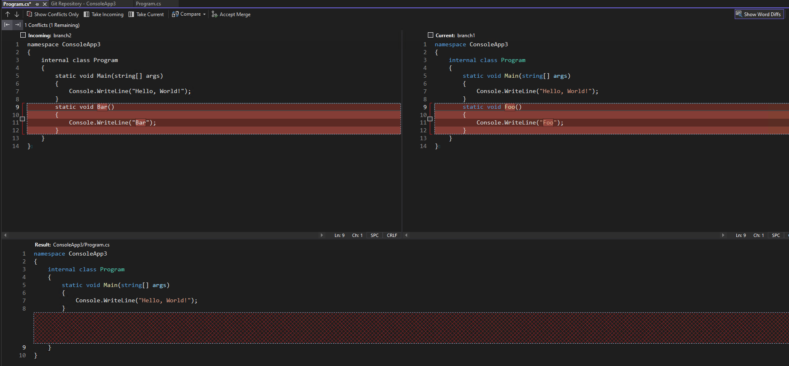
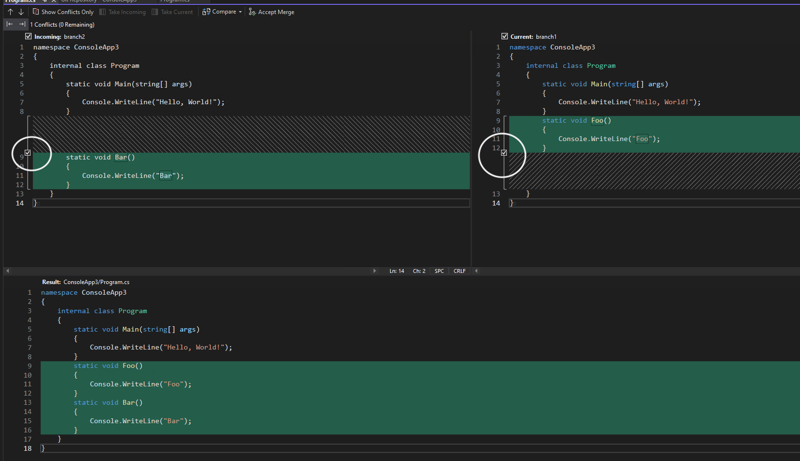

# Merge Conflicts & Pull Requests

## Definition

A merge happens when two separate branches of a git repo have changes made to the same code, and git just does not know which changes are valid.

## When do they occur?

Git tries its best to decipher changes to files, and often can distinguish between two sets of independent changes.  However, if the changes occur within the same 'chunk' , git just doesn't know which change is correct.

## Examples

### Using `merge` in Visual Studio 2022

#### Setup

1. Create a project
2. Add to git source control

​	

3. Create a new branch `branch1` from `main`

   

4. In branch `branch1`, add new class `foo` to `program.cs`

   

5. Stage > Commit > push

6. Go back to the main branch

7. Create a new branch `branch2` from `main`

   

8. In branch `branch2`, add new class `bar` to program.cs

   

9. Commit and push

10. Merge `branch1` into `branch2` in VS.

    

    

   11. Merge conflicts.  Boo!

       

#### What does a merge conflict look like

#### How to fix a merge conflict

1. Decide if you want to abort the merge, or fix it

   

2. To fix it, double click the file you want to edit.  The following will be displayed

   

3. Select the changes you want to keep

   

4. Accept the changes

   

5. Commit and Save

## Pull Requests

1. **Navigate to your repository on GitHub** in your web browser. A yellow banner will often appear prompting you to **Compare & pull request** for the newly pushed branch.
2. Alternatively, you can go to the **Pull requests** tab and click the **New pull request** button.
3. On the "Comparing changes" page:
   - Use the **base branch** dropdown menu to select the branch you want to merge your changes *into* (e.g., `main` or `master`).
   - Use the **compare branch** dropdown menu to choose the *source* branch containing your changes.
   - Verify that the changes shown are correct.
4. **Add a descriptive title and description** for your pull request. Mention what changes you made and why. You can reference related issues using `#` followed by the issue number (e.g., `#123`).
5. Click the **Create pull request** button. If you're not ready for a formal review, you can use the dropdown to select **Create Draft Pull Request**. ![GitHub Docs](data:image/png;base64,iVBORw0KGgoAAAANSUhEUgAAAGAAAABgCAYAAADimHc4AAAQfklEQVR4nO2deWAUVZ7HP9U5yZ1ADiABREhAIAQQ2HALoiIznqh4LKiIeLGoiKisIKDOBGVG1sUFlMX1WhXXUUYQAUFUjuGIEZwlBMMRkJADyH11ut/+UdVNdSfd6eN10mH2+1fVq+r3Xv9+9a7fqeDHEEIEA4nAFUAq0Aford13BqKBIMAIlAOFwAngGJAL5Gn3RYqiNLR2/12B0tYd0EMIEQVkADcC01CJLAuFwHvAJiBHUZQKiXW3XwghEoQQDwghjojWxRGt3YS2/P9tMgK0qWU88Aow2OF7Zqgqb+D8uTqKTlVTeKqaooIaSs7UUHGhgZrKRowNJoKCAwiLDCSqYzAJyWEkpoST1D2MpO7hxCWFEhEdjGJw2qVsYAGwvbWnqlZlgBAiGpgBLG/uudkMxadryD1wnn1bzpF/uExa273SYxh6XWf6DIkjISUMg2OGzAXWKopSLq1xJ2gVBmhz+xxgif0zsxkKciv48a+/8cOXZ1qjOwCMvjmZUb/vSrc+UY6YsRBY4eu1wqcMEEIEAA8Ab9s/q7zYwO6NZ/n8rWO+7IJLuPXR3oyY3IWouODmHs8E1imKYvJF2z5jgBDiamAnEKYvLz1by5dr8tm3pdBXTXuModcmcfOsXsR37WD/qAYYqyjKAdltSmeAECIEdXGdqy8vK6nnf1Ye80vC2+PqCUnc/kRv4hJD7R8tBxYoilIvqy2pDBBC9AEOoR6OAGhsMPPNhyfZ8Ha+zKZaBZPv78mk6VcQFGKzSBiBdEVRcmW0IY0BQoi7gI/1ZfmHy1k2a5+sJtoMc1deTeqgWPviqYqifOJt3V4zQAihAH8A5lvKTEbBX1b/ytaPTnpbvd9g3G0pTPmXVIKCbUZDFvC8oijC03q9YoB2oFoP3GQpO3+ujj88+Dcqy/xS9OIVAoMMLPogk4QUm33FBuAOTw9wHjNACBEG/IDuJJuXfZHlT0jfKPgdZi8fRP/MTvqibGC0oig17tblEQM04h9ElU4CsOfrQt5d+osn1bVL3D23D+NuT9EX5QJD3GWC2wzQpp096L78rf99is/ezHO3qnaPyff35KaHr9QXZQOZ7kxHzkVUdtAW3PXoiP/1eyf+IYkPsPHd43z27zYn+cHAeo1OLsEtBqDudqwL7raPC/hi1a9uVnF5YetHJ/lytc0Z5yZUOrkElxmg7fOtW819W86x/t+Ouvrzyxqb/us429ef1hfN1+jVIlwaKtoJ94jl/tdDZbz2yH63OvmPgMeXZZA+Kl5f1LelE3OLDNBkO5Vo4oWyknrm3/y9N/28rLH4oxEk9Qi33BqBSGeyI1emoFfQiG82if//8lvAont201BnlVwHodLPIZwyQBMpW6WaG9cdp7Sw1ts+Xvb48DWbWWeuRsdm4XAK0pQpFWjy/IKjlbzywF6POzV9QT+GXJOI0WimvLSe/MNl7Fh/mrMnqjyuUxZi4kOZeHd3UgfFEpsQQlBIAGePV5H1sOeCxNnLB9M/s6PltgaIak6p44wBD6FpskyNgieu+RazyWOZE699NbZZjVP5+QZ2fn6ajeuOe1y3p7h2ancm3NWtObk/jUYzj4/91qv6V2wdT2h4gOV2pqIo79i/0ywDNB2uVSm9/dMCPnnDuy3nql0TUZws+VXlRj594yh/+8axwiYqLpiU1Cjiu3QgIjaY0A4BGAIVzCaBsd5MdYWRC0V1FJ6sptDJyMoYm8C98/o6UkFaMXfSTqrKPRcqjr+jG3c9laYvirbXMQc6+O0cy0VVmdFr4scldXBKfICI6CAeXNSfIRMSeevZHGLiQxl3ezJ9ru5IQnIYYRGBLZmWNEFDvZmykjpOHangwLdF5HxfzEOLBzB0YpJLv++VHkPOD8XuNarD9vUFjJuSQuIl6ekcYKn+nSZk0UxHrPYgH/8plx2fnbZ/zS30z+zE7OWDXH6/trqRDuGOvg3PYTYJDAGui7/Wr8hj2yenvGozdVAsc1farMExepOX5r6pGZaL8tJ6r4kPEBnrfKjbwxfEB9wiPkBohPf9yPvpImeOVeqLZuhvbBigSTqtRlObPzjpdQcADAa/MkF1HZ7vOWxgN4Uv1+gMNB0B4y0XtVWNbP+0QEoHaqsapdTT2qipMkqpJ++ni5SetTk/WelszwDrqe3At0VSGgcoOu22osgvUFwgr9/bPrb5mK10tjJAsxK2yvk/yPpfaY3/ll/Z8kt+iCP7z0ura8dnBRjrzZbbwRarbP0ImGy5KDxRLa1hC6rK5Qzn1kJtdSMmLw6ezeFo9gX97WSwZcCzlou9m+Vbr53KbV/+EKW/yZd5bfnIZkv7LGgM0E6+qoJdwOb3T0hteOytKfQb3rHlF/0IKamR3PNMX6l1Hj14QS8p7SOEiLKMgAxL6YWiOqmNAkyZ3Vt6na2BsbcmE98lrOUX3cCpXJv1MMPCgBstJcd+vii1wZlL0gkODWj5RX+EAo/8caDUKnO+txFt3GhhwDRLyYFt8rafAIPGtakLltdI7hVBj6uipdW383MbycI0g3YqU70RBRzaVSKtsdse601AYDs9Betw++PyplBjg5n6Gus60NmA6ocLQI3kE6urUkd/x5UDYqTWp19nDahOzwBcLJa7ADen6GiPCAhUGDg6vuUXXYReC2hA9UAHoEji0Xvk77pKq8sfMGS8vNFccPTSTsiAzsD23Cl5J+C+Q+Ok1eUPSOkdKa2ugqOXDqUG1NgLAJwrkMcAOxv6do/oju7pNJzhdJ7tCLCuASVn5E1BEdHyOuwPkHmW0TuvGNAFxCgrkeb8R2BQ+99+6iFbqSQ0OZ8BNeQLIFdiKVuS2NYwC7n/R5jV+gzoXEp18mqv0VAnry5/gMkomQG6EWD97N1VWjtDWYl8oV5borrSN/oMAzoDrNAweQuNfq97OUCmehKw2kkZUCNJAe6bjzjDz14YNPkj7LRZXsOyqBtQY6oB0KlLkyAVHuPXQ2U0Nlw+68A3kkx0rNCNAKuXWWK3cAdve4b8w60S88jnKD1bi9ksbxHuckWE9dqA6t8KQFJ3uafXr9a2vwAdzWHn53IDSXVLuyTWMKCGdgQgSfIIyMu5SPGZ9u3QUVPZyBbJMS+6pUVZr23XgKaBirzGhxLti9oCG/9Tvt9Cci/bEWDVQUbFhUhvLPfgBX7ZK8/AqTVxOq/Sa+vo5pDY7dJUb9Dc6gtBld/4Qony5tPZVFxoX9FT6mpMvHy/5y5ZzqBzDCm0KOXfs5RkTu7ik0aXzdqPsZ1sS80mwcpnfvJJ3VcOiNFLHN6zMGCTpWSAbRgWaSj5rYaV83JolCxTkQ2zSfDOosPk5cg1z7Egc5LNB77JwoAcS0nXXvI0P/Y4sv88rz+2n9pq/zRXr6sx8ec52RzcLtc0R4++w2w0hTkGAM1xLBcgOMRA2hDfqRNP/L2cJyfu4OzxtndP1ePMsSrmXLudPMkiB3t06mzdaeYqilKhN85dZrmYOLW7TzsBsPi+PWx+/2SbT0kNdWa+XJ3P0ul7fN7W5Ad66r3yloHuVrNXL1I7ZWL2+O0+75AFD7+cTsaYhFY14qqvNbFvyzmpfhAtYemnI0lItm5BExVFKbZ6oSmKUiyEyAYGB4cGMPJ3Xdn11W8uV96lZwRJ3cL5ZW+p3gLYJaz510OAGkJ42HVJPrMnMpsEZ49X8/0Xp9n5l9aLUw2qpFlH/GxFUYrBzk1VCHED8DVA4clqXrpnd4sVj7klmSmzUwnpcEmXUHmxgU3vnmD7es99zCbe3Z2+wzrSuUc4kTHB9sFTXUJVmZGLxXWcOlpBzs4SDu+WZ3bpLh5+OZ0h461GiJMURdkMTRkQDFg184vv3dNiLIdHXh1I2pA4wiKbunQe2lXKynne76cjooN5feNYtxy1hRmyZu3jxN/9QyK78rsJBF6KORpiiStn85e0Qmt0lHvnt+ygsOqFn3nq+h0smPIj507Zao3SR3Zi3n8M9arjid3CefXzUW57ySsGmL9mGOPv6OZV+zJw55NpeuLP1Qf1a+5vrbVc9EqPIb6rayLq0rO1LLp7V5PtZa+BMR57msQlhrJg3XCb6c0dKArc9VSafYzPVseo39uYaa7V3zRhgOZGv9ByP3PpALcaW3zfniZRVcbelsw/TXJPxBERHcTC9zM9Jr4eM15y7z/IxH3zr9L/h4X2mTkcDewVlovufaLIGOOek8XhXaVNyv75uauITXBtdxOXGMrST0fRQUKoAICwyEDp/l6uYoStbG2F/fNmGaCdjGda7u+d517n31l0uElZYJDCwvczbZQRzaHv0I4s/nhks4u6Nxh+g8yMWK7hmbeG6s82M5tLh+JsaVuHGumJqI7BTF/Qz+WGG+pN5B9qmoAnLDKQ598ZxrQXmtYV3SmEWa8O5MkVgwn2YMvZEkLDAhg4uvXcpYZf35neGVbHjhpUejaB06OnFuvMGqVv2az9Lmc2iokPIevLMY7rNkNdTSP1tSZCwwOl2iQ5QvZ3xax+4WeftwPwxtZr9FFfhjpKf+L0U9N+ZI2e8qgbHoNlJfVO400oBugQEUhMfEirEB8gxYeSXj3mrRqqJ/5yZ7lnXBnrC9DMFyNjg3nGjX392y8ekmpx7S2iJNr4O8Jtj/WmV7p16jGi0s8hWmSAFnQ03XLf2819/ZJpe6iv9UkGKLcRECh/bdEjfWQ819/Xw6aopYQ/LvVIC7871XI/9rZkJtzp2gmzutzIS/fsptoPgnUYfDjTRXcM4eGX0/VFU11J9OPyJ6ElrMmy3N85J00vXHKKC0V1PD3pOw79WIJkM3u/waIPMvUCwyxXE/y4JYDX4uJ/gRbC3myGVc//7LYh7pTZqfQb3omYTiHWTtfVmCgqqGb/1nNUVxh5aIn806vZLHh01Dbp9S7bMIboTlaTng3ALa4m9vE6g4bZDOuW/CI1QdvQa5PaDQOyNowh5hLxfZtBA6wS09FoOmSDAWa81N9+8bnsEZsQyp++Hqcnfi5qIh+3DKA82hZoiWqGoHIcULdf7pyW2zMGjopn6ScjCY+2endl40ECH/CQAWBlQibqnAeogqfn1w73tMp2gdsfT+WxZRn6BXcD6rTjkQuNVxtjbbjdgm531KNvFH/+5hqpsRX8BfPXDOO6e20sRrJQF1yP7S69PpkoiiIURXkO3TkhLDKQx7IyePSPGU5+2X4wYnJXVmwbT8/+NnGDpiqK8pw3aQxBAgMs0Pa9fdF5XWaMieeNLdf4hVpQhXubvsAgA/PXDGP6gqv08iojam4YrxN5gkQGgPXEHIlOgNchIpC7nkrj5fWjGDDCtWnJV1G2DAbo2c+16FcPLuzPmzsm2H/1y1FzwkhJZQttkFG76HQNf307n/3bzjn87esbxxEZG+TwuTfI3lHM6gWORdLTX+jHsOuS9Ep0aE8ZtfVwllO+qszI3s2FNrnIUlIjmfXKwOZSikuFfUKKHldFc8usXqQNjm3OWd2nOeVbBUKIKCHEi8IBGupMouJig6PHPoHZLER5ab0wNZodvfKiUOOpXj4QQkQLIZ5uNSp7hqeFmsTi8oUQIlgIcYMQ4mDb0tqKg0Ltz+UV5MgVCCEShBAPCCGOtDLRj2jttmlgU7+KqiTUOTcDNZLvNHTBpCSgENUXbhOQ05yJSFvg/wAETg8FpkFJEAAAAABJRU5ErkJggg==)GitHub Docs +5

Once created, other developers can review your changes, leave feedback, and ultimately approve and merge the pull request into the base branch. 
