# Git Merge Conflicts in Visual Studio

## Definition

A merge happens when two separate branches of a git repo have changes made to the same code, and git just does not know which changes are valid.

## When do they occur?

Git tries its best to decipher changes to files, and often can distinguish between to sets of independent changes.  However, if the changes occur within the same 'chunk' (I believe git uses the bash 'diff' command to see changes), git just doesn't know which change is correct.

## Examples

### Using `merge` in VisualStudio 2022

#### Setup

1. Create a project
2. Add to git source control

​	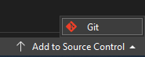

3. Create a new branch `branch1` from `main`

   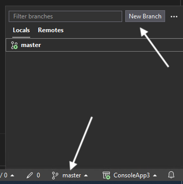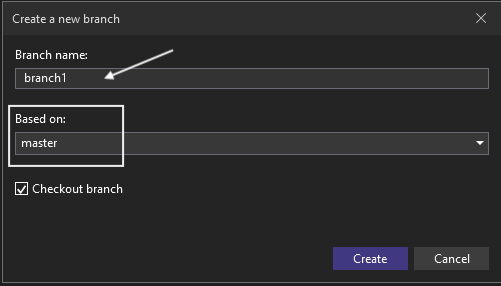

4. In branch `branch1`, add new class `foo` to `program.cs`

   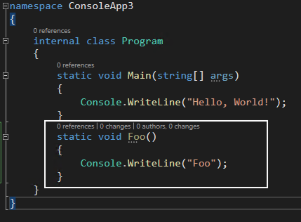

5. Commit and push

6. Go back to the main branch

7. Create a new branch `branch2` from `main`

   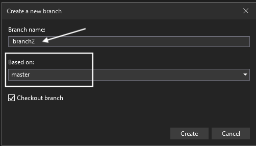

8. In branch `branch2`, add new class `bar` to program.cs

   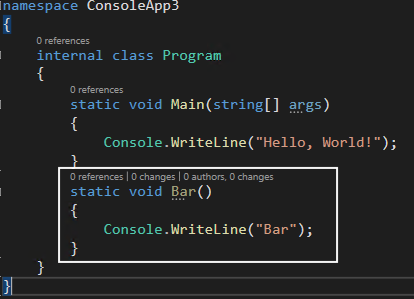

9. Commit and push

10. Merge `branch1` into `branch2` in VS.

    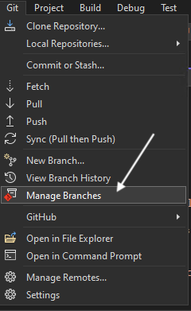

    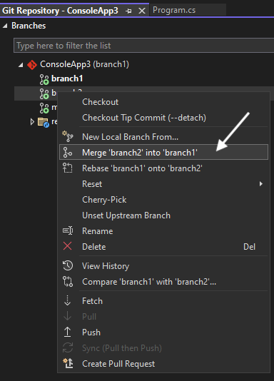

   11. Merge conflicts.  Boo!

       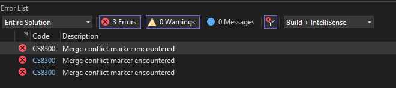

#### What does a merge conflict look like

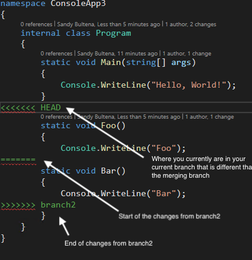

#### How to fix a merge conflict

1. Decide if you want to abort the merge, or fix it

   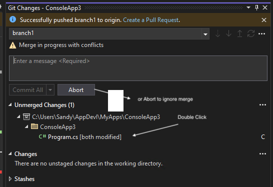

2. To fix it, double click the file you want to edit.  The following will be displayed

   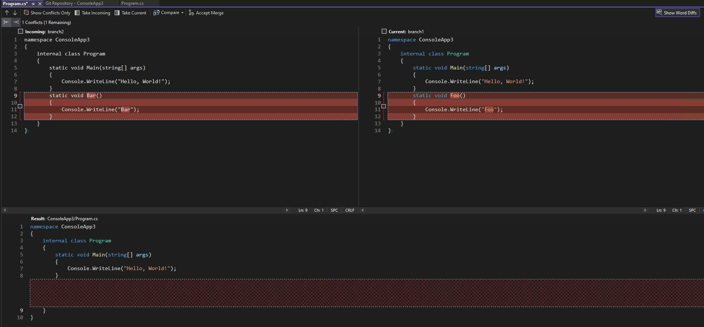

3. Select the changes you want to keep

   

4. Accept the changes

   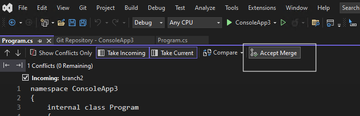

5. Commit and Save
