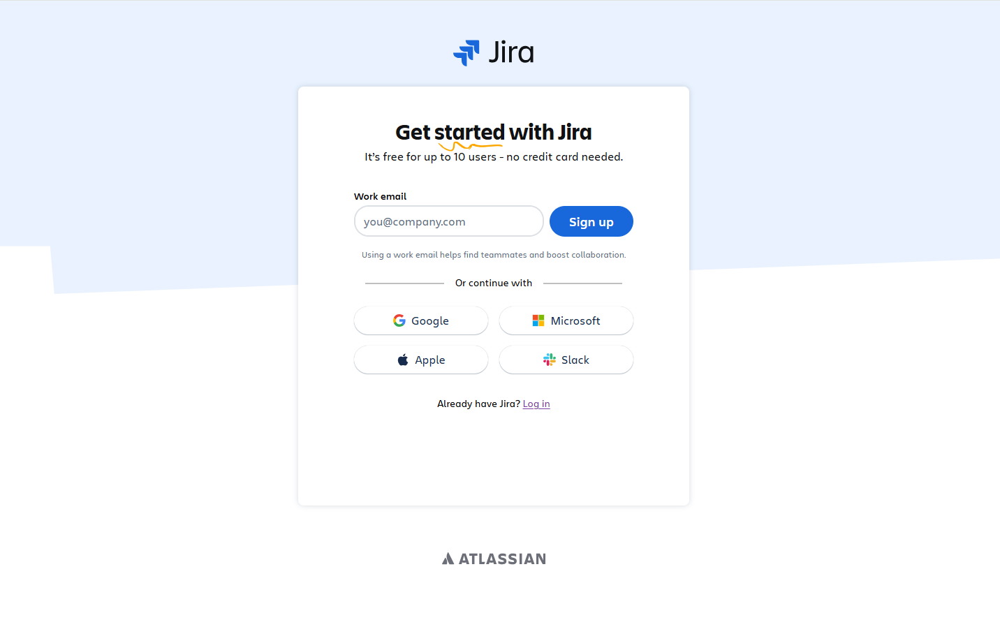

# JIRA - Scrum project management software

## What is JIRA?

JIRA is a widely-used industry tool for software project management

https://www.atlassian.com

## Create a JIRA account (<u>**ONE team member**</u> per team)

Create an account using an email address. You could use your JAC email address or any other one (you will need to access your email to confirm your registration).

1. ONE PERSON PER TEAM: Select Get Started

   

2. ONE PERSON PER TEAM:  Enter the email address you would like to create an account with (need to be able to access the confirmation email) and select Sign up.

   

3. ONE PERSON PER TEAM: Access your email and confirm your registration, creating a password.

4. ONE PERSON PER TEAM: Once confirmed, select Jira Software and create your team site! Use this site name format (use only lowercase letters, numbers and hyphen):

   ##### **jacappdev1-2026-yourteamname**

   

5. Choose Software Development for the kind of work you do:

   

6. You could choose the options that make sense for your team plans to use JIRA.

    

7. Set project name to CalendarApp > Get started

8. Select types of work you need like Story, bugs, Task

    

9. On How do you track Work page, leave the default option => Choose Finish.

10. Choose the ... next to your site name => Add People to add the email addresses of your **teammates** and **BOTH** teachers:

    meghrig.terzian@johnabbott.qc.ca

    helen.katalifos@johnabbott.qc.ca

    

10. In the backlog view, choose view and turn on epic panel.

    

11.  you can create epics

    

12. and stories

    

13. add details to stories

    

14. add stories to epics

    

15. Click on a story to edit it: associate it to an epic, set the story points, add a description with acceptance criteria.

    

16. Fill in your backlog!

17. After a sprint planning meeting, create a sprint.

18. closing?

