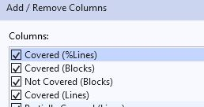
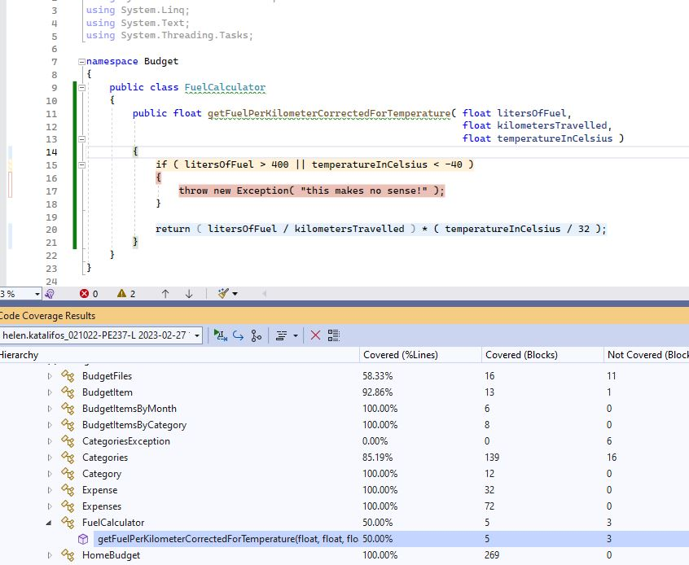

# Application testing and Code Coverage

Testing is crucial to verifying that your code base works as intended and that it is robust. 

### Unit testing

* Narrow scope
* Testing an individual unit of code, ideally the smallest testable piece (method or class)
* No dependencies on any outside systems. You are testing the internal workings of this unit. You do not care how it interacts with anything else.

### Integration testing

- Testing the interaction between components of the system.

- Normally done once there is assurance that each individual component works properly - i.e. they are each well unit tested.

- You are verifying that your code behaves nicely with other code it is using.

- Test environment resembles production.	

  

  Integration test: you test with the actual instance of the database, test against the actual server. 

  ​                                                                     VS	

  Unit test: you mock the other components to only test the behaviour of the one unit.

### Regression testing

- Verify if any new bugs were introduced in the system after it was changed. 

- Good practice to add regression tests for bug fixes that feel unsteady (easily reintroduced)

- You run your regression tests to make sure all existing functionality is still as expected.

  

  Wikipedia - good description of ways changes cause unexpected bugs:

  *“As software is updated or changed, or reused on a modified target, emergence of new faults and/or re-emergence of old faults is quite common. Sometimes re-emergence occurs because a fix gets lost through poor [revision control](https://en.wikipedia.org/wiki/Revision_control) practices (or simple [human error](https://en.wikipedia.org/wiki/Human_error) in revision control). Often, a fix for a problem will be "[fragile](https://en.wikipedia.org/wiki/Software_brittleness)" in that it fixes the problem in the narrow case where it was first observed but not in more general cases which may arise over the lifetime of the software. Frequently, a fix for a problem in one area inadvertently causes a [software bug](https://en.wikipedia.org/wiki/Software_bug) in another area. Finally, it may happen that, when some feature is redesigned, some of the same mistakes that were made in the original implementation of the feature are made in the redesign.”*

  Note: All this testing is increasingly automated. 

## Code Coverage

The degree to which the source code of a program is executed when unit tests are run.

Depending on the unit testing framework used, metrics could be provided to indicate which functions are run, which statements are run, and which lines are run by the unit tests. 

Information on which conditions or branches of control statements are executed could also be provided (in if and case statements, for example).

#### Code coverage in Visual Studio Enterprise 

*note, code coverage functionality is not provided in base VS*

After performing a run of your unit tests, you could trigger a code coverage analysis run (Test > Analyze Code Coverage for All Tests):

The code coverage results will appear in a tab:

An interesting metric is the % of lines of code that are executed. 

You may need to add this column to your Code Coverage Results View.

At many companies, maintaining a minimum code coverage % is required. In fact, some teams set up their systems to block commits automatically if they lower the current % covered by the unit tests. 

!! **<u>Careful</u> !!**

Code coverage does NOT guarantee full testing or good code.

Remember, just because a line of code is considered covered with respect to code coverage, does not mean that it has been fully tested, it may not have been run in all possible code paths or situations that should be tested.

Consider the following method: 

    public float getFuelPerKilometerCorrectedForTemperature( float litersOfFuel, 
                                                             float kilometersTravelled, 
                                                             float temperatureInCelsius )
    {
        if ( litersOfFuel > 400 || temperatureInCelsius < -40 )
        {
        	throw new Exception( "this makes no sense!" );
        }
    
    	return ( litersOfFuel / kilometersTravelled ) * ( temperatureInCelsius / 32 );
    }

And the unit test that tests it:

    [TestMethod]
    public void Test_getFuelPerKilometerCorrectedForTemperature()
    {
    	//Arrange
    	FuelCalculator fuelCalculator = new FuelCalculator();
    
        float litersOfFuel = 20;
        float kilometersTravelled = 4;
        float temperatureInCelsius = 30;
    
        //Act
        float fuelPerKilometer =         	
        	fuelCalculator.getFuelPerKilometerCorrectedForTemperature( litersOfFuel,
        															   kilometersTravelled,
                                                                       temperatureInCelsius);
    
        //Assert
        Assert.AreEqual(4.6875, fuelPerKilometer);
    }

The current unit tests are inadequate. The code coverage analysis shows 50% coverage:

Adding the following test, brings code coverage to 100%!

    [TestMethod]
    public void Test_getFuelPerKilometerCorrectedForTemperature_litersTooBig_exceptionExpected()
    {
        //Arrange
        FuelCalculator fuelCalculator = new FuelCalculator();
    
        float litersOfFuel = 500;
        float kilometersTravelled = 4;
        float temperatureInCelsius = 30;
    
    	//Act
    	try
    	{
    		float fuelPerKilometer = 	
    	  	 fuelCalculator.getFuelPerKilometerCorrectedForTemperature(litersOfFuel,
    																   kilometersTravelled,
    																   temperatureInCelsius);
        }
        catch
        {
        	Assert.IsTrue( true, "Liters beyond maximum threw exception");
        }
    }

This is misleading!

The tests are not testing all the logic! For example, they do not ensure that:

- an exception is thrown when the temperature is too small (control statement alternate flow)
- that edge cases are handled - what if the km travelled is 0?

Additionally, code quality is not ensured:

- the public method is not documented
- naming conventions could have not been followed (they are here, if you like Helen's style of naming)

It is your responsibility to make sure that your code is properly tested in unit tests by adding tests that test:

- all possible logic flows in the expected use of the method
- all possible cases where things could go wrong: edge cases
- intentional misuses of your method (security risks)

To remove the code coverage highlighting in the code:

