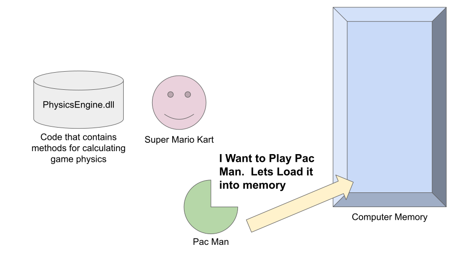
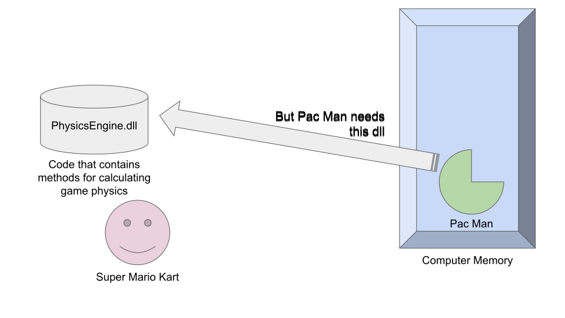
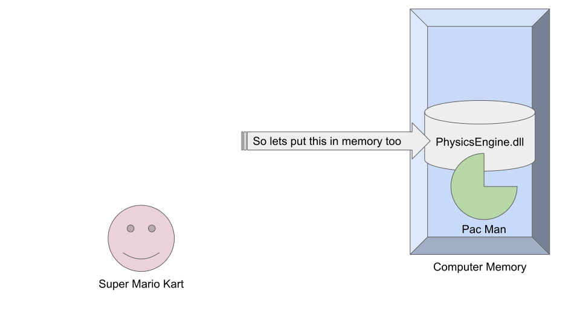
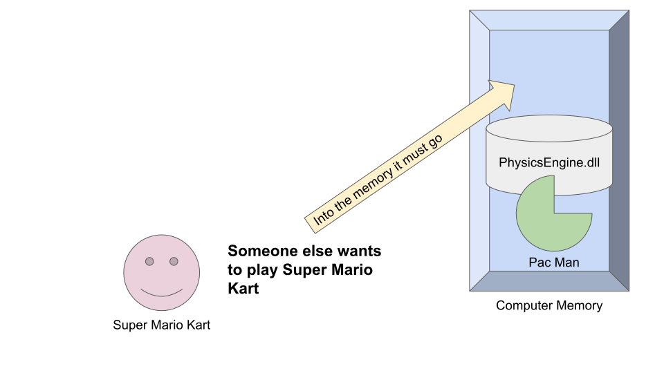
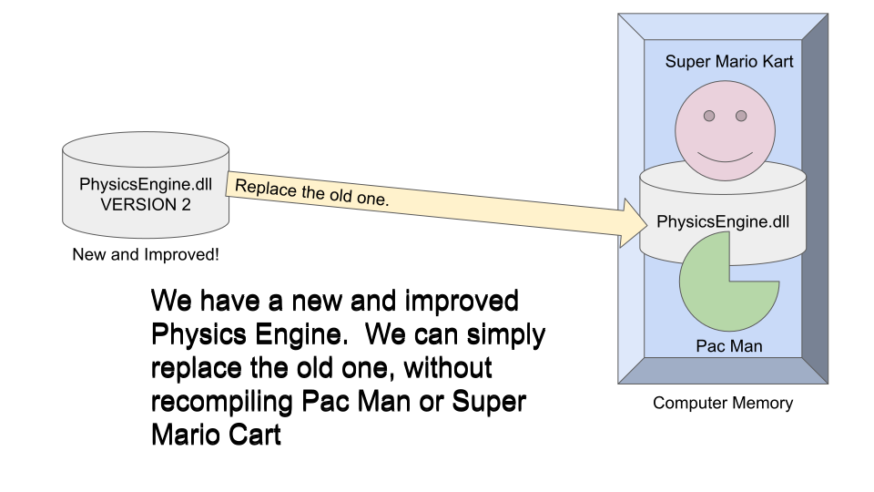

# Dynamic Link Libraries (DLLs)

“Friends share all things.”  *Pythagoras*

## What is a DLL

Very briefly…

* A dll is a piece of code that cannot execute by itself
* If another program (executable) has been properly instructed to use a particular dll, the program can call functions which are coded in the dll
* A dll library will be loaded into memory when needed, and can be used by many different programs at the same time.

## Usage

---

---

---

---

---

---

## How to Create a DLL and How to Use a DLL

Watch the following video. [video]https://drive.google.com/file/d/12m0R_LVVs5DNoCYq5DfPApCz0XCz_vfG/view?usp=sharing

There is no sound track (other than the sound of clicking keys), so you can watch with the volume turned off.

The audio was giving me trouble, so I went with the silent version.

Is is slow moving, but I want to show everyone what's going on.  Watch it carefully!

