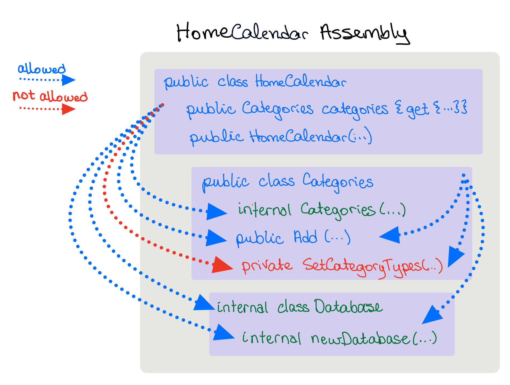
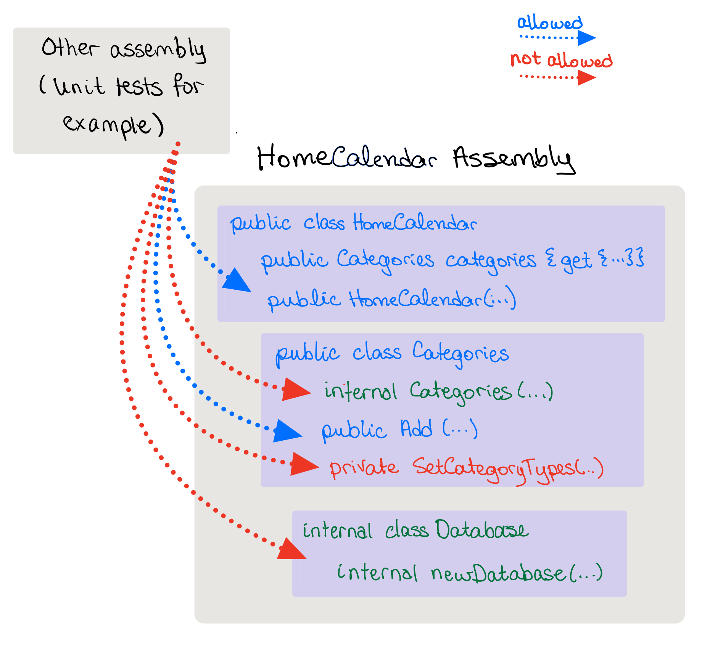

# Access Modifiers

> Though a hundred crooked paths may conduct to a temporary success, the one plain and straight path of public and private virtue can alone lead to a pure and lasting fame and the blessings of posterity. - *Author: Edward Everett*

## What are access modifiers?

In object orientated programming, the *scope* of a class, property, or method is determined by specific keywords, called **Access Modifiers**.

 These keywords are prepended to the class, property or method name.

### Allowed Access Modifiers in C#

**[Reference](https://www.c-sharpcorner.com/uploadfile/puranindia/what-are-access-modifiers-in-C-Sharp/#:~:text=Access%20modifiers%20in%20C%23%20are,accessible%20to%20the%20assembly%20only.)**

| Modifier           | Description                                                  |
| ------------------ | ------------------------------------------------------------ |
| public             | There are no restrictions on accessing public members.       |
| private            | Access is limited to within the class definition. This is the default access modifier type if none is formally specified |
| protected          | Access is limited to within the class definition and any class that inherits from the class |
| internal           | Access is limited exclusively to classes defined within the current project assembly |
| protected internal | Access is limited to the current assembly and types derived from the containing class. All members in current project and all members in derived class can access the variables. |
| private protected  | Access is limited to the containing class or types derived from the containing class within the current assembly. |

#### Example

In the following example, the class `HomeCalendar` is **public**, as well as the property `Categories`, whilst the backing fields `Categories` and `Events` are **private**.

```csharp
    public class HomeCalendar
    {
        private Categories _categories;
        private Events _events;

        public Categories categories { get { return _categories; } }

```

## Summary table

**[reference](https://docs.microsoft.com/en-us/dotnet/csharp/programming-guide/classes-and-structs/access-modifiers#:~:text=Class%20members%2C%20including%20nested%20classes,from%20outside%20the%20containing%20type.)**

> An [assembly](https://docs.microsoft.com/en-us/dotnet/standard/glossary#assembly) is a *.dll* or *.exe* created by compiling one or more *.cs* files in a single compilation.

| Caller's location                      | `public` | `protected internal` | `protected` | `internal` | `private protected` | `private` |
| :------------------------------------- | :------: | :------------------: | :---------: | :--------: | :-----------------: | :-------: |
| Within the class                       |    ✔️️     |          ✔️           |      ✔️      |     ✔️      |          ✔️          |     ✔️     |
| Derived class (same assembly)          |    ✔️     |          ✔️           |      ✔️      |     ✔️      |          ✔️          |     ❌     |
| Non-derived class (same assembly)      |    ✔️     |          ✔️           |      ❌      |     ✔️      |          ❌          |     ❌     |
| Derived class (different assembly)     |    ✔️     |          ✔️           |      ✔️      |     ❌      |          ❌          |     ❌     |
| Non-derived class (different assembly) |    ✔️     |          ❌           |      ❌      |     ❌      |          ❌          |     ❌     |

**Example**: `System.Data.SQLite` assembly.

Any class within the `System.Data.SQLite` code that has been declared `public` is available to us, 

* `SQLiteConnection` is a public class.

Likewise, only `public` methods of the `SQLiteConnection` connection class is available to HomeCalendar.


## Special Circumstances

**[reference](https://docs.microsoft.com/en-us/dotnet/csharp/programming-guide/classes-and-structs/access-modifiers#:~:text=Class%20members%2C%20including%20nested%20classes,from%20outside%20the%20containing%20type.)**

### Classes

*default*: `internal`.

*allowed* : `public`, `internal`

If a class is defined as `public`, any code, even if it is not part of the current assembly, has access to that class.

If a class is defined as `internal`, only code within the current assembly has access to that code.

### Interfaces 

*default*: If not specified, a class will be assumed to be `internal`.

*allowed* : `public`, `internal`

* Interface members are `public` by default because the purpose of an interface is to enable other types to access a class or struct. 

### Enumerations

Enumeration members are always `public`, and no access modifiers can be applied.


# Access Modifiers in HomeCalendar

While developing HomeCalendar, we wanted to ensure that it worked properly. 

To do so, we used Xunit tests, *which is a **separate** assembly from our HomeCalendar*!

TO ENABLE UNIT TESTING, WHICH IS A SEPARATE ASSEMBLY, ALL THE CLASSES AND METHODS WERE DECLARED PUBLIC.

**THIS IS NOT GOOD!**

## Deciding on the Proper Access Modifiers for HomeCalendar

Ask the following questions:

1) Which methods are *necessary* for a gui app to have access to?
2) Could leaving a particular method as *public* cause any problems?

**Example:** Consider the following

```csharp
// NOT realistic code
myHomeCalendar = new HomeCalendar("abc.db");
var e = homeCalendar.Categories;
var c = new Categories(Database.Open("def.db"));
c.Add("whatever");
```

​	Would the `whatever` category be part of the HomeCalendar? 

* Maybe?  depends on how it is coded behind the scenes

​    Would we *want* someone to be able to do this?

* I certainly would not.

### Categories class - which Access Modifier?

What if we make `Categories` an *internal* class?

* Then we could not use the `homeCalendar.Categories.Add` function.
  * fix: Create a method `homeCalendar.AddCategory` method that takes care of it for us, and make sure that `AddCategory` is *public*

What if we make `Categories` a *public* class?

* Then the user could create their own `Categories` object, and really make for some confusing code.
  * fix: Make the constructor for the `Categories` class *internal*, thus `HomeCalendar` class methods can use it because it is part of the same assembly, but an external assembly could not.

### Database class - which Access Modifier?

Questions: 

* Does the user of our code *need* access to the database directly? No!

* Do we want the user to have direct access to our database? No!

  * Why not?

    Because we want to *hide* our implementation of data storage from everyone else (this is called encapsulation). 

    Whether or not the data is stored in an XML file, or in an SQLite file, the API interface (the part of the code that you can call or use) should remain the same.


#### Internal access privileges

It is what one would expect, where anything that is `public` or `internal` is available to all code, and `private` is restricted to the class where it was defined.



#### External access privileges

This is a little more complicated.

The external *assembly* ...
* cannot create a new `Categories` object, because the constructor is `internal` (hence no one outside of the HomeCalendar assembly can access it)
* but, it can access the `Categories` methods

How does that work?
Well, the HomeCalendar class creates the `Categories` object, which then can be accessed via the HomeCalendar object.

```csharp
var hb = new HomeCalendar(...);
hb.Categories.Add(...);  // allowed, because 'Add' is public

// not allowed, because the constructor is internal
// var cat = new Categories(...); 
```



## How to test `Internal` Classes

If the class is `internal`, then by definition, another assembler (such as unit tests), cannot access that class.

The fix: (I think this works for both `debug` mode and `release` mode, but have not tested in `release` mode)

Add this to your HomeCalendar code.

> NOTE: `HomeCalendarTesting` is the name of *my* project for testing.  Modify the code below to use the name of *your* testing project.

```csharp
using System.Runtime.CompilerServices;
[assembly: InternalsVisibleToAttribute("HomeCalendarTesting")]

```

