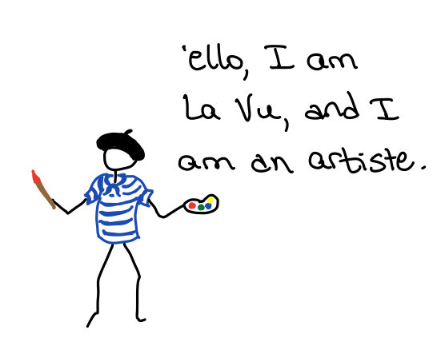
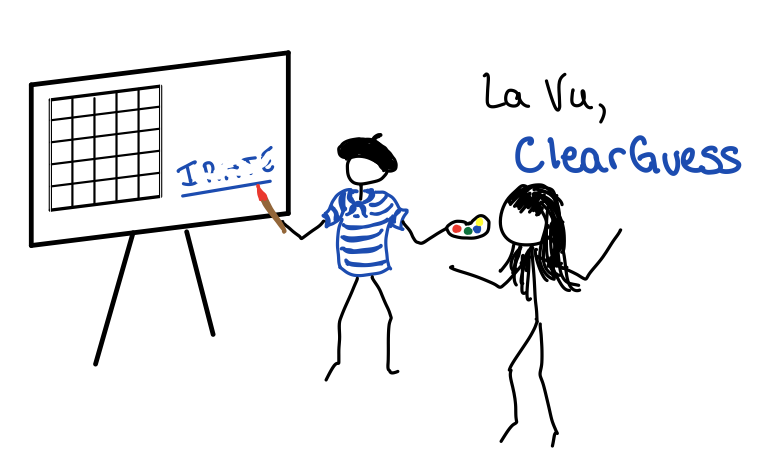

# MVP Wordle Game

## Introductions:

### La Vue



"I will create the game board for you.  It will look beautiful."

"My toolset will include a lot of `TextBlock`s and `TextBox`es, among other things"

```csharp
results = new List<List<TextBlock>>()
{
  new List<TextBlock>(){tb00, tb01, tb02, tb03, tb04},
  new List<TextBlock>(){tb10, tb11, tb12, tb13, tb14},
  new List<TextBlock>(){tb20, tb21, tb22, tb23, tb24},
  new List<TextBlock>(){tb30, tb31, tb32, tb33, tb34},
  new List<TextBlock>(){tb40, tb41, tb42, tb43, tb44},
  new List<TextBlock>(){tb50, tb51, tb52, tb53, tb54},
};

  userinputs = new List<TextBox>()
{
  one, two, three, four, five
};

```

"I will need someone to help me with the logic of the game, because as an *artiste*, I do not concern myself with logic, only beauty"

### Pria Centre


"I am the boss, because I am good at making decisions, and I know how the logic of the Wordle game works."

"Unfortunately, I do not know a lot of english words, so I will need some help"

### Mo Dell


"I know a lot of words, "

```csharp
public readonly List<string> wordlist =
  new List<string>()
    {
      "beast",
	  "beats",
      "began",
      "begin",
      "begun",
...
```

"and I know if something isn't a word, "

```csharp
public bool IsValidWord(string word) { ... }
```

"and I know if the a letter is in the wrong or right place"

```csharp
public bool VerifyLetterInPosition(string c, int pos) { ... }
public bool IsLetterInWord(string c) { ... }
```


### Yu Sir


## Putting the Pieces Together

**La Vue** asks **Pria Centre** if they will be willing to work together.

**Pria Centre** says "Ok, but you will have to sign a contract.  I am very particular about how I do things, and you need to do it the way *I* want to do it".


```csharp
    public interface ViewInterface
    {
        void ShowError(string msg);
        void ClearError();
        void ClearGuess();
        void SetCharacterValidInPosition(string c, int row, int column);
        void SetCharacterValidNotInPosition(string c, int row, int column);
        void SetInvalidCharacter(string c, int row, int column);
        void GameWon();
        void ShowAnswer(string answer);
        void EndGame();
        void Refresh();
    }	
```

```csharp
// by adding "ViewInterface" here, : La Vue (MainWindow) has signed the contract.    
public partial class MainWindow : Window, ViewInterface
    { ... }
```

 

---

"Now that that is done", says La Vue, "how will I talk to you, Pria Centre?  Do we need a contract?"

"We probably should", replies Pria Centre, "but for now, I will just tell you how you can contact me."

"You can contact me via the following commands: "

```csharp
       public void NewGame()
       public void ProcessGuess(String guess)
       public void Cheat()
       public void EndGame()
```

"Next time, we must have a contract for you as well, Pria Centre" snorts La Vue.

"Ya, next time" replies Pria Centre.

---

Lastly, Pria Center needs to get the help of Mo Dell, who can help with word lists and spelling.

```csharp
public Presenter(ViewInterface v)
{
    model = new Model();
    view = v;
    NewGame();
 }
```


## Starting the Game

### La Vue

"First I, La Vue, the great artiste, will draw the board, "


```csharp
InitializeComponent();
```


"then, I will add Pria Centre to the team, and give them my calling information"

```csharp
// 'this' is the nickname that La Vue uses for themselves
presenter = new Presenter(this);

```

### Pria Centre

"Once I have received the request from La Vue, I will save their contact info"

```csharp
public Presenter(ViewInterface v)
{
   view = v;
   // ...
}
```

"Now, I will ask Mo Dell to help me, and ask for a new word."


```csharp
model = new Model();
model.NewWord(); 
```

"And finally, I must let La Vue know that if they need to update their design for a new game, to do it now."

```csharp
view.Refresh();
```


## Playing the Game

### Yu Sir


### La Vue

"First I must process the information that Yu Sir has given me."

```csharp
private void BtnTest_Click(object sender, RoutedEventArgs e)
{
  string guess = "";
  foreach (TextBox tb in userinputs)
  {
    guess += tb.Text;
  }
  // ...
```

"And now, a very important part, I must tell Pria Centre that Yu Sir has made a guess."


```csharp
presenter.ProcessGuess(guess);
```

### Pria Centre

"Once I have Yu Sir's guess, I need Mo Dell's help with things."


```csharp
if (model.IsValidWord(guess))
```

"I decided that before I finish checking the guess, if it is a valid word, I want La Vue to clear the guess from the board."



```csharp
view.ClearGuess();
```

---

More questions for Mo Dell


```csharp
for (int i = 0; i < guess.Length; i++)
{
  string c = guess.Substring(i, 1);
  if (model.VerifyLetterInPosition(c, i)) { ... }
  else if (model.IsLetterInWord(c)) {...}
  else {...}
}

```


----

"Now that I have asked all the info I need from Mo Dell, it is time to tell La Vue what to do in response to the word guess"


```csharp
view.SetCharacterValidInPosition(c, guessNumber, i);
view.SetCharacterValidNotInPosition(c, guessNumber, i);
view.SetInvalidCharacter(c, guessNumber, i);
```


# Testing Pria Centre


### Tess Stir

"I do not care about art.  I do not care what La Vue does.  I only want to know if Pria Centre is doing a good job of organizing everything".

"BUT, I do not want Pria Centre to know that they are being tested, so that they will act as they always do."

"How to do that", wondered Tess Stir.

---

Suddenly, Tess Stir was inspired.  They would create a *machine* that would pretend to be La Vue.

Pria Centre would never know the difference, because he talks to La Vue through the interface.

If Tess Stir's machine, called "Test La Vue", uses the same interface, Pria Centre will never be the wiser.

```csharp
// Signs the same contract as La Vue
public class TestView : ViewInterface
```

### Test La Vue

But what should Test La Vue do, it it does not make art?  

* Keep track of every instruction that Pria Centre gives to it.

```csharp
// everytime this function is called, save the parameters in lists
public void SetCharacterValidInPosition(string c, int row, int column)
{
  calledSetCharacterValidInPosition = true;
  validposchar.Add(c);
  validposrow.Add(row);
  validposcolumn.Add(column);
}
```

### Tess Stir

---

*prepare*

"I will create a fake view using Test La Vue, bwa ha ha!"

```csharp
TestView testView = new TestView();
```

"Next, I will ask Pria Centre to join the team, and tell them to talk to my Test La Vue.  Pria Centre won't know the difference because Fake La Vue signed the same contract that La Vue did".

```csharp
Presenter p = new Presenter(testView);
```

---

*action*

"And now, I tell Pria Centre to process a guess"

```csharp
p.ProcessGuess(answer);
```

---

*evaluation*

After Pria Centre has done their thing, Tess Stir grins..

Tess Stir then shouts loudly, "I will check all the data that my machine Fake La Vue has gathered, and verify that Pria Centre has instructed in the appropriate manner". 

```csharp
Assert.True(testView.calledGameWon);
Assert.True(testView.calledClearError);
Assert.True(testView.calledClearGuess);
Assert.True(testView.calledSetCharacterValidInPosition);
Assert.Equal(5, testView.validposchar.Count);
Assert.Equal(5, testView.validposcolumn.Count);
```

