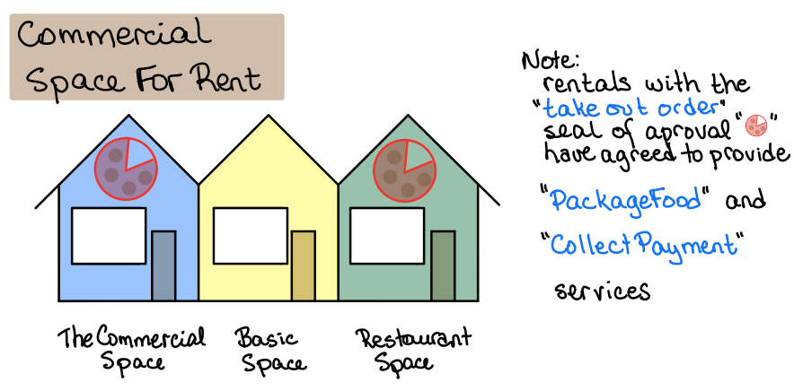
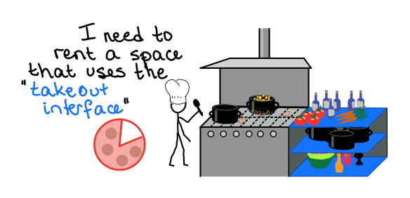
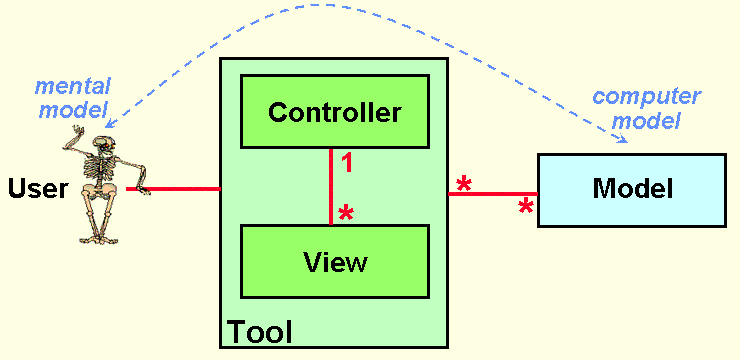
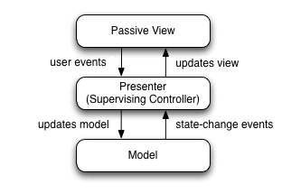

# Interfaces 

## Quick Review

Just a quick refresher on what an **interface** is.

An **interface** is a *contract* that states that any class that *implements* this **interface** will contain all the necessary methods and properties.

### Example: Take-Out Food Counter

What do we need from a *food take-out counter*?

* define our contract

```csharp
public interface FoodTakeOutInterface {
  void PackageFood(Food food);
  void CollectPayment(Money money);
}
```

We have a commercial space available, and it can be used for a take-out restaurant.



* Class `TheCommercialSpace` implements `FoodTakeOutInterface`, 

* This class also has *delivery* method (but cannot be used if someone is ONLY using the `FoodTakeOutInterface`)

```csharp
public class TheCommercialSpace : FoodTakeOutInterface {
  
  // required methods
  public void PackageFood (Food food) { ... }
  public void CollectPayment ( Money amountDue) { ... }
  
  // additional methods
  public void DeliverFoodTo ( Address address ) { ... }

}
```

`BestPizza`, an instant of `Restaurant`, requires a `FoodTakeOutInterface`.

* It does *not* deliver food.




* So it needs a `class` that implements the `FoodTakeOutInterface`


```csharp
public class Restaurant {
  
  FoodTakeOutInterface takeOutCounter;
  
  public Restaurant (FoodTakeOutInterface tac) {
    takeOutCounter = tac;
  }
  
  public void Order (Food food) {
    // make food
    // ....
    
    takeOutCounter.PackageFood( food );
    takeOutCounter.CollectPayment( amountDue );
    
    // takeOutCounter.DeliverFoodTo (address) !! Not allowed, not part of the interface
  }
  
}
```

In the main program, we create a new commercial space.

* The new restaurant requires a `FoodTakeOutInterface`, but the `building` in the following code is a `TheCommercialSpace` object.

  * However, since the new `building` object *also* implements `FoodTakeOutInterface`, we are allowed to use it.

```csharp
public Main () {
  TheCommercialSpace building = new TheCommerialSpace();
  Restaurant bestPizza = new Restaurant(building);
  bestPizza.Order( allDressedPizza);
}
```


# Architectural Patterns

[wikipedia](https://en.wikipedia.org/wiki/Architectural_pattern)

Even though an architectural pattern conveys an image of a system, it is not an architecture. An architectural pattern is a concept that solves and delineates some essential cohesive elements of a software architecture. 

... a pattern can be seen as a solution to a problem.

## How?

Group together classes, etc, and define how they communicate.  The goal is to have a set of classes that deal with a specific *layer* of functionality, thus making it easier to re-use code.

## Why?

Code needs to be well organized so that it is easier to:

* Debug well 
  * organized code makes it easier to narrow down the search area (chunk of code) where the bug might possibly be
* Maintain
  * well organized code makes it easier to modify specific areas of the code, as well as add extra features
* Development Within a Team
  * If your design is well organized, it is easier to separate the development work between team members.

## [G]UI Applications

Three standard Architectural Design Patterns for UI are:

* **MVC**: Model - View - Control
* **MVP**: Model - View - Presenter
* **MVVM**: Model - View - ViewModel

### MODEL 

(applicable to: **MVC**, **MVP**, **MVVM**)

* Contains the *code* that retrieves and stores the data 
  * reading and writing and filtering
    * database
    * internal memory
    * local files
    * web service
    * *etc.*

* Contains the *state* of the data
  * Examples:
    *  `accessGranted` could be a *state* that determines if the user currently has access 
    * `gameWon` could be a *flag* that determines the current state of the game

* Other than decisions about *state* the **model** does not make any decisions
  * Does not decide what is to be done with the data

    

### VIEW

(applicable to: **MVC**, **MVP**, **MVVM**)

* The **view** is what the user *sees* and interacts with.
  * In MVP, 
    * the **view** is a dumb as they come, and never interacts with the **model**, only presenting data that is given to it by the **presenter**.
  * in MVC, 
    * the **view** fetches data from the model to display it as needed.  
      * To be clear here, the view may *fetch* data, but NOT by directly accessing any database, etc, it would still need to use the methods that are provided by the model API.
    * the **view** does NOT modify or manipulate the data.
  *   in MVVM
    * the **view**'s data is *bound* to the data controled and manipulated by the **view model**


### Controller, Presenter, View Model

(applicable to: **MVC**, **MVP**, **MVVM**)

* In all cases, the Controller, Presenter, or View Model deal with the logical, or decision making aspects of the application.

The difference between these architectures is based primarily on who talks to whom, and how they transfer information.


## MVC



 Picture from: [Notes and Historical documents](http://heim.ifi.uio.no/~trygver/themes/mvc/mvc-index.html) from Trygve Reenskaug, inventor of MVC.

#### Conflicting opinions

Due to the ubiquitous nature of the internet, there has been a rise of misinterpretations that get repeated so often that they become the new *truth*. This has confused the issue as to what, *exactly*, is the **MVC** architectural model.

**MVC** is often defined as having the *controller* act as an interface between the *model* and *view*. This is *not* how it was originally designed.

[advanced discussion about **MVC**](https://r.je/views-are-not-templates) 

To avoid confusion, we will not be describing **MVC**, because different sources describe different patterns.


## MVVM: Model-View-ViewModel


**Model**

​	Model refers either to a [domain model](https://en.wikipedia.org/wiki/Domain_model), or to the [data access layer](https://en.wikipedia.org/wiki/Data_access_layer)

**View**

​	is the structure, layout, and appearance of what a user sees on the screen.[[7\]](https://en.wikipedia.org/wiki/Model–view–viewmodel#cite_note-MSDN-7) It displays a representation of the model and 	receives the user's interaction with the view '

**View model**

​	MVVM has a *binder*, which automates communication between the view and its bound properties in the view model. 

**Binder**

​	Declarative data and command-binding are implicit in the MVVM pattern. 


#### Windows WPF and MVVM

It is often stated in articles that if you are using Windows WPF to make a GUI application, you are using MVVM by default.

That is not true! Windows WPF gives the developer the opportunity to bind variables, thus using the MVVM architecture, but it is not necessary to actually use the binding.


# MVP: Model-View-Presenter

In **MVP**, the *presenter* assumes the functionality of the "middle-man". In MVP, all presentation logic is pushed to the presenter.

**MVP** was engineered to facilitate automated unit testing and improve the separation of concerns in presentation logic.

## Overview

* The *model* is an ***interface*** defining the data to be displayed or otherwise acted upon in the user interface.
* The *view* is a ***passive interface*** that displays data (the model) and routes user commands (events to the presenter to act upon that data.
* The *presenter* acts upon the model and the view. It retrieves data from repositories (the model), and formats it for display in the view.




**IMPORTANT NOTE**: Normally, the view implementation instantiates the presenter object, providing a reference to itself. 

**Example**

```csharp
public class MainView : ViewInterface
{
    private MainPresenter _mainPresenter = null;

    public MainView()
    {
        _mainPresenter = new Presenter(this);
    }
}
```

### Advantages of MVP

#### Multiple Views in MVP

By using a **ViewInterface** in the **Presenter** class:

* a **View** can be anything as long as it implements the methods defined in the **ViewInterface** *contract*,
  * the application can have multiple views using the same **Presenter** class.
    * Console
    * WPF DataGrid (looks like Excel)
    * WPF Chart 

#### Unit Testing

By using a **ViewInterface** in the **Presenter** class:

* The testing software can create a **View** that does nothing except record which methods were called with the various arguments.
  * At this point, the **Tester** can simply verify that the **Presenter** is calling the correct **View** methods given the specific circumstances of the test. 

### MVP Example:

See the document 21.1_MVP_Wordle.


# Summary:  MVC vs MVP vs MVVM

*Note: There is a lot of contradictory information on line - this is our best attempt*

#### MVC - Controller

- Controller manages multiple views (deciding what view to show and when)

#### MVP - Presenter

- A View Interface (considered part of the view) is created that interacts directly with the view object properties
- The Presenter is called from the View Interface, processes the information, and then calls methods in the View Interface, which will update the view

#### MVVM - ViewModel

- The ViewModel does not interact with the view directly at all!
- The View and the ViewModel share (bind) variables, so that when data is updated, it is updated everywhere
- The View grabs the events, and calls the ViewModel, which processes the information and updates the data

