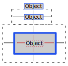

# Intro to WPF C# Application

## Resources

### Videos

These videos were created for the old *User Interface* course for 2nd semester students.

Some of these videos will be too basic, but others are very relevant.

[videos](https://www.youtube.com/playlist?list=PLrkQ3hzZrc4jhO4Zpb3GVk6loXUKdDDcy)

### On-line documentation

Sandy learned WPF by reading this and just trying stuff out

* [wpf-tutorial](http://wpf-tutorial.com) 
  * Can purchase a pdf (no advertisements, yay!) with example code
  * The 'table of contents' is on the right hand side, interspersed with advertisements.  Keep scrolling down to see all of the content
* [tutorialspoint (wpf)](https://www.tutorialspoint.com/wpf/index.htm)
  * Can purchase a pdf
  * The 'table of contents' is on the left hand side.  Once a main topic has been clicked, there are links to sub-topics.
    * Example, to find info on `grid`, go to `layouts`, and then click the link to `grids` in the text on that page.

## Anatomy of a WPF application

Create a new `C# WPF (.Net Framework)` project.

### Files

#### App.xaml

* `xmlns:local`: Specifies the namespace for the variable names for all of the gui elements
* `StartupUri`: Which window will open up on startup.

```xaml
<Application x:Class="WpfApp1.App"
             xmlns="http://schemas.microsoft.com/winfx/2006/xaml/presentation"
             xmlns:x="http://schemas.microsoft.com/winfx/2006/xaml"
             xmlns:local="clr-namespace:WpfApp1"
             StartupUri="MainWindow.xaml">
    <Application.Resources>
         
    </Application.Resources>
</Application>
```

#### App.xaml.cs

If there is any code that you want to execute *before* the window is drawn,

* create a `void private foo` function, and set the `StartupUri` in the **xaml** file to point to `foo` instead, thus giving you much more control.

[detailed info](https://wpf-tutorial.com/wpf-application/working-with-app-xaml/)

```csharp
namespace WpfApp1
{
    /// <summary>
    /// Interaction logic for App.xaml
    /// </summary>
    public partial class App : Application
    {
    }
}
```

#### MainWindow.xaml

* Defines properties of the `MainWindow` object.
* Defines the title, height and width
* VERY IMPORTANT: Contains *one* and only *one* `xaml` object.  
  * By default, this object is a `grid`.
  * However, the `grid` can contain many objects.

```xaml
<Window x:Class="WpfApp1.MainWindow"
        xmlns="http://schemas.microsoft.com/winfx/2006/xaml/presentation"
        xmlns:x="http://schemas.microsoft.com/winfx/2006/xaml"
        xmlns:d="http://schemas.microsoft.com/expression/blend/2008"
        xmlns:mc="http://schemas.openxmlformats.org/markup-compatibility/2006"
        xmlns:local="clr-namespace:WpfApp1"
        mc:Ignorable="d"
        Title="MainWindow" Height="450" Width="800">
    <Grid>
        
    </Grid>
</Window>
```

#### MainWindow.xaml.cs

* First method to be executed when window is being draw is the constructor, 
  * which in turn calls `InitializeComponent` which is where all the gui elements are initialized.

```csharp
public partial class MainWindow : Window
{
    public MainWindow()
    {
        InitializeComponent();
    }
}
```


## XAML

e**X**tensible **A**pplication **M**arkup **L**anguage

The gui elements of the windows application are coded in XAML.  

During the build process, the XAML is compiled and converted into C# language code, which is then incorporated into your project.

Standard format:

```xaml
<element_type
	attribute_name="attribute_value"
	attribute_name="attribute_value"
>
	content			
</element_type>
```

or

```xaml
<element_type
	attribute_name="attribute_value"
	attribute_name="attribute_value"
/>
```

XAML is **Case-sensitive** 
Whitespace and newlines that are not within quotation marks are ignored

**Example**

Button class in the .NET Framework with `HorizontalAlignment`, `Margin`, `Width` properties.

```xaml
<Button HorizontalAlignment="Left" Margin="215,78,0,0" Width="75">My Button</Button>
```

**Visual Studio**

The properties window (F4) allows you to see all properties available for the selected control

## Layout

We are assuming that you have done some WPF, so this doc will not go through all of the basics.

However, there are some things you may not realize.

* As a rule, do *not* drag and drop objects from the toolbar into your window.  This will hardcode the absolute position of these objects, and your application will not adapt if the window is resized.

### Layout tips and tricks

* Draw it out first!
* Add a background colour to the Layout Panel to clearly see its borders 
  * `<StackPanel Background="blue">`
* To check if something has an effect, exaggerate its value - particularly useful for padding and margins
* Make grid lines visible 
  * `<Grid ShowGridlines="True">`

### Containers

A container is any gui element that can hold other gui elements within it.

For a more elaborate window, you can place container objects within container objects to achieve whatever it is you need.

> Before you begin coding your XAML, draw your window on a piece of paper, and decide what containers you are going to use for certain things.
>
> Picking the right container for the right job is super important if you don't want to end up with a mess.

**References**: [tutorials point](https://www.tutorialspoint.com/wpf/wpf_layouts.htm), [wpf-tutorial](https://wpf-tutorial.com/panels/introduction-to-wpf-panels/)

The most commonly used containers are:

* `Grid`: Divides itself into the specified number of rows and columns, and other gui elements can be assigned to each individual cell.  (More on this later... maybe even in another document)
* `WrapPanel`: gui objects can be added to the `WrapPanel`, and they will be placed one after another (either vertically or horizontally) until there is no more room, and then it will continuing places more objects on the next line.  Think of sentences in a paragraph.
* `StackPanel`: similar to `WrapPanel`, but gui objects do not wrap.
* `DockPanel`: gui objects are placed relative to sides of the `DockPanel` (if you are familiar with `Tk` or `pTkinter`, it is the same as *packing*)

### Placing Objects in Containers

#### Padding and Margins

In the image below, there are three objects stacked one below the other.

* The first object has no padding or margins.
  * The object size is just large enough to contain the text.
* The second object has a **margin**, indicated by the black arrows.
  * The total *size* of the object includes the object, plus the margins.
* The third object has a margin, indicated by black arrows, and it also has **padding** indicated by the red arrows.  
  * The padding is the distance between the size of the text, and the edge of the object.
  * The margin encapsulates the *new* size of the object.



#### Margins and Alignments

Use `bottom`, `top`, `left`, `right`, `center`, in combination with `margins` to define your layout.

[***MUST WATCH***!!!](https://www.youtube.com/watch?v=aJ06sU6hOuY&list=PLrkQ3hzZrc4jhO4Zpb3GVk6loXUKdDDcy&index=9)

## Grids

You define a number of columns and rows using the following tags within the `<grid>` object.

* `Grid.ColumnDefinitions`
* `Grid.RowDefinitions`

You define the sizing behaviour of columns and rows by 

* `number of pixels`
* `star`: percentage compared to other rows
* `auto`: adjust size based on content

Add an element to a specific grid cell (defaults to row 0, column 0)	

* `Grid.Column` (zero-based)   
* `Grid.Row` (zero-based)

You set the layout for controls within a cell.

**Example**

```xaml
<Grid>
<Grid.ColumnDefinitions>
		<ColumnDefinition Width="1*" />
		<ColumnDefinition Width="Auto" />
		<ColumnDefinition Width="100" />
</Grid.ColumnDefinitions>

<Button 
        Grid.Row="1" 
        Grid.Column="0"
>
	Exit
</Button>
</Grid>
```


By default items in a grid occupy one cell, you may want them to span more than one column or row

**Example**

```xaml
<Button 
        Grid.Row="1" 
        Grid.Column="0"
        Grid.RowSpan="2" 
        Grid.ColumnSpan="2"
>
	Exit
</Button>
```

### Grid Column and Row Spacing

To make your application look professional, it is ***imperative*** that it behaves well when the window is resized.

Part of that process is defining how grid columns and rows will grow and shrink when the window is resized.

#### Star

By using *star* sizing, the columns (or rows) will resize relative to each other.

Which means:

* If column '0' is of size `1*`, and column `1` has size `5*`, then column `1` will always be 5 times as large.

#### Student Activity

Use the following XAML code in a test project.

Play with the size of the columns and rows until you really begin to understand how it works.

```xaml
    <Grid ShowGridLines="True" Margin="5">
        <Grid.ColumnDefinitions>
            <ColumnDefinition Width="1*"/>
            <ColumnDefinition Width="2*"/>
            <ColumnDefinition Width="5*"/>
        </Grid.ColumnDefinitions>
        <Grid.RowDefinitions>
            <RowDefinition Height="Auto"/>
            <RowDefinition Height="10*"/>
            <RowDefinition Height="10*"/>
        </Grid.RowDefinitions>
        <Button Margin="5" Grid.Column="0" Grid.Row="0">one</Button>
        <Button Margin="5" Grid.Column="1" Grid.Row="0">two</Button>
        <Button Margin="5" Grid.Column="2" Grid.Row="0">three</Button>
        <Button Margin="5" Grid.Column="0" Grid.Row="1">four</Button>
        <Button Margin="5" Grid.Column="1" Grid.Row="1">five</Button>
        <Button Margin="5" Grid.Column="2" Grid.Row="1">six</Button>
        <Button Margin="5" Grid.Column="0" Grid.Row="2">seven</Button>
        <Button Margin="5" Grid.Column="1" Grid.Row="2">eight</Button>
        <Button Margin="5" Grid.Column="2" Grid.Row="2">nine</Button>
    </Grid>

```

## Student Activity

* Take the `LayoutPractice.zip` zip file from the student notes.

* unzip
* open solution
* do all of the exercises

> Answers are provided, but you will learn more if you do it without looking at the answers.
