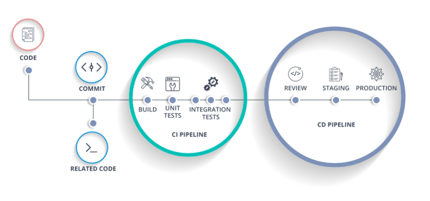
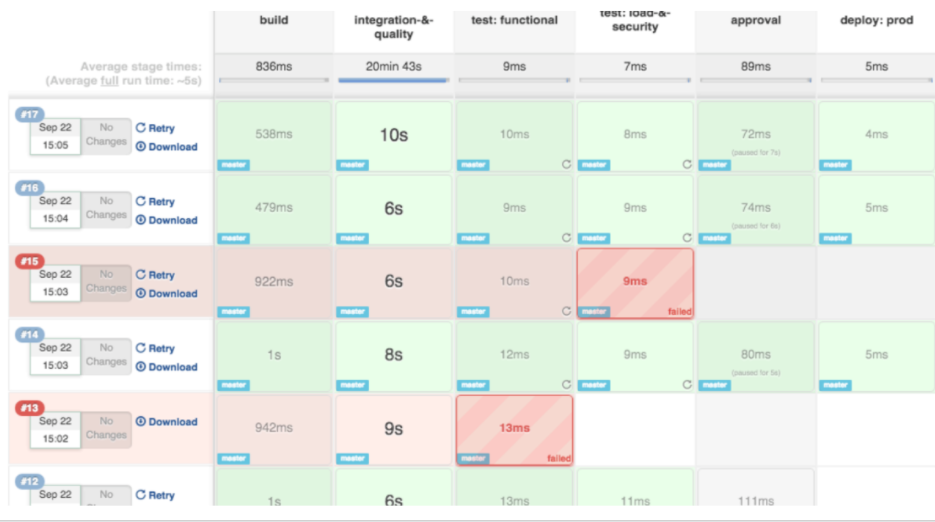
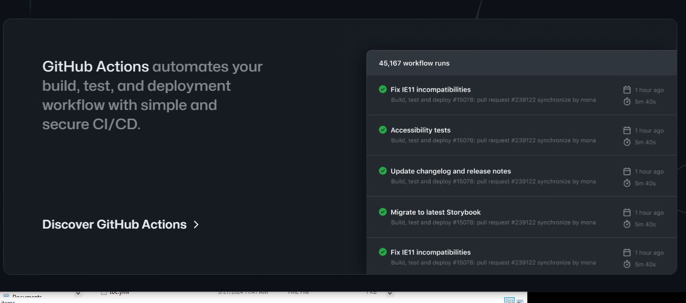

# CI / CD

### Continuous Integration / Continuous delivery/deployment

*souce: synopsys.com*

#### Goal

Deliver code changes, quickly, frequently, and reliably (sound Agile inspired?)

leading to:**continuous software product releases**

### CI - Continuous integration

A software development practice where the team integrates their work with increasing frequency, getting closer and closer to an integration that is 'continuous'.

In the past, **testing, integrating, and building** software took much effort. It often involved separate teams.  Instead, more and more, individual developers are expected to incorporate these into their regular development tasks. 

Developers are expected to:

- Add/modify tests for your changes and having the full series of tests run on every change (detects regressions)
- Integrate your changes very often
- Identify how your changes that affect the build process. Did you add a dependency (package), modify the version of a package you require? You are expected to update the build scripts.

This requires: code coverage metrics, tests done before the story is completed, frequent integration of code.

CI involves using **tools** to **automate** these processes and incorporate them into the development iterations. This makes it so that the testing, integration and build tasks are not big, separate efforts. Instead these tasks are done incrementally and frequently. This ensures that errors are detected as quickly as possible.

This is inline with the Agile principles. In the past, it wasn't rare that all the integration, writing of tests, and updating of the build scripts happened only after all the development was done, exposing issues very late in the process.

### CD - Continuous delivery

Same as CI but for **packaging** and **deploying**. Processes to get software built, packaged and deployed as close to 'continuously' as possible.

Ultimate goal: code put onto master frequently => automatically, tests are run, application built and deployed straight onto customer sites.  

### CI / CD specifics

- The code is continuously integrated (no silos of code)

- Automation of the stages involved in producing an application

- Reduction of manual mistakes

- Traceable record of what needs to be done to release

- Visibility for all (devs, QA, management). The tools used show reports that everyone can acccess.

- Notification in case of problems, visual feedback of the process.

- Rapid notification of bugs, problems (while still fresh in our minds)

- Reduced disconnect between developers, QA, etc

- Repository of builds and versions

- Tracking of time to build etc to keep these in check

- Rapid releases

- Often referred to as the CI/CD pipeline:

  

## DevOps

DevOps is a compound of **development** (Dev) and **operations** (Ops).  It is the union of people, process, and technology to continually provide value to customers.

It represents a **cultural change**. Instead of development and operations being considered two disconnected teams, as they were in the past, these should collaborate or even merge roles to achieve the common goal of: 

- more streamlined, agile and efficient process of software production
- deliver applications and services quickly

Cultural practices such as information flow, collaboration, shared responsibilities, learning from failures and new ideas are central to DevOps.

DevOps makes it so that companies evolve and improve products at a faster pace than organizations using traditional software development and infrastructure management processes.

The CI/CD pipeline is considered one of the best workflows that a DevOps team can follow.

Note: While DevOps describes an approach to work rather than a distinct role, job advertisements are increasingly using terms like "DevOps Engineer".

*Sources: azure.microsoft.com, aws.amazon.com, itportal.com, wikipedia.com*

## CI/CD Automation tools

Automation tools are very widely used. Developers often have to modify the CI/CD tool scripts.

Parts of the automated CI/CD pipeline:

- Triggers: push to master, pull request to master, manual build

- Components: Build instructions, running of tests, packaging, deployment onto test and production environments. 

- Record of attempted builds

- Notification of completed pipeline or any failures

  

#### Jenkins 

open-source continuous integration server, very extendable (plugins)

#### GitHub Actions

Allows you to create custom workflows directly in your GitHub repository. You can discover, create, and share actions to perform any job you’d like, including CI/CD, and combine actions in a completely customized workflow. 

You can create continuous integration (CI) workflows that build, and test projects written in different programming languages.

.Workflows run in Linux, macOS, Windows, and containers on GitHub-hosted machines, called ‘runners’. You could also host your own runners to run workflows on your machine(s).

*https://devblogs.microsoft.com/premier-developer/github-actions-overview/*

### GitHub Actions Workflows

A workflow is a configurable automated process made up of one or more jobs. You can set up workflows in your repository to build, test, package, release, or deploy any project on GitHub. 

Workflows are stored in the .github/workflows directory in the root of your repository. 

There is a requirement to have at least one job in a workflow. A job contains a set of steps that perform tasks.

Workflows can be configured to start when:

- An event occurs on GitHub

  - a commit is pushed
  - issue or pull is requested

- A scheduled event begins (overnight builds)

- An external event occurs

  

Workflows in GitHub Actions are created as YAML files and saved in your repository. 

Once the workflow has been created and triggered, the logs, test results, artifacts, and the status for each step will be available for review.
