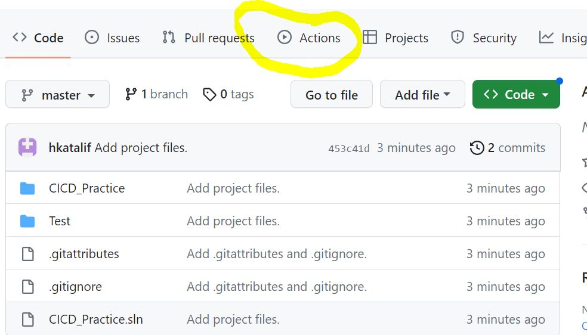
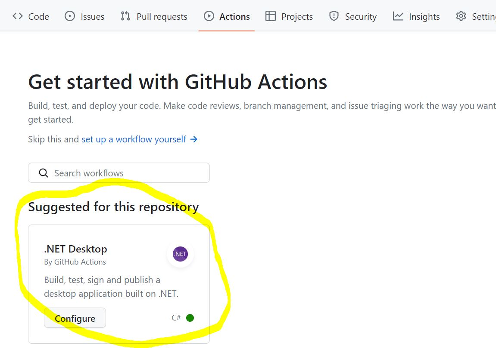
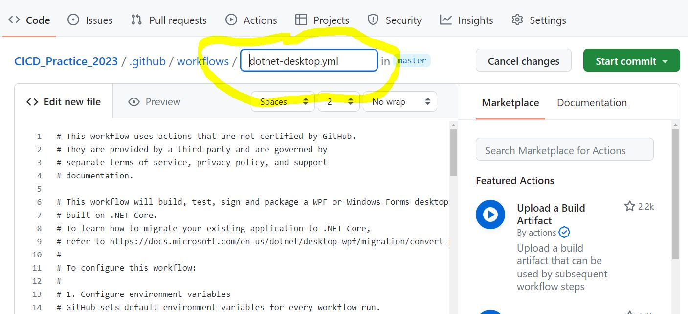
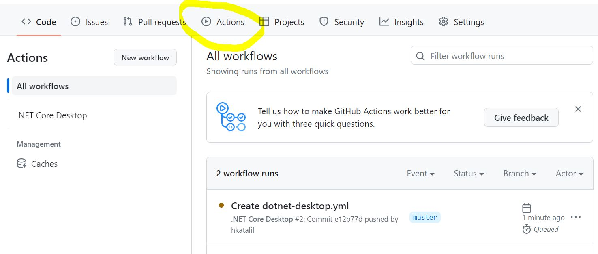
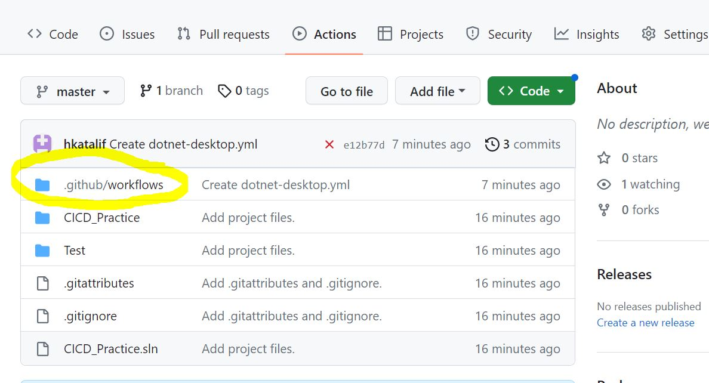
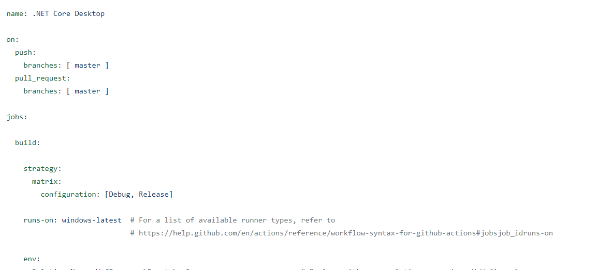
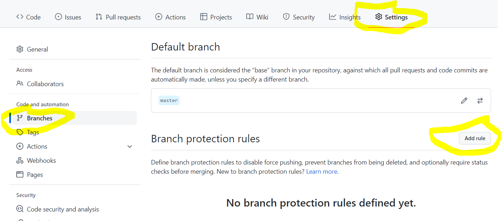
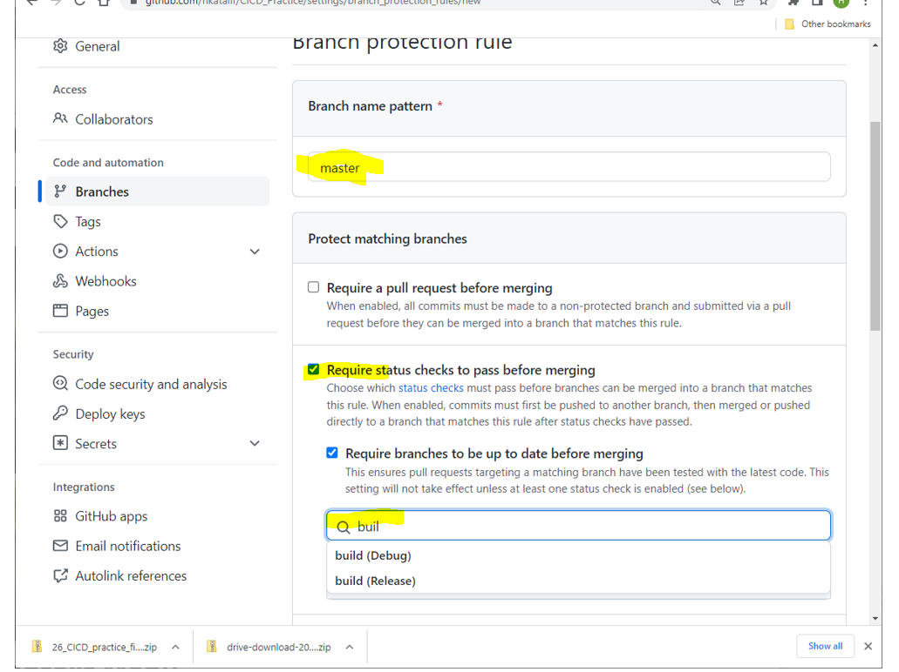
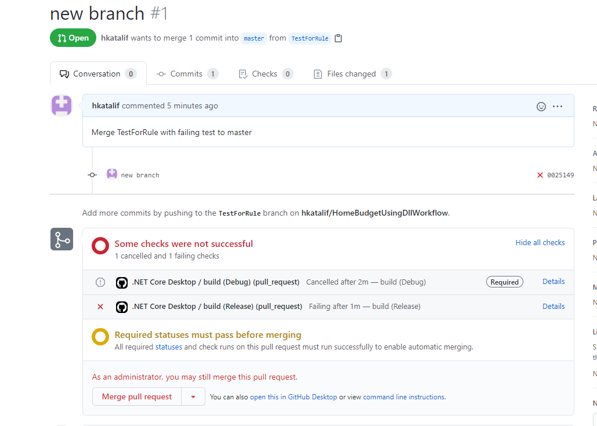

# Set up a CI / CD Workflow in GitHub Actions


### Why create a Workflow?

Why do we need to build, run tests on and package our application on a ‘clean’ machine?

It ensures that the steps and process is independent of the developer, tester or integrator’s set up. Steps and tests may pass on a local machine due to files or environment details that one did not realize are at play.

We will implement a CI/CD process for our application using GitHub Actions. Our script (workflow) will be run on GitHub runner machines with clean Windows installations. 

We have to specify what steps should be run to build, test and package our application.


## Figure out the command-line commands to run to build and test

First, we will look at the command-line instructions required to get the solution built and tested. These are the same tools VS uses to build and test the solution/projects. We will be using these commands in our workflow script.

To get to a 'clean' solution state:

- Run Build->Clean Solution in Visual Studio
- In File Explorer, delete
  -  the packages folder (alongside the sln file), 
  - for both the WPF and test projects, delete the bin folder and the obj folder


#### Build the solution

As in the lab you already did, use the command line version of the solution builder, the MSBuild executable. 

From a command prompt terminal run it on the solution:

```
> [path to MSBuild.exe]\MSBuild.exe [path to the folder with my solution]
```

If you cleaned out the projects properly this should fail. Why?

```
error : This project references NuGet package(s) that are missing on this computer. Use NuGet Package Restore to download them.
```


#### Restore the packages

The NuGet packages are not in place!

We used the restore flag on msbuild to bring in the packages, just as VS does when the solution is loaded.

Restore the packages on your projects:

```
> [path to MSBuild.exe]\MSBuild.exe [path to the folder with my solution] -restore
```

With the packages now in place, use msbuild.exe to build again.


#### Run the unit tests 

We will run the unit tests using the .NET Core build tool: dotnet

You run this tool in the folder where the solution is.

```
> [path to dotnet.exe]\dotnet test
```


## Create a Workflow in GitHub Actions

Now that you know what commands we will have to run, setup up a workflow in GitHub Actions. The workflow is a script written in YAML, a mark-up language that resembles json.

The script specifies the steps to build, run unit tests, create the installer, and provide access to the final product (the built installer, setup.exe and .msi files).

The script steps run powershell command-line instructions that do what VisualStudio does (when building, running tests, building the installer) under the hood.

You will start with a template workflow generated in GitHub under the Actions tab for your home budget application repository. 




### Generate the Workflow file

In the Actions window, a .NET Desktop template might be proposed. If it is not, searching for wpf will give you the .NET Desktop template.





Select the ‘Configure’ button for the .NET Desktop template.

A template workflow will be generated for you in a file called [dotnet-desktop.yml](https://github.com/hkatalif/HomeBudgetAppUsingDll/commit/db3fe3a961597eea617918ec56d03a0968febfc1) (you could rename it to be relevant to your app if you would like - you must commit to see changes)

The file will automatically be in your repository, inside a **new .github/workflows folder**





### Edit the Workflow file

In GitHub, edit (small pencil at top right) the new .yml file to customize it for your repo. You need to make some changes to make the workflow work.

Careful, indentation matters in YAML!!

**To save your changes, commit them using the green start commit button at the top right.** 

Every commit triggers a run of the script. You could see the run in the Actions page.




### Customize the script

Edit the script:




Keep the triggers as is (‘`on`:’ section).  This specifies that the workflow will be run anytime there is a direct push (should be rare) or a pull request to master. 




After the triggers, you are specifying the job to run. 

The strategy matrix specifies the different configurations your build will run in, Debug and Release. This means that there will be 2 separate GitHub Actions jobs on every commit: one running in Release and one in Debug.


### Environment variables

Update the environment variable values for your workflow:


#### Solution

Set your solution name in `Solution_Name` (note the example in the comment).


#### Unit tests

Set the`Test_Project_Path`.


#### Wap installer variables 

You may leave the `Wap_` variables as is, we won't be using them yet.


### Job steps in general

Steps are run in order. They have a name. They may have a uses property where you could specify an available script you want to run. For example, in the first step, we are using the actions/checkout@v3 script to instruct GitHub to clone our repository on the runner machine.

The run property can be used to run commands. For example, you could specify a step:

```yaml
- name: Show the contents of the current directory
  run: dir
```


This step changes the current directory to the bin directory of the unit test project and runs dir on it to see its contents:

```yaml
- name: Change directory to the unit test project directory bin subdirectory and run dir
  run: cd $env:Test_Project_Directory\bin\${{ matrix.configuration }}; dir
```

Note the following:

- how an env variable is referenced in a run command: `$env:my_env_variable`

- how you reference the current run's configuration (Debug or Release): `${{ matrix.configuration }}`

- How to separate command invocations in a single run property: using a semi-colon (`;`)

  

### Setup steps

Leave the ‘`Checkout`’ and ‘`Install .NET Core`’ steps as is.

Note the next step is setting up MSBuild to be used.


#### Run the tests  

Note the next step that runs `dotnet test` to run the unit tests as we did using the command-line tool.


#### Restore the packages

The next step restores the packages as we also did using the command-line tool. 


#### Build

We will be introducing an installer to our project next class. The installer project will produce an installer package which will be the end result of our pipeline. This will be the pipeline **artifact**.

The MSBuild command included with the template assumes the installer is present. For now, we will modify the step to build only our solution.

Comment out the `Decode the pfx`, `Remove the pfx`, and `Upload build artifacts` steps.

Note: dotnet test already builds the solution, so this step is redundant for now. It will be more relevant when it is used to build the installer instead.


TODO: Modify the MSBuild command to ONLY build your solution, as we did in the command-line exercise.


### Stop pull requests when tests fail

What if you could run the workflow before the commit proceeds? You could use it as an automatic check to make sure that only releasable changes get onto master to begin with.

Configure GitHub to require a successful workflow run before a pull_request proceeds.

You need a GitHub Pro account (free as a student) to add a rule to your repo.

Note:  you would have a GitHub Pro account if you set up your account as an education one. Here are instructions on how to add JAC to your account and get GitHub PRO for free. Submitting your JAC email should suffice, if it doesn’t let your teacher know. https://docs.github.com/en/education/explore-the-benefits-of-teaching-and-learning-with-github-education/apply-for-a-student-developer-pack#applying-for-a-github-student-developer-pack

In GitHub, on your repo, under **Settings > Branches**, add a rule:




Create the rule:




Set master as the branch pattern.

Check the option **‘Require status checks to pass before merging’. ** Search for 'Build' to see your workflows. Add the Release and Debug workflows as required to pass before a Merge pull request to master can go through.


#### Test it!

Attempt a pull request from a branch that would introduce a failing unit test. Note that the pull request will fail. No changes are added to master/main.


