# Creating an Installer

An installer is an application that takes care or installing all the pieces needed for your application to run for your users. It also allows the user to configure some details of the installation.

## Information you need for later

### Determining which architecture your application is built for (x32, x64)

The default architecture in visual studio is `Any CPU`.

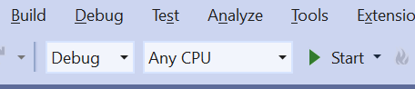

* You can select Build -> Configuration Manager to specify what should happen with each of your projects when your app is built on different architectures. 

  

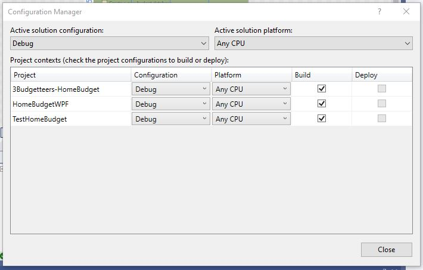

## Can’t we just copy over the exe?

Do we really need an installer? Can't we just give our users the .exe file?

**TRY IT!**

In the bin folder, find the .exe file for your WPF application. 

- Double click on it to run it. Does your application run?

Copy the .exe file. Go to a new folder (on your Desktop, or any other folder outside of your solution). Paste the copy of the .exe file there. Double click on it to run it. Does your application run?

- Double click on it to run it. Does your application run? Can you explain why?

  

Beyond the application executable, an application often involves more components

* generic `dll`s, such as `HomeBudget.dll`, `sqlite.dll`
* specific `dll`s to match the processor (64 vs 32 bit), such as `sqlite.Interop.dll`

In addition to the necessary files, there is often the request to add the application to the desktop, and/or the windows menu. Modern installers include ways to update and digitally sign the app files.

## Application executable versus Setup executable versus Microsoft Installer

### Application Executable

When you build your solution or project, it will create an application executable, example: `myApp.exe`

### Older Windows desktop app installer: Setup Executable and `msi` file

Used to create a Windows msi installer that would generate a `setup.exe` and a Microsoft installer `myApp.msi`.

`setup.exe`: 

* an executable that acts as a bootstrapper. It verifies that the the software program can be installed on the computer and then allows the user to interact with the installer. Internally it uses (one or more) `*.msi` file(s).

`msi file`:

* a database that contains the information: 
  * the exe files for the application, 
  * configuration and registry settings, 
  * custom actions, 
  * relevant files, etc

*It is always a good idea to run `setup.exe` and **not** the `*.msi` directly*

* `msi` files allow IT people to create automated installs that bypass the user interaction with the installer.

### New Microsoft Installer (`msix` file): 

In 2018, Microsoft introduced the `msix` app packaging format which 

* uninstalls more cleanly (registry changes, files created throughout the system)
* installs the program in a container
* allows you to publish to the Microsoft Store.

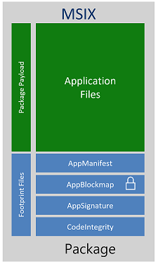

# Creating an `MSIX` Installer for `HomeBudget`

## Preparation

### Do you need to add the WAP or UWP option in Visual Studio?

Check if you can add a Windows Application Packaging project in your solution (next section). If you can't, you need to add the Universal Windows Platform development option in VS:

`Tools`->`Get Tools and Features...`

Check the Windows Application development option or the Universal Windows Platform development option, whichever you see under Desktop & Mobile:

> 

### Create a `WAPP` project

With the extension installed, create a new C# **Windows Application Packaging Project** in the ***same solution*** as your application.

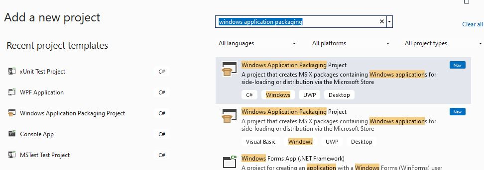

## Windows version:

> You could keep the defaults for the minimum Windows versions to install on. The minimum version limits the features you want to include, for example. You would consider your customer base to make sure to make your application accessible to most.

You may ignore any warning about requiring the Developer Mode for Windows.

## Link the Application to install

On the Installer project, set the application that it will install when it is run. On the WAP project, select `Dependencies`. Right-click to select `Add Project Reference...`

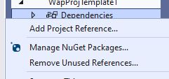

Select your `CICD_Practice` application. Note that any assemblies the application depends on will be automatically be brought in by the installer.

Should you also choose the xunit unit testing project? Why or why not?

## Package Configuration

Double-click the `Package.appxmanifest` file in the project. The manifest allows you to configure the installer.

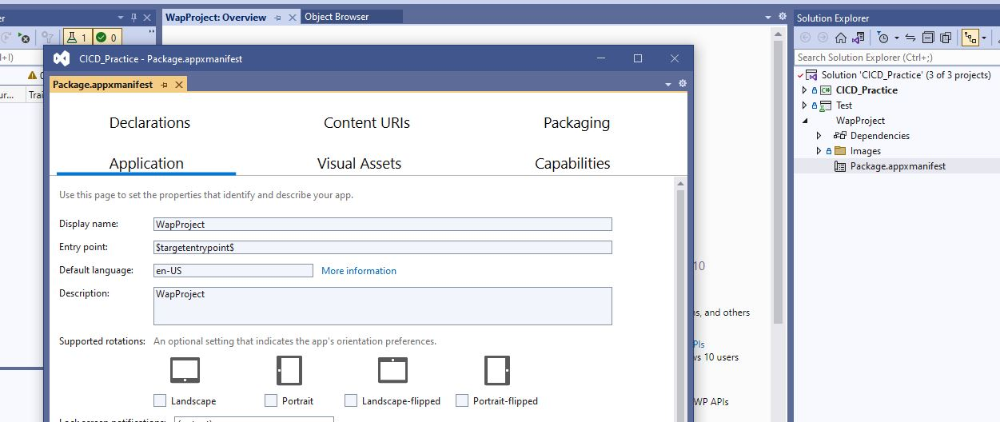

### Display name

Customize the installed application's display name. Describe your app in the description field.

### Icons

In Visual Assets, you will be able to se the Icons for your application. More on this next week.

### Packaging

Leave the Package name (a unique Id) as is.

Set the package display name. The default first version of 1.0.0 makes sense.

### Certificate

A signed package gives the user of the installer package the certainty that the code comes from a trusted source.

You sign your package with your certificate. 

A proper certificate would be a certified trusted certificate. You would need to involve a trusted authority (Comodo, for example) that you would pay annually to obtain a certificate for signing your code so that people you give it to can trust it. 

Since we are only distributing our application internally, no one we don't know needs to trust us. We will generate a dev certificate to sign our installer package with. We will not bother getting this certificate authenticated by a trusted authority.

#### Generate a dev certificate

In the Packaging page, select `Choose Certificate...` and `Create...`

You could enter your Team name as the Publisher Common Name. 

Choose a password that you will **not lose**! Enter it in the Confirm your password field too.

Click Ok to create the certificate.

Note that when you View the certificate (select `View Full Certificate`), it is clearly  indicated that the certificate is not trusted. 

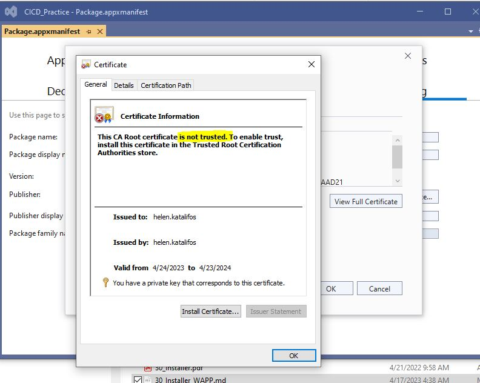

The certificate expires in a year. When we use the installer that our build will generate, we will have to indicate that we "trust it". Click `Ok`.

Click `Ok`  again in the `Choose a Certificate` dialog to choose this new certificate. You could select `Ok` on the warning.

The certificate is now chosen for the installer.

Note that a pfx file that has now been added to the project. This file holds all the signing information for the certificate. Signing involves some private information that you do not share and public information you provide.  

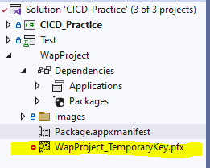

You can now save and close the manifest file.

We have specified the installer details.  Now we must build it.

## Build the installer

Rebuild your solution.

MSIX allows you to publish your desktop app to the Microsoft Store. We will not be doing this. Instead, we will be using the option to create a local installer instead. To distribute your application you could give any 'customer'  the installer.

To build the installer, right-click on your installer project and choose `Publish -> Create App packages...`

As we will not be publishing our app on the Microsoft Store, we will keep the `Sideloading` option checked. When we incorporate the building of the installer in our GitHub Actions script we will also have to specify that it our installer is side loading.

Click `Next`.

We will use the dev certificate we created earlier. It should appear and be selected by default.

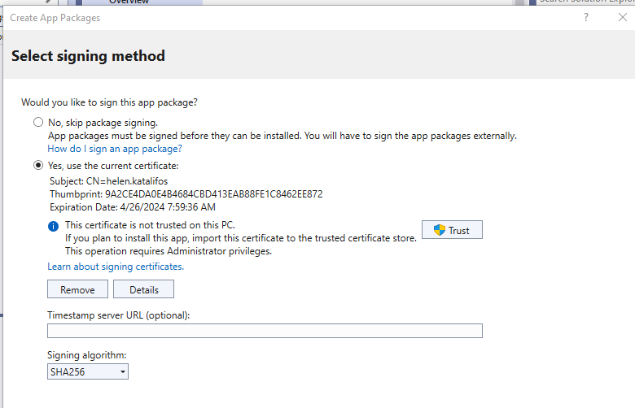

Click `Next`.

Next, we see the architectures we are choosing to support in our installer. Leave this as is for now.  

In 'Output location' set the location where the installer will be placed once built. 

Choose `Create`.

#### Configuration Architectures

The creation of the installer fails with errors about mismatches in the architectures. We need to be more specific about how our projects will be built for different architectures. 

With the main CICD_Practice project selected, choose `Build -> Configuration Manager`. 

Set up the following configurations:

​	Choose Release as the Active solution configuration.

​	Change the Active solution platform to x64. Change all the projects to be built for x64. To set the platform to x64 for any project that does not have it selected:

​		Choose `Platform -> <New...>`.  In the `New Project platform dialog`, unselect the `Create new solution platforms` checkbox and  then select `x64` in the `New Platform` dropdown 

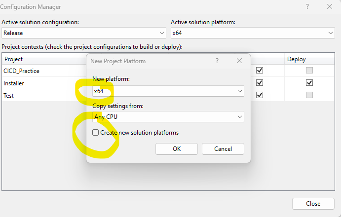

​	Make the same changes for x86. Change the Active solution platform to x86. For each project, set x86 as the platform as you did for x64.

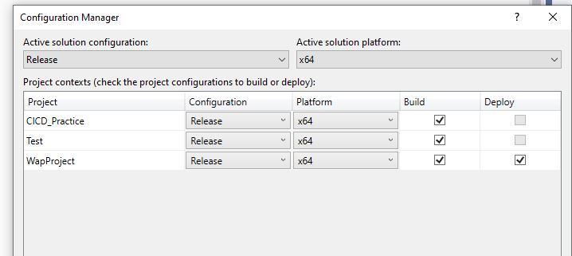

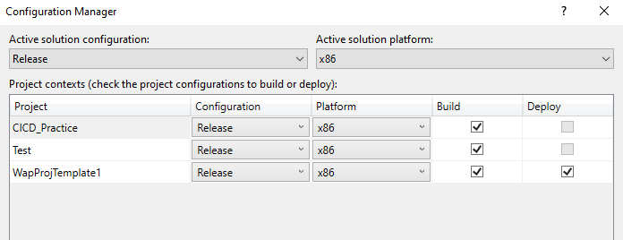

Regenerate the Installer:

​	Right-click on your installer project and choose `Publish -> Create App packages...`like we did before. Click next until you get to the  `Select and configure packages` page.

In the `Select and configure packages` page, select the x86 and x64 architectures, instead of the generic Neutral:

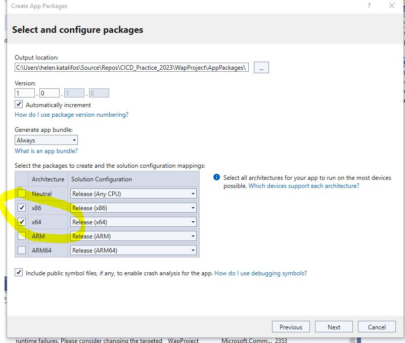

Note that we will only bother with the Release configuration. Our GitHub Actions script will have to reflect this.

Click `Create` to create the Installer. This takes some time.

When it is done, a `Finished creating package` dialog will appear:

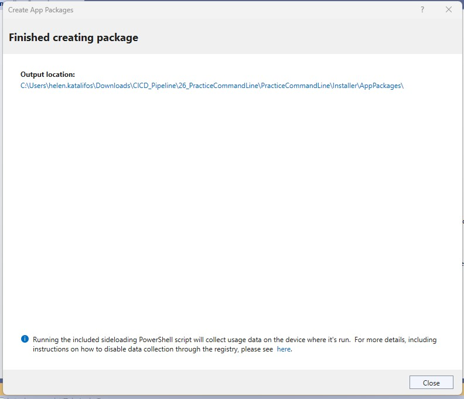

> Clicking on the output location link will take you to the installer files 
>

In the installer directory, the installer bundle and the public security certificate information (the `.cer` file) appear in the Installer folder.

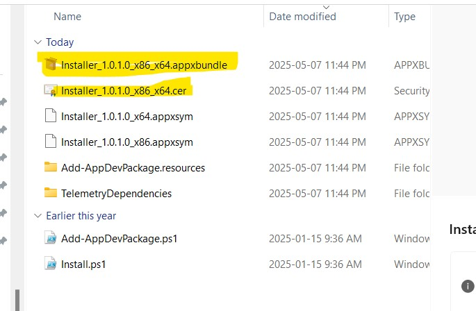

> Note that every time you create an installer selecting `Publish -> Create App packages...` the version is incremented. You can disable auto-increment or set the version number in the  `Select and configure packages` page.
>

### Testing your installer

You can launch the installer from the bundle file. Try it.

Note that you are blocked from installing the application. This is because the certificate is not trusted! Since you know that you created the certificate you could indicate that you trust the certificate below. In order to do this, however, **you will need admin privileges on the machine you wish to install the app on**.

Note, you do not have admin privileges on the lab computers. If you or one of your teammates has a personal computer on which they have admin privileges, test on there. Otherwise message your teacher to see if they can test for you and give you feedback.

#### Trust the dev certificate

In order to be able to use this 'signed' certificate we have to tell Windows that we trust it. To do this, we will add the certificate we made to our list of trusted certificates on our machines manually.

Double-click the public .cer certificate file to see that it is your certificate.

Right-click on the .cer file to choose `Install certificate`. 

Choose `Local Machine`

For the Certificate store, choose `Trusted Root Certification Authorities`

Note again, that you need administrator privileges on the test computer to do these steps.

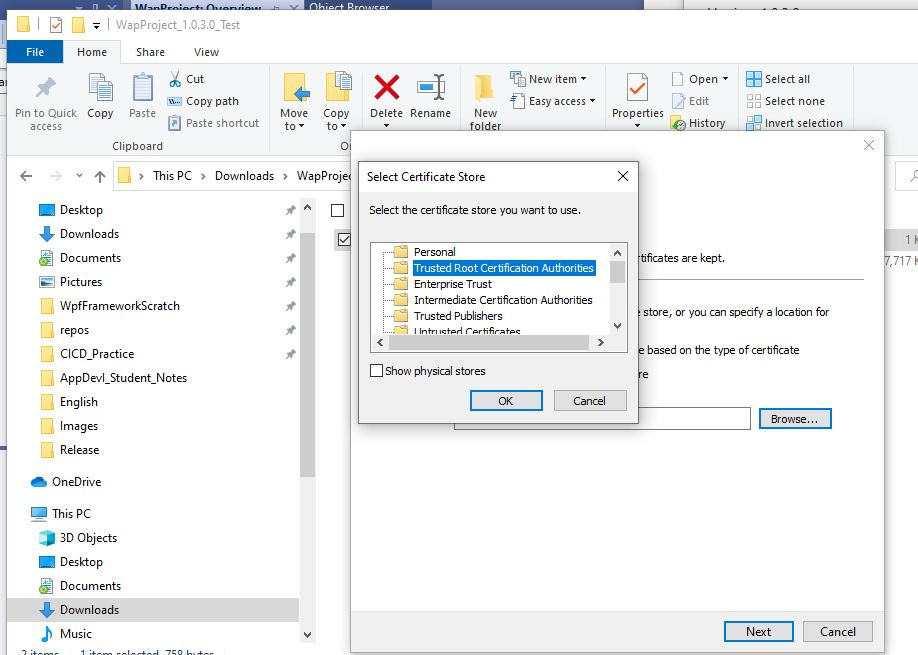

Note: Normally, in a company, you would have your company's certificate trusted by everyone. If it is not your company's application, you would want to make sure that the certificate is verified by a trusted authority.

You could go to Windows Manage user certificates to delete the certificates when done. 

### Install

* Double click the msixbundle file to install your application.

	> To test the installer, you must run  it **AS ADMINISTRATOR**. 

* Select  `Install`.

  

#### Validate
* Note that every build of the installer object increments the version number.
* You should see:
  * Your company name as a folder in the Start menu with your application in it. 
  * The application is launched by default.
    * It works (all DLLs and the application exe are present). 
  * Rerunning the installer attempts an update

