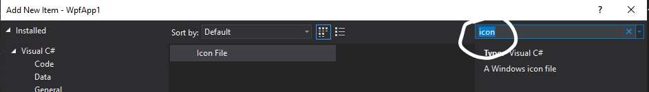
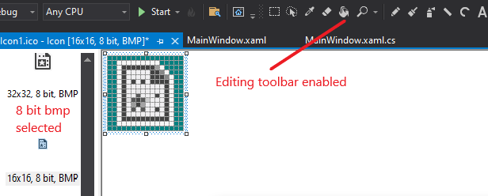
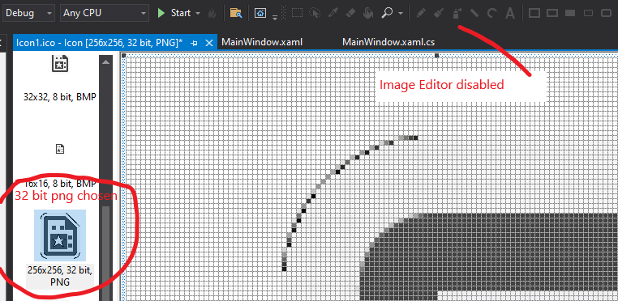
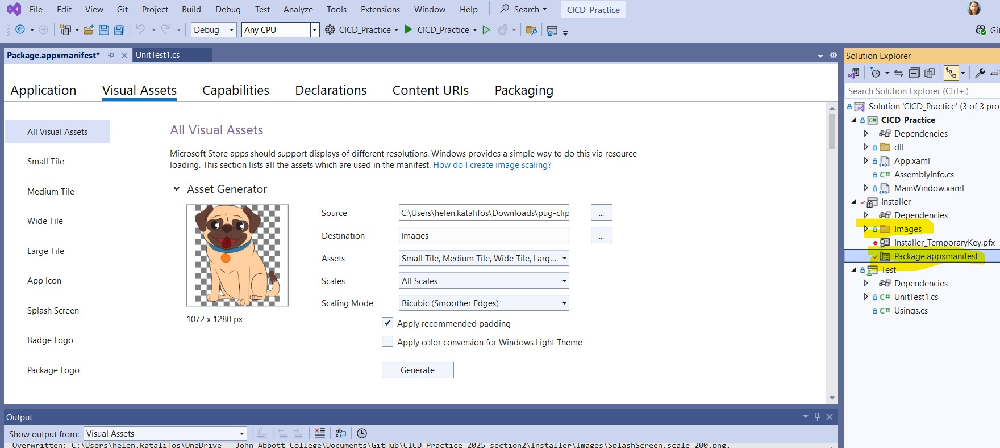
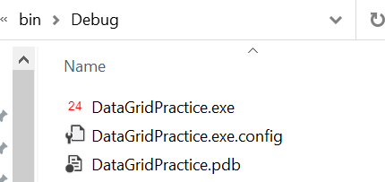
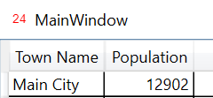

# Icons

**WARNING!**

Do not just grab any old icon that you find on the web without reading the *terms of use*, because many icons are copyrighted!

### What are icon files (`*.ico`)

The **ICO file** format is an image **file** format for computer icons in Microsoft Windows.

 **ICO files** contain one *or more* small images at multiple sizes and color depths, such that they may be scaled appropriately. 

An application **icon** has to be provided in many sizes as it can be applied at different screen resolutions and for different purposes 

 * desktop shortcut icon bigger than status bar icon, for example

*What if your icon file doesn't have images for all the sizes required by windows?*

Windows will simply grab the closest sized image and enlarge or shrink as needed.  Be aware that this could result in a blurry images  

## Creating an icon file

You could create a `.ico` file manually 

* in Visual Studio, 
* using a drawing tool (GIMP or photoshop), 
* or using a converter (https://icoconvert.com/)

Essentially you are creating different sized versions of your icon all in one file.

**The icon needs to be a square**. 

> NOTE: You may want to tweak the icon for different sizes (elements might be less visible in the small version, for example)

### Visual Studio

On your project, right-click to Add->New Item. Use the search to choose an icon file:

The icon editor will then pop-up, and you can edit each image individually.  To toggle between *"seeing the pixels", and "seeing normal scale", click on the image.

For me (Sandy), the ability to edit the `png` images is disabled, where as the toolbar is enabled for `bmp` images.

### Using MS-Paint and Visual Studio

#### Create your images

Using MS Paint (or any other drawing tool)

* Resize your image to the required number of pixels
* Draw your image

## A professional looking app 

To make sure your application looks professional (and does not just show the default application icon)  you need to associate images. 

### Adding an icon to your application

In your WAP project, open the `Package.appxmanifest` file. Select the `Visual Assets` tab.

Select the `Source` to load in the image you created.

Select `Generate` to allow VisualStudio to create the image in all the different sizes. You can then change an individual image type. Clicking on an image gives you information on where that image would appear in the application or installer. Save the `Package.appxmanifest` file and regenerate your installer. The list of images can be seen in the Images folder of your installer WAP project.

Your icon will now be applied to the installer and your app that it installs.

# Example

### Results

Application shown in file explorer.

Application shown in taskbar.  I think that the image is actually bigger than 64x64, it just scaled it up.

Icon in corner of app

