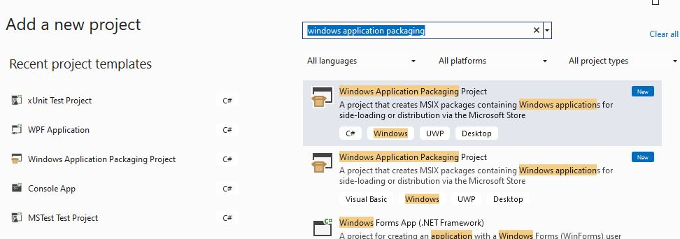

# Creating an Installer

## Information you need for later

### Determining which architecture your application is built for (x32, x64)

The default architecture in visual studio is `Any CPU`.

* You can select Build -> Configuration Manager to specify what should happen with each of your projects when your app is built on different architectures. 

  

# Creating an Installer (`setup.exe`)

## Can’t we just copy over the exe?

Beyond the application executable, an application often involves more components

* generic `dll`s, such as `HomeBudget.dll`, `sqlite.dll`
* specific `dll`s to match the processor (64 vs 32 bit), such as `sqlite.Interop.dll`

In addition to the necessary files, there is often the request to add the application to the desktop, and/or the windows menu. Modern installers include ways to update and digitally sign the app files.

## Application executable versus Setup executable versus Microsoft Installer

### Application Executable

When you build your solution or project, it will create an application executable, example: `myApp.exe`

### Older Windows desktop app installer: Setup Executable and `msi` file

Used to create a Windows msi installer that would generate a `setup.exe` and a Microsoft installer `myApp.msi`.

`setup.exe`: 

* an executable that acts as a bootstrapper. It verifies that the the software program can be installed on the computer and then allows the user to interact with the installer. Internally it uses (one or more) `*.msi` file(s).

`msi file`:

* a database that contains the information: 
  * the exe files for the application, 
  * configuration and registry settings, 
  * custom actions, 
  * relevant files, etc

*It is always a good idea to run `setup.exe` and **not** the `*.msi` directly*

* `msi` files allow IT people to create automated installs that bypass the user interaction with the installer.

### New Microsoft Installer (`msix` file): 

In 2018, Microsoft introduced the `msix` app packaging format which 

* uninstalls more cleanly (registry changes, files created throughout the system)
* installs the program in a container
* allows you to publish to the Microsoft Store.

# Creating an `MSIX` Installer for `HomeBudget`

## Preparation

### Add the UWP option in Visual Studio:

`Tools`->`Get Tools and Features...`

Check the Universal Windows Platform development option:

> 

### Create a `WAPP` project

With the extension installed, create a new **Windows Application Packaging Project** in the ***same solution*** as your application.

## Windows version:

> You could keep the defaults for the minimum Windows versions to install on. The minimum version limits the features you want to include, for example. You would consider your customer base to make sure to make your application accessible to most.

You may ignore any warning about requiring the Developer Mode for Windows. This is required if you want to publish your application in the Windows Store, which we will not be doing here.

## Application to install

First, we will set the application to install. Select `Dependencies`. right-click to select `Add Project Reference...`

Select your `HomeBudget` application. Note that any assemblies the application depends on will be automatically be brought in by the installer.

## Package Configuration

Select the `Package.appx.manifest` file in the project. The manifest allows you to configure the package

### Display name

Customize the name you want as the installed application's display name. Describe your app in the description field.

### Icons

In Visual Assets, you will be able to se the Icons for your application. More on this next class.

### Packaging

Leave the unique Id Package name as is.

Set the package display name. A first version of 1.0.0 makes sense.

### Certificate

A signed package gives the user of the package the certainty that the code comes from a trusted source.

You sign your package with your certificate. 

A proper certificate would be a certified trusted certificate. You would need to involve a trusted authority (Comodo, for example) you would pay annually to obtain a code signing certificate. 

Since we are only distributing our application internally (no one we don't know needs to trust us), we will generate a dev certificate. We will not get it authenticated by a trusted authority.

#### Generate a dev certificate

Select `Choose Certificate...` and `Create...`

You could select your Team name as the Publisher Common Name. Choose a password that you will not lose! Create the certificate.

Note that when you View the certificate, `View Full Certificate`, you note that it is indicated that the certificate is not trusted. 

The certificate expires in a year. We will "trust it" later. Select OK to create the certificate.  You could select Ok on the warning.

The certificate is now chosen for the installer.

Note that a pfx file that has now been added to the project.

You can now close the manifest file.

## Build the installer

Rebuild your solution.

Note that MSIX allows you to publish your app to the Microsoft Store. We will be creating a local installer instead.

To build the installer, choose `WAPP project -> Publish -> Create App packages...`

We will not be publishing our apps on the Microsoft Store. Keep the `Sideloading` option.

Click `Next`.

We will use the certificate we created, which should appear.

Click `Next`.

We have to choose which architectures you want to support.  

Choose the location where the installer will be placed. This could be a URL, or a folder. Updates will be checked for in that folder.

Choose `Create`.

#### Configuration Architectures

Note that the creation of the installer fails with errors about mismatches in the architectures. We need to be more specific about how our projects will be built for different architectures. 

Select `Build -> Configuration Manager`. 

Setup the following configurations:

​	Choose Release as the Active solution configuration.

​	Change the Active solution platform to x64. Change all the projects to be built for x64:

​		`Choose Platform -> <New...>`.  In New platform, select x64.

​	Make the same changes for x32. For each project, set x32 as the platform.

Regenerate the Installer:

​	`WAPP project -> Publish -> Create App packages...`

In the `Select and configure packages` page, select the x86 and x64 architectures, instead of the generic Neutral:

Click `Next` and `Create` to create the Installer. This takes some time.

When it is done, a `Finished creating package` dialog will appear:

Clicking on the output location will take you to the installer files.

Note the index.html page that is generated.

Also note that in the installer directory, the msix bundle and the public security certificate appear.

Click Copy and Close to have the installer copied to the Installer location. 

You could launch the installer from the html files or the folder.

Note that you are blocked from installing the application.  This is because the certificate is not trusted!

Since you know that you created the certificate you could indicate that you trust the certificate.

#### Trust the dev certificate

Double-click the public certificate file to see that it is your certificate.

Right-click on the .cer file to choose `Install certificate`. 

Choose `Local Machine`

Choose the Certificate store: Trusted Root Certification Authorities

In a company you would have your company's certificate trusted by everyone. If it is not your company's application, you would want to make sure that the certificate is verified by a trusted authority.

You could go to Windows Manage user certificates to delete the certificates when done. 

### Install

* Run `setup.exe`

	> To test the installer, you must run `setup.exe` **AS ADMINISTRATOR**. 

* Select  `install for everyone`.
* You could choose all the defaults for the rest to complete the installation. 

#### Validate
* You should see:
  * A desktop shortcut with your icon which launches your application
  * Your company name as a folder in the Start menu with your application in it. 
  * Icons are correct and application can be launched.
  * Your application installed at the location chosen during installation. 
    * All DLLs and application exe are present. 
  * Executable can be run.

