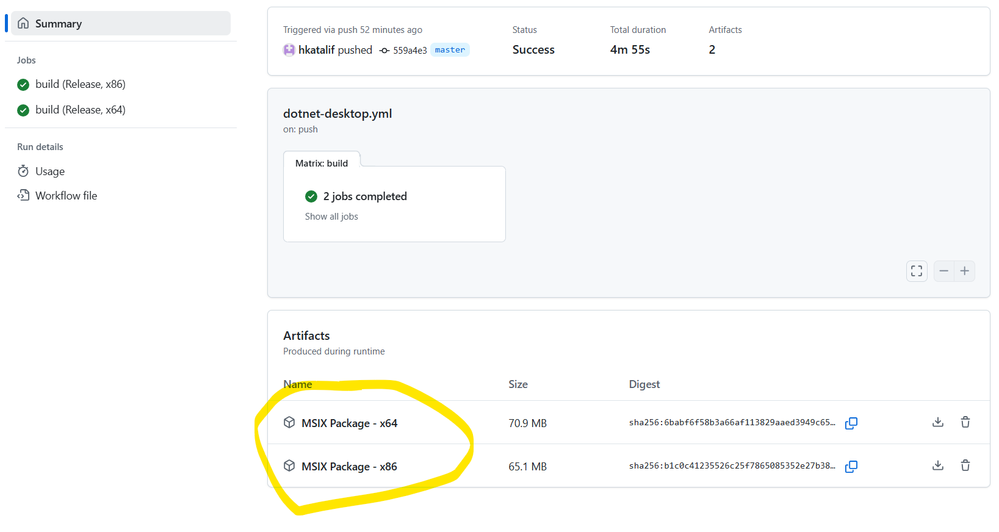

# Build the installer in the GitHub Actions CI / CD Workflow


### Starting point

In an earlier class, we set up a GitHub Actions YAML script (`dotnet-desktop.yml` file) to build and run the unit tests for the CICD_Practice solution. We set up GitHub to run our script on any commit on master/main. The script will be run by GitHub on a clean Windows OS installation.

We started with the GitHub Actions template for a WPF application. 

Inspired by the command-line steps we figure out on the copy of our solution on our machines, we modified the template. 

We modified it to run:

- dotnet test - runs our unit tests
- msbuild restore solution - to get the packages needed by the solution
- msbuild solution - to build the solution

At the time we disabled the template's steps to `Decode the pfx`, `Remove the pfx`, `Upload build artifacts`.

We will now work on these steps and building our solution with the installer project.


### Edit the Workflow file

In GitHub, edit (small pencil at top right) the .github/workflows/dotnet-desktop.yml file for your application. 

> Reminder:  indentation matters in YAML!
>

If you are starting from scratch:

- you could start with the suggested .NET Desktop script in the GitHub Actions tab of your repository.

- set the `Solution_Name` and `Test_Project_Path` env variables according to their adjacent comments.

- make sure you have set the Release x86 and x64 build configurations on the projects in VisualStudio.

  

#### Build in Release mode, x86 and x64 architectures

In the Windows Application Packaging (WAP) project, we only added build configurations for the Release mode. **Change** the script to only build in Release mode, to reflect this:

```yaml
  build:

    strategy:
      matrix:
        configuration: [Release]
```

We specified the Release configurations for both x86 and x64 architectures. **Add** target platform to the build matrix:

```yaml
    build:

    strategy:
      matrix:
        configuration: [Release]
        targetPlatform: [x86, x64]
```


From last class, you should have the following steps already set to go:

`Checkout`, `Install .NET Core`, `Setup MSBuild.exe`, `Execute unit tests`


#### Restore the application

**Change** the `Restore the application` step to specify the target platform and ensure that the proper packages are restored. Make sure you update the env variables on the step accordingly as seen here:

```yaml
    # Restore the application
    - name:  Restore the Wpf application to populate the obj folder
      run: msbuild $env:Solution_Path /t:Restore /p:Configuration=$env:Configuration /p:RuntimeIdentifier=$env:RuntimeIdentifier
      env:
        Configuration: ${{ matrix.Configuration }}
        RuntimeIdentifier: win-${{ matrix.targetplatform }}
```


#### Add certificate handling

As we saw, we must provide a certificate for our installer for users to be able to use it to install our application. 

In the copy of the solution on the lab computers, we used a dev certificate to sign our installer. A .pfx file was added to the WAP project.  This file is used to sign the certificate when generating the installer. It contains a private key for the certificate. It is important to keep the private key **secret**, so others do not use it to sign other (possibly malicious) software with it. We don't want our users that have trusted our certificate to be misled.

> The `.pfx` file in the installer project did not make it onto the GitHub repo. Why do you think that is? What prevented it from being committed?

We need the `.pfx` file on the clean GitHub build machine where our installer will be built. We therefore need to add it to our repo. However, we have to ensure that it is kept protected.


##### Provide the .pfx file and password for certificate signing

Using the instructions below you will encode the contents of the `.pfx` file using PowerShell so that it is not in plain text . Follow the instructions at the top of the GitHub Actions template workflow's comment: -> 2. Signing.

Essentially:

- Using the provided PowerShell commands, you will encode the `.pfx` file in your Windows Application Packaging project on your computer.

- After running the two commands, you will find, in the same folder, a text file called `SigningCertificate_Encoded.txt`, which contains the certificate encoded as a base64 string. Open the text file and copy the whole content.

- In your repository on GitHub, add repository secrets (https://docs.github.com/en/actions/security-guides/encrypted-secrets#creating-encrypted-secrets-for-a-repository) 

  Choose **Settings → Security (on the left panel) → Secrets and variables → Actions →  Repository secrets** and create the two new repository secrets:

  - Call the first secret `Base64_Encoded_Pfx` and, as its value, paste the encoded base64 string you have just copied.

  - To sign your installer, GitHub will also need the password you used to create your certificate. This password should also be kept secret! Create a second secret and call it `Pfx_Key`. Set its value to be the password you used to sign your certificate. 

    

In the GitHub Actions script, the encoded version of the .pfx file will be decoded and placed in the solution, and it will be used to sign your installer with the password.


##### Add a step to decode the .pfx file where the script is run

**Uncomment** the  `Decode the pfx` step. This step generates a GitHubActionsWorkflow.pfx file from the encoded string in the secret

```yaml
    # Decode the base 64 encoded pfx and save the Signing_Certificate
    - name: Decode the pfx
      run: |
        $pfx_cert_byte = [System.Convert]::FromBase64String("${{ secrets.Base64_Encoded_Pfx }}")
        $certificatePath = Join-Path -Path $env:Wap_Project_Directory -ChildPath GitHubActionsWorkflow.pfx
        [IO.File]::WriteAllBytes("$certificatePath", $pfx_cert_byte)
```


Commit the changed script. Go to the Actions tab to check the status of the build run.

It failed! We did not set the env:Wap_Project_Directory used in the decode step. 


#### Set the WAP project environment variables

Go ahead and check the comments next to the following two script variables to set them to point to the installer project correctly:

```yaml
Wap_Project_Directory: your-wap-project-directory-name
Wap_Project_Path: your-wap-project-path  
```


#### Build the installer

Now, we have an installer. **Uncomment** and **copy** this build step to build the installer, specifying that we are building a SideLoadOnly installer (not one to be published to the Microsoft store). Note that this step also specifies where the decoded .pfx file can be found and the associated password in the secret so that our installer can be properly signed: 

```yaml
    # Create the app package by building and packaging the Windows Application Packaging project
    - name: Build the Windows Application Packaging Project (wapproj)
      run: msbuild $env:Solution_Path /p:Platform=$env:TargetPlatform /p:Configuration=$env:Configuration /p:UapAppxPackageBuildMode=$env:BuildMode /p:AppxBundle=$env:AppxBundle /p:PackageCertificateKeyFile=GitHubActionsWorkflow.pfx /p:PackageCertificatePassword=${{ secrets.Pfx_Key }}
      env:
        AppxBundle: Never
        BuildMode: SideloadOnly
        Configuration: ${{ matrix.Configuration }}
        GenerateAppInstallerFile: True
        TargetPlatform: ${{ matrix.targetplatform }}
```

 

#### Clean up the .pfx file from the build setup

We do not want our secret .pfx file hanging around on the setup GitHub used to run our script. **Uncomment** the `Remove the pfx` step to ensure the file is removed.

```yaml
    # Remove the pfx
    - name: Remove the pfx
      run: Remove-Item -path $env:Wap_Project_Directory\GitHubActionsWorkflow.pfx
```


### Get your artifact

On a successful run of your workflow, we want to end up with an installer that installs our application. **Uncomment** the step to `Upload the build artifact`. **Change** the name property to include the platform:

```yaml
    # Upload the MSIX package: https://github.com/marketplace/actions/upload-a-build-artifact
    - name: Upload build artifacts
      uses: actions/upload-artifact@v4
      with:
        name: MSIX Package - ${{ matrix.targetPlatform }}
        path: ${{ env.Wap_Project_Directory }}\AppPackages
```


When the build succeeds, the msix installer bundle will be available by clicking on the run in Actions:




You can click on the artifact to download it. Run the installer to verify that your application was properly built up. If you have access to one with admin privileges, test your installer on it to make sure it looks right and installs your application!


### Troubleshooting

If you see an error indicating that you need to add RuntimeIdentifiers to your WPF project's .csproj file, add the following in the `<PropertyGroup>` property, below the `<TargetFramework>`:

`<RuntimeIdentifiers>win-x86;win-x64</RuntimeIdentifiers>`


Any further tips will be added here as they come up
