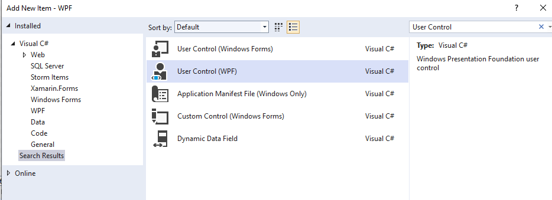
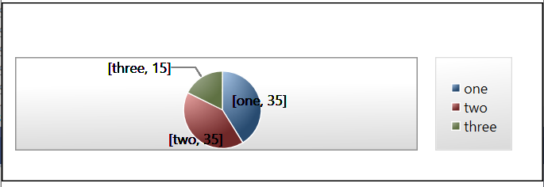

# **Custom user control**

***NOTE: Although the notes listed below should work, I (Sandy) got tied up in knots trying to get it to work, even though it is my own code.  I gave up.  If you want to try charts as your extra feature... go for it***

It could be convenient to group controls into your own user control. 

To create a custom User Control, in VS, right-click the project and select Add-> New Item. Search for ‘User Control’. Select the WPF User Control type:




Name your new control class as you want (ChartView or DataGridView for example).

The xaml and code behind (xaml.cs) files will be automatically created for you. In the xaml file, you could add other sub-controls (you could move the DataGrid and search from the MainWindow into this custom control, for example). (you don't need to do this if it is too complicated)

In the MainWindow, you can now use your new control directly:

`<local:DataGridView x:Name="theDataGridView"></local:DataGridView>`

Note: The XAML may indicate that the type does not exist in the namespace, even though it does. Go ahead and run, if there are no other ('real') errors it will work.


# Adding Charts

We are going to make a custom control for displaying the data as a chart instead of a `datagrid`.

> user control info: [microsoft docs](https://docs.microsoft.com/en-us/archive/msdn-magazine/2019/may/xaml-custom-xaml-controls),  [tutorials point](https://www.tutorialspoint.com/xaml/xaml_custom_controls.htm)

## Installing package

* using the `Nuget` package manager, install 
  * DotNetProjects.WPFToolKit.DataVisualization

## Create the new user control

Follow above instructions for making a new user control.

## Creating a Pie Chart

[tutorial](https://www.c-sharpcorner.com/UploadFile/mahesh/charting-in-wpf/)

### Making the controls available in XAML

In your xaml code, we need to define an XAML *namespace* and import the `toolkit` extension to that namespace.

Within the `<Window...>` tag, create a new inner tag

`<xmlns:`*`namespace`*`="`

At this point, a dropdown list of all the possible extensions are listed.
Select "http://schemas.microsoft.com/winfx/2006/xaml/presentation/toolkit"
          
In the following example, I chose `toolkit` to be the namespace for the charting controls

```xaml
Window x:Class="EarthCoordinates.MainWindow"
        xmlns="http://schemas.microsoft.com/winfx/2006/xaml/presentation"
        xmlns:x="http://schemas.microsoft.com/winfx/2006/xaml"
        xmlns:d="http://schemas.microsoft.com/expression/blend/2008"
        xmlns:mc="http://schemas.openxmlformats.org/markup-compatibility/2006"
        xmlns:local="clr-namespace:EarthCoordinates"
        xmlns:toolkit="http://schemas.microsoft.com/winfx/2006/xaml/presentation/toolkit"
        mc:Ignorable="d"
        Title="MainWindow" Height="450" Width="800">
```

### Making Chart Controls available in code

Add `using System.Windows.Controls.DataVisualization.Charting;` to your code

### Creating a simple pie chart

* First you create a chart,
* Then you specify what type of chart
* The `datasource` for a chart is a list of `key/value` pairs
* The `IndependentValue` is defined below to be the `key` portion of the `key/value` pair
* The `DependentValue` is defined below to the the `value` portion of the `key/value` pair.

```xaml
<!-- create a chart -->
    <toolkit:Chart Name="chPie">
        
        <!-- this chart will be a pie chart -->
        <toolkit:LabeledPieSeries 
              
            IndependentValueBinding="{Binding Path=Key}"
              DependentValueBinding="{Binding Path=Value}" 
                              Title="Test" Margin="10,10,0,0">

        </toolkit:LabeledPieSeries>
    </toolkit:Chart>
```


To see an actual pie-chart...

```csharp
        public MainWindow()
        {
            InitializeComponent();

            // ---------------------------------------------------------------
            // define which data is to be displayed
            // ---------------------------------------------------------------
            var DisplayData = new List<KeyValuePair<String, double>>();

            DisplayData.Add(new KeyValuePair<string, double>("one", 35));
            DisplayData.Add(new KeyValuePair<string, double>("two", 35));
            DisplayData.Add(new KeyValuePair<string, double>("three", 15));

            // set the data for the pie-chart
            ((PieSeries)chPie.Series[0]).ItemsSource = DisplayData;

        }
```





# Chart for Budget, 

## NOTE:

After creating the new User Control, you must absolutely rebuild your code before you can use the new control.

## by Category and Month

> This code creates a **user control**.  To create a user control, add a new item to your project, and select user control

This is *sample* code, and you can/should modify as necessary to fit your code-base

```xaml
<UserControl x:Class="Budget.DataChartControl"
             xmlns="http://schemas.microsoft.com/winfx/2006/xaml/presentation"
             xmlns:x="http://schemas.microsoft.com/winfx/2006/xaml"
             xmlns:mc="http://schemas.openxmlformats.org/markup-compatibility/2006" 
             xmlns:d="http://schemas.microsoft.com/expression/blend/2008" 
             xmlns:local="clr-namespace:Budget"
             xmlns:toolkit="http://schemas.microsoft.com/winfx/2006/xaml/presentation/toolkit" 
             mc:Ignorable="d" 
             d:DesignHeight="450" d:DesignWidth="800">
    <Grid >
        
        <!-- Divide space into two columns, one for title and other stuff, and one for the chart -->
        <Grid.ColumnDefinitions>
            <ColumnDefinition Width="150"/>
            <ColumnDefinition Width="800"/>
        </Grid.ColumnDefinitions>
        <Grid.RowDefinitions>
            <RowDefinition Height="400"/>
        </Grid.RowDefinitions>
        
        <!-- insert stack panel in column one, include title, and drop-down box for choosing months -->
        <StackPanel Margin="10,0,10,10">
            <TextBlock FontSize="18" Name="txtTitle">Title</TextBlock>
            <ComboBox Name="cbMonths" Margin="0,10,0,0" SelectionChanged="cbMonths_SelectionChanged"></ComboBox>
        </StackPanel>
        
        
        <!-- Create a chart in column 1 -->
        <toolkit:Chart Grid.Column="1" Name="chPie" Margin="0,0,150,0" Height="390">
            
            <!-- this chart will be a pie chart -->
            <toolkit:LabeledPieSeries 
                  
                IndependentValueBinding="{Binding Path=Key}"
                  DependentValueBinding="{Binding Path=Value}" 
                                  HorizontalAlignment="Left" 
                                  Height="305" 
                                  VerticalAlignment="Top" 
                                  Width="537" 
                                  Title="Test" Margin="10,10,0,0">

            </toolkit:LabeledPieSeries>
        </toolkit:Chart>
        <toolkit:Chart 
            Grid.Column="1" 
            Name="chBar" 
            Margin="0,0,150,0" 
            Height="390"
            Visibility="Hidden"
            >
            <toolkit:BarSeries IndependentValueBinding="{Binding Path=Key}"
                  DependentValueBinding="{Binding Path=Value}" 
                                  HorizontalAlignment="Left" 
                                  Height="305" 
                                  VerticalAlignment="Top" 
                                  Width="537" 
                                  Title="Test" Margin="10,10,0,0"
                  >
            </toolkit:BarSeries>
        </toolkit:Chart>


        <TextBlock Grid.Column="1" 
                   HorizontalAlignment="Center" 
                   VerticalAlignment="Center"
                   Name="txtInvalid"
                   FontSize="36" TextAlignment="Center">Not Implemented</TextBlock>
    </Grid>
</UserControl>

```

```csharp
using System;
using System.Collections.Generic;
using System.Windows;
using System.Windows.Controls;
using System.Windows.Controls.DataVisualization.Charting;

namespace Budget
{
    /// <summary>
    /// Interaction logic for PieChart.xaml
    /// </summary>
    public partial class DataChartControl : UserControl
    {

        // ----------------------------------------------------------------------------------
        // private globals
        // ----------------------------------------------------------------------------------
        private List<object> _dataSource;
        private enum ChartType
        {
            Standard,
            ByCategory,
            ByMonth,
            ByMonthAndCategory
        }
        private ChartType chartType = ChartType.Standard;
        private List<string> Categories;

        // ----------------------------------------------------------------------------------
        // public properites
        // ----------------------------------------------------------------------------------
        public DataPresenter presenter { get; set; }
        public List<object> DataSource
        {
            get { return _dataSource; }
            set
            {
                // if changing data source, then redraw chart
                _dataSource = value;
                if (chartType == ChartType.ByMonthAndCategory) drawByMonthPieChart();
                if (chartType == ChartType.ByMonth) drawByMonthLineChart();
            }
        }

        #region public methods
        
        // -----------------------------------------------------------------------------------
        // constructor
        // -----------------------------------------------------------------------------------
        public DataChartControl()
        {
            InitializeComponent();
        }

        // -----------------------------------------------------------------------------------
        // clear the current data
        // -----------------------------------------------------------------------------------
        public void DataClear()
        {
            ((PieSeries)chPie.Series[0]).ItemsSource = null;
        }

        // -----------------------------------------------------------------------------------
        // Get prepared for displaying Month and Category
        // Inputs: usedCategoryList... a list of categories 
        // -----------------------------------------------------------------------------------
        public void InitializeByCategoryAndMonthDisplay(List<string> CategoryList)
        {
            txtTitle.Text = "By Month";
            chartType = ChartType.ByMonthAndCategory;   // set chart type appropriately
            chPie.Visibility = Visibility.Visible;      // show the pie chart
            txtInvalid.Visibility = Visibility.Hidden;  // hide the "invalid parameters" text
            this.Categories = CategoryList;             // save the categories list
        }

        // -----------------------------------------------------------------------------------
        // prepare for 'byCategory',
        // NOTE: just show invalid text... this chart is not implemented
        // -----------------------------------------------------------------------------------
        public void InitializeByCategoryDisplay()
        {
            chPie.Visibility = Visibility.Hidden;
            txtInvalid.Visibility = Visibility.Visible;
        }

        // -----------------------------------------------------------------------------------
        // prepare for 'byMonth',
        // NOTE: just show invalid text... this chart is not implemented
        // -----------------------------------------------------------------------------------
        public void InitializeByMonthDisplay()
        {
            chPie.Visibility = Visibility.Hidden;
            txtInvalid.Visibility = Visibility.Visible;
        }

        // -----------------------------------------------------------------------------------
        // prepare for standard display,
        // NOTE: just show invalid text... this chart is not implemented
        // -----------------------------------------------------------------------------------
        public void InitializeStandardDisplay()
        {
            chPie.Visibility = Visibility.Hidden;
            txtInvalid.Visibility = Visibility.Visible;
        }
        #endregion

 
        // -----------------------------------------------------------------------------------
        // draw by Month is NOT implemented :(
        // -----------------------------------------------------------------------------------
        private void drawByMonthLineChart()
        {
        }


        #region byMonthAndCategory

        // --------------------------------------------------------------------
        // Draw the 'ByMonth' chart
        // --------------------------------------------------------------------
        private void drawByMonthPieChart()
        {
            // create a list of months from the source data
            List<String> months = new List<String>();
            foreach (object obj in _dataSource)
            {
                var item = obj as Dictionary<String, object>;
                if (item != null)
                {
                    months.Add(item["Month"].ToString());
                }
            }

            // add the months to the combobox dropdown
            cbMonths.ItemsSource = months;

            // reset selected index to last 'month' in list
            cbMonths.SelectedIndex = -1;
            
            // set the data for the pie-chart
            set_MonthCategory_Data();
        }

        // --------------------------------------------------------------------
        // define the data for the given month from the datasoure,
        // ... which in this case is a list of Dictionary<String,object>
        //     defining totals for each category for a given month
        // --------------------------------------------------------------------
        private void set_MonthCategory_Data()
        {

            DataClear();

            // bail out if there are no 'month' items in the drop down
            if (cbMonths.Items.Count == 0) return;

            // set the default selection to the last in the list
            if (cbMonths.SelectedIndex < 0 || cbMonths.SelectedIndex > cbMonths.Items.Count - 1)
            {
                cbMonths.SelectedIndex = cbMonths.Items.Count - 1;
            }

            // what is the selected month?
            String selectedMonth = cbMonths.SelectedItem.ToString();

            // ---------------------------------------------------------------
            // define which data is to be displayed
            // ---------------------------------------------------------------
            var DisplayData = new List<KeyValuePair<String, double>>();
            
            foreach (object obj in _dataSource)
            {
                var item = obj as Dictionary<String, object>;
            
                // is the item listed in the _dataSource part of the selected month?
                if (item != null && (string)item["Month"] == selectedMonth)
                {

                    // go through each key/value pair in this item (item is a dictionary)
                    foreach (var pair in item)
                    {
                        String category = pair.Key;
                        String value = pair.Value.ToString();

                        // if the key is not a category, skip processing
                        if (!Categories.Contains(category)) continue;

                        // what is the amount of money for this category (item[category])
                        var amount = 0.0;
                        double.TryParse(value, out amount);

                        // only display expenses (i.e., amount < 0)
                        if (amount < 0)
                        {
                            DisplayData.Add(new KeyValuePair<String, double>(category, -amount));
                        }
                    }

                    // we found the month we wanted, no need to loop through other months, so
                    // stop looking
                    break;
                }
            }

            // set the data for the pie-chart
            ((PieSeries)chPie.Series[0]).ItemsSource = DisplayData;
       }

        #endregion

        private void cbMonths_SelectionChanged(object sender, SelectionChangedEventArgs e)
        {
            set_MonthCategory_Data();
        }
    }
}

```

## Using your new Chart Control

```xaml

               <local:DataChartControl x:Name="theChart"></local:DataChartControl>
 

```

#### Notes:

To obtain a List<Object> from a List<Dictionary<string, object>>:

```c#
using System.Linq;

List<Dictionary<string, object>> myItems = presenter.GetBudgetItemsByCategoryAndMonth...
List<Object> theObjects = myItems.Cast<object>().ToList();
```

The DataSource property is set to establish the items to be shown. You could add DataSource to the interface shared by the pie chart view and the data grid view:

```c#
List<object> DataSource { get; set; }
```

Your presenter can set the DataSource on whichever implementation of the interface it is using, either the Pie Chart or DataGrid view, in order to set the data to be shown. Your data grid implementation of the interface could use the DataSource set method to use the data accordingly.
