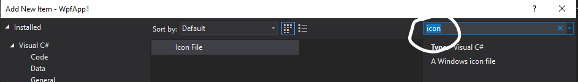
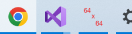
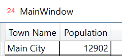

# Icons

**WARNING!**

From tests: installer splashscreen: Scaled assets

Do not just grab any old icon that you find on the web without reading the *terms of use*, because many icons are copyrighted!

### What are icon files (`*.ico`)

The **ICO file** format is an image **file** format for computer icons in Microsoft Windows.

 **ICO files** contain one *or more* small images at multiple sizes and color depths, such that they may be scaled appropriately. 

An application **icon** has to be provided in many sizes as it can be applied at different screen resolutions and for different purposes 

 * desktop shortcut icon bigger than status bar icon, for example

*What if your icon file doesn't have images for all the sizes required by windows?*

Windows will simply grab the closest sized image and enlarge or shrink as needed.  Be aware that this could result in a blurry images  

## Creating an icon file

You could create a `.ico` file manually 

* in Visual Studio, 
* using a drawing tool (GIMP or photoshop), 
* or using a converter (https://icoconvert.com/)

Essentially you are creating different sized versions of your icon all in one file.

**The icon needs to be a square**. 

> NOTE: You may want to tweak the icon for different sizes (elements might be less visible in the small version, for example)

### Visual Studio

On your project, right-click to Add->New Item. Use the search to choose an icon file:

The icon editor will then pop-up, and you can edit each image individually.  To toggle between *"seeing the pixels", and "seeing normal scale", click on the image.

For me (Sandy), the ability to edit the `png` images is disabled, where as the toolbar is enabled for `bmp` images.

### Using MS-Paint and Visual Studio

#### Remove all but one of the icons

* In visual studio, right click any image, and delete it.
* LEAVE AT LEAST ONE IMAGE.

#### Create your images

Using MS Paint (or any other drawing tool)

* Resize your image to the required number of pixels
* Draw your image

#### Transfer your images to your icon file

* In MS Paint, select the whole image (`ctrl-A`) and copy it into the clipboard (`ctrl-C`)
* In VS Studio, select an image in the icon editor
* right-click and select `New Image Type`, choosing the correct pixel size
* Once the new image pops up, paste your MS Paint image (`ctrl-V`)

#### Repeat for all required sizes

* 16x16
* 24x24
* 64x64
* 128x128
* 256x256

### External Tools

There are many icon editors that you can download, and many drawing apps support the use of creating icons.

There are also many on-line tools to create icons.  The following on-line editor works quite well.

[X-Icon Editor](http://www.xiconeditor.com/)
Not only can you can create your icon from scratch, you can also import a base image to start with and change it to make it your own.

The above editor is specifically created to create icons for web pages, so the default icon name, when exported, will be `favicon.ico`.

## A professional looking app 

To make sure your application looks professional (and does not just show the default application icon)  you need to associate a `.ico` image file to your app. 

### Adding an icon to your application

At this point, even though you have created an icon file, it will not automatically be associated with the final built application.

Right-click on your project and select Properties.
In Application, under Resources - Icon and Manifest, browse to add your new icon file.

Your icon will now be applied to the application.

# Example

### Creating the icon.

### Adding it to the application

### Results

Application shown in file explorer.

Application shown in taskbar.  I think that the image is actually bigger than 64x64, it just scaled it up.

Icon in corner of app

