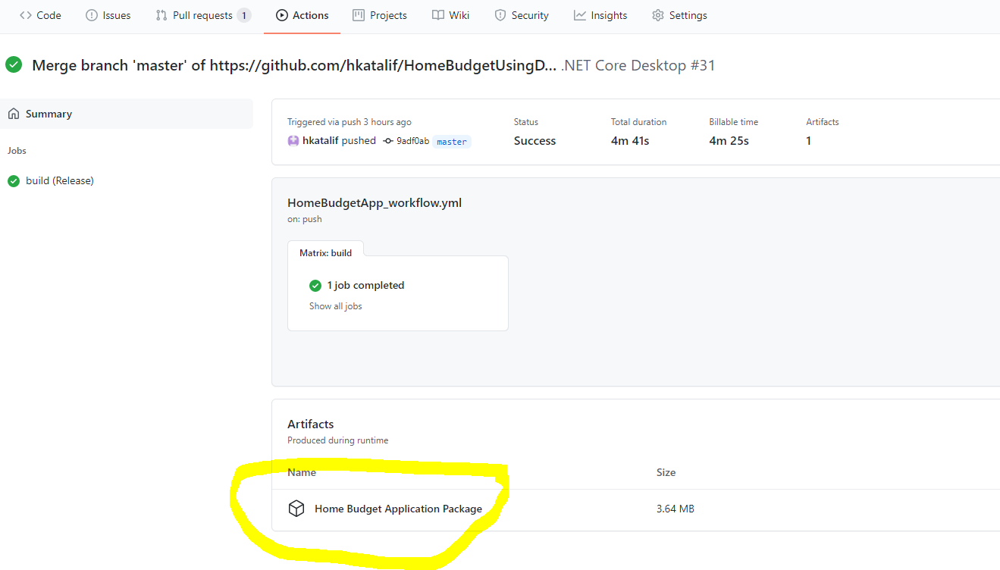

# Build the installer in the GitHub Actions CI / CD Workflow


### Starting point

Last time, we set up a GitHub Actions YAML script (`dotnet-desktop.yml` file) to build and run the unit tests for the CICD_Practice solution. We set up GitHub to run our script on any commit on master/main. The script will be run by GitHub on a clean Windows OS installation.

We started with the GitHub Actions template for a WPF application. 

Inspired by the command-line steps we figure out on the copy of our solution on our machines, we modified the template. 

We modified it to run:

- dotnet test - runs our unit tests
- msbuild restore solution - to get the packages needed by the solution
- msbuild solution - to build the solution

At the time we disabled the template's steps to `Decode the pfx`, `Remove the pfx`, `Upload build artifacts`.

We will now work on these steps and building our solution with the installer project.


### Edit the Workflow file

In GitHub, edit (small pencil at top right) the .yml file for your application. 

Reminder:  indentation matters in YAML!


#### Only build in Release mode

In the Windows Application Packaging (WAP) project, we only added build configurations for the Release mode. Change the script to only build in Release mode as well:

```
  build:

    strategy:
      matrix:
        configuration: [Release]
```

We specified the Release configuration for both x86 and x64 architectures. To simplify our script, we will only build for Windows x64. Add a target platform to the build matrix:

```
    build:

    strategy:
      matrix:
        configuration: [Release]
        targetPlatform: [x64]
```


#### Specify the unit test project to test

Modify the `dotnet test` step to specify the unit test project. `dotnet` is not filtering out the installer project when looking for unit test projects to run in the solution. We could modify the installer project's `.csproj` file to mark it not a test project. The alternative we will use, is to explicitly run `dotnet test` on our one test project:

Modify the `Execute unit tests` step:

```yaml
    # Execute all unit tests in the solution
    - name: Execute unit tests
      run: dotnet test $env:Test_Project_Path
```


In the `Restore the application` step, specify the target platform to ensure that the proper x64 packages are restored:

```yaml
    # Restore the application to populate the obj folder with RuntimeIdentifiers
    - name: Restore the application
      #run: dotnet restore
      run: msbuild $env:Solution_Name /t:Restore /p:Configuration=$env:Configuration /p:RuntimeIdentifier=$env:RuntimeIdentifier
      env:
        Configuration: ${{ matrix.configuration }}
        RuntimeIdentifier: win-${{ matrix.targetplatform }}
```


#### Add certificate handling

As we saw, we must provide a certificate for our installer for users to be able to use it to install our application. 

In the copy of the solution on the lab computers, we used a dev certificate to sign our installer. A .pfx file being added to the WAPP project.  This file is used to sign the certificate when generating the installer. It contains two keys for the certificate: a private and a public one. It is important to keep the private key secret, so others do not use it to sign other (possibly malicious) software with it. We don't want our users that have trusted our certificate to be misled.

> The `.pfx` file in the installer project did not make it onto the GitHub repo. Why do you think that is? What prevented it from being committed?

We need the `.pfx` file on the clean GitHub build machine where our installer will be built. We therefore need to add it to our repo. However, we have to be ensure that it is kept protected.


##### Provide the .pfx file and password for certificate signing

We will encode the contents of the `.pfx` file so that it is not in plain text . Follow the instructions in the GitHub Actions template top comment: -> 2. Signing.

We will then add it to GitHub as a **GitHub secret**: https://docs.github.com/en/actions/security-guides/encrypted-secrets#creating-encrypted-secrets-for-a-repository

<p style="background:yellow"><b>MILESTONE 8 work: </b>
     Follow the instructions to ENCODE the Windows Application Packaging project's .pfx file and ADD it to your GitHub repo as a secret: https://docs.github.com/en/actions/security-guides/encrypted-secrets#creating-encrypted-secrets-for-a-repository.</p>

To sign your installer, GitHub will also need the password you used to create your certificate. This password should also be kept secret!

<p style="background:yellow"><b>MILESTONE 8 work: </b>
     Continue with the GitHub Actions template top comment: -> 2. Signing. instructions to add your signing certificate password as a GitHub secret.</p>

The result will be that your repo will include two GitHub secrets, the encoded .pfx file in the `Base64_Encoded_Pfx` secret and the certificate signing password in the `Pfx_Key` GitHub secret .  

In the GitHub Actions script, the encoded version of the .pfx file will be decoded and placed in the solution, and it will be used to sign our installer with the password.


##### Add a step to decode the .pfx file to build our installer

Uncomment the `Decode the pfx` step in the `dotnet-desktop.yml` script:

```yaml
    # Decode the base 64 encoded pfx and save the Signing_Certificate
    - name: Decode the pfx
      run: |
        $pfx_cert_byte = [System.Convert]::FromBase64String("${{ secrets.Base64_Encoded_Pfx }}")
        $currentDirectory = Get-Location
        $certificatePath = Join-Path -Path $currentDirectory -ChildPath $env:Wap_Project_Directory -AdditionalChildPath $env:SigningCertificate
        [IO.File]::WriteAllBytes("$certificatePath", $pfx_cert_byte)
```


Commit the changed script. Go to the Actions tab to check the status of the build run.

It failed! We did not set the env:Wap_Project_Directory. 


##### Set the WAP project environment variables

Go ahead and check the comments next to the following two script variables to set them to point to the installer project correctly:

```
Wap_Project_Directory: your-wap-project-directory-name
Wap_Project_Path: your-wap-project-path  
```


##### Clean up the .pfx file from the build setup

We do not want our secret .pfx file hanging around on the setup GitHub used to run our script. Uncomment the `Remove the pfx` step to ensure the file is removed.

    # Remove the pfx
    - name: Remove the pfx
      run: Remove-Item -path $env:Wap_Project_Directory\GitHubActionsWorkflow.pfx


### Get your artifact

On a successful run of your workflow, we want to end up with an installer that installs our application. Uncomment the step to `Upload the build artifact`:

    # Upload the MSIX package: https://github.com/marketplace/actions/upload-a-build-artifact
    - name: Upload build artifacts
      uses: actions/upload-artifact@v3
      with:
        name: MSIX Package
        path: ${{ env.Wap_Project_Directory }}\AppPackages

When the build succeeds, the msix installer bundle will be available by clicking on the run in Actions:




You can click on the artifact to download it. Run the installer to verify that your application, built up and tested on an independent machine looks right!
